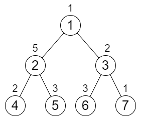
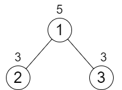

# 2673. Make Costs of Paths Equal in a Binary Tree

## Problem

You are given an integer `n` representing the number of nodes in a **perfect binary tree** consisting of nodes numbered from **1 to n**.

The root of the tree is node **1**, and each node `i` has two children:

- Left child: `2 * i`
- Right child: `2 * i + 1`

Each node in the tree also has a **cost**, represented by a 0-indexed integer array `cost` of size `n`.

```
cost[i] = cost of node (i + 1)
```

You are allowed to **increment the cost of any node by 1** any number of times.

Your task is to return the **minimum number of increments** required so that the **cost of all root-to-leaf paths becomes equal**.

---

# Notes

A **perfect binary tree** is a tree where:

- Every internal node has **exactly two children**
- All leaves are at the **same depth**

The **cost of a path** is defined as:

```
Sum of costs of all nodes along the path from root to leaf
```

---

# Example 1



### Input

```
n = 7
cost = [1,5,2,2,3,3,1]
```

### Output

```
6
```

### Explanation

We perform the following increments:

- Increase cost of node **4** once
- Increase cost of node **3** three times
- Increase cost of node **7** twice

After these operations, each root-to-leaf path has total cost:

```
9
```

Total increments:

```
1 + 3 + 2 = 6
```

This is the **minimum possible**.

---

# Example 2



### Input

```
n = 3
cost = [5,3,3]
```

### Output

```
0
```

### Explanation

Both root-to-leaf paths already have equal cost, so **no increments are required**.

---

# Constraints

```
3 ≤ n ≤ 10^5
n + 1 is a power of 2
cost.length == n
1 ≤ cost[i] ≤ 10^4
```
