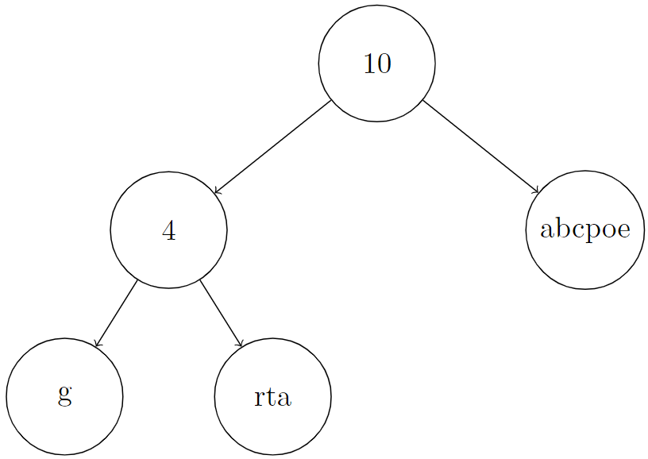
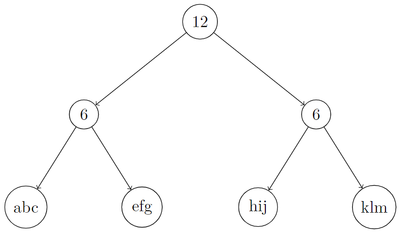

# 2689. Extract Kth Character From The Rope Tree

## Problem

You are given the **root of a binary tree** and an integer `k`.

Besides the left and right children, each node has two additional properties:

- `node.val` → a string containing only lowercase English letters (possibly empty)
- `node.len` → a non‑negative integer

The tree contains **two types of nodes**.

---

## Node Types

### 1. Leaf Node

Leaf nodes have:

- No children
- `node.len = 0`
- `node.val` is a **non-empty string**

### 2. Internal Node

Internal nodes have:

- At least one child (and at most two children)
- `node.len > 0`
- `node.val` is an **empty string**

---

## Rope Binary Tree

The tree described above is called a **Rope Binary Tree**.

We define a string `S[node]` recursively:

### Leaf node

```
S[node] = node.val
```

### Internal node

```
S[node] = concat(S[node.left], S[node.right])
S[node].length = node.len
```

Where:

```
concat(s, p) = string formed by appending p to s
```

Example:

```
concat("ab", "zz") = "abzz"
```

---

## Goal

Return the **k-th character** of the string `S[root]`.

Note: `k` is **1-indexed**.

---

# Example 1



### Input

```
root = [10,4,"abcpoe","g","rta"]
k = 6
```

### Output

```
"b"
```

### Explanation

The rope structure forms:

```
S[root] = concat(concat("g","rta"),"abcpoe")
        = "grtaabcpoe"
```

The **6th character** is:

```
"b"
```

---

# Example 2



### Input

```
root = [12,6,6,"abc","efg","hij","klm"]
k = 3
```

### Output

```
"c"
```

### Explanation

```
S[root] = concat(concat("abc","efg"), concat("hij","klm"))
        = "abcefghijklm"
```

The **3rd character** is:

```
"c"
```

---

# Example 3

### Input

```
root = ["ropetree"]
k = 8
```

### Output

```
"e"
```

### Explanation

```
S[root] = "ropetree"
```

The **8th character** is:

```
"e"
```

---

# Constraints

```
The number of nodes in the tree is in the range [1, 10^3]

node.val contains only lowercase English letters
0 ≤ node.val.length ≤ 50

0 ≤ node.len ≤ 10^4

For leaf nodes:
    node.len = 0
    node.val is non-empty

For internal nodes:
    node.len > 0
    node.val is empty

1 ≤ k ≤ S[root].length
```
