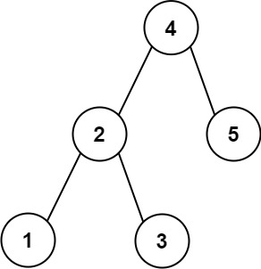

# 270. Closest Binary Search Tree Value

## Problem

Given the **root of a Binary Search Tree (BST)** and a **target value**, return the value in the BST that is **closest to the target**.

If there are **multiple answers**, return the **smallest value**.

---

## Example 1



**Input**

```
root = [4,2,5,1,3]
target = 3.714286
```

**Output**

```
4
```

---

## Example 2

**Input**

```
root = [1]
target = 4.428571
```

**Output**

```
1
```

---

## Constraints

- Number of nodes in the tree: **[1, 10^4]**
- `0 ≤ Node.val ≤ 10^9`
- `-10^9 ≤ target ≤ 10^9`
