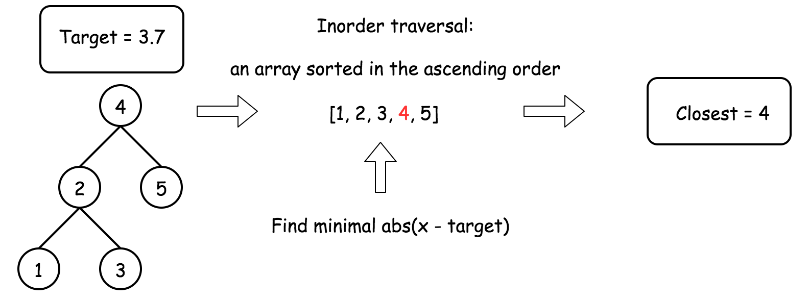
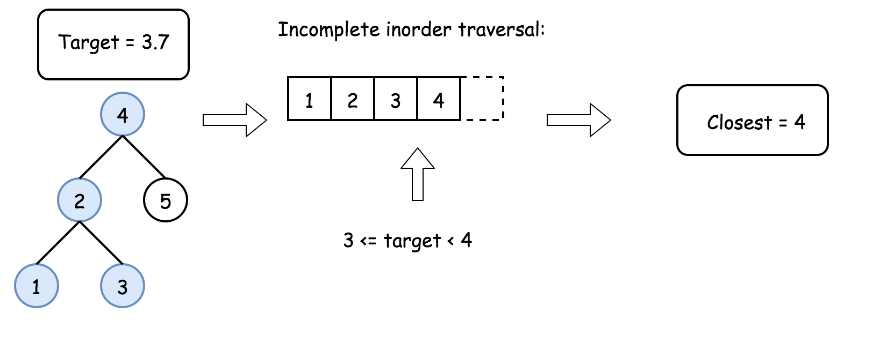
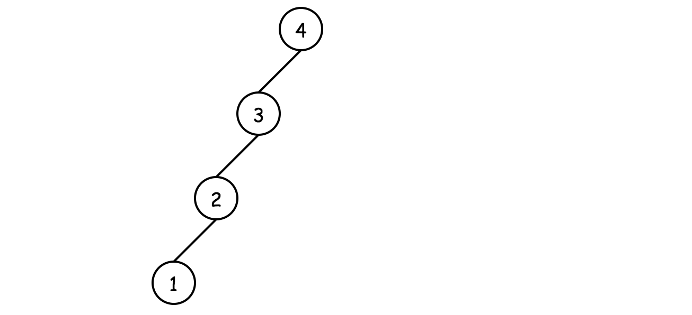
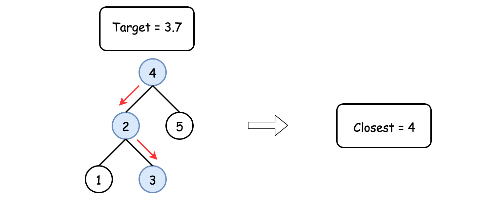

# Closest Binary Search Tree Value — Solution Approaches

## Approach 1: Recursive Inorder + Linear Search

### Intuition

The simplest approach is:



1. Perform an **inorder traversal** of the BST.
2. Store the values in a **sorted array**.
3. Find the element whose difference with the target is minimum.

Because **inorder traversal of a BST is sorted**, we can easily search for the closest element.

---

### Algorithm

1. Build an inorder traversal list.
2. Iterate through the list to find the element with minimum absolute difference from the target.

---

### Java Implementation

```java
class Solution {

  public void inorder(TreeNode root, List<Integer> nums) {
    if (root == null) return;

    inorder(root.left, nums);
    nums.add(root.val);
    inorder(root.right, nums);
  }

  public int closestValue(TreeNode root, double target) {

    List<Integer> nums = new ArrayList<>();
    inorder(root, nums);

    return Collections.min(nums, new Comparator<Integer>() {
      @Override
      public int compare(Integer o1, Integer o2) {
        return Math.abs(o1 - target) < Math.abs(o2 - target) ? -1 : 1;
      }
    });
  }
}
```

---

### Complexity Analysis

**Time Complexity**

```
O(N)
```

- Building inorder traversal → `O(N)`
- Linear search → `O(N)`

**Space Complexity**

```
O(N)
```

The inorder traversal array stores all nodes.

---

# Approach 2: Iterative Inorder Traversal

### Intuition

We can improve the previous approach by:

- Performing inorder traversal **iteratively**
- Tracking the **closest value while traversing**
- Stopping early once the closest range is identified

If:

```
pred <= target < current
```

then the closest value must be either `pred` or `current`.



---

### Algorithm

1. Maintain a stack for inorder traversal.
2. Track the predecessor (`pred`).
3. While traversing:
   - If target lies between `pred` and current node value → return closest.
4. Otherwise continue traversal.

---

### Java Implementation

```java
class Solution {

  public int closestValue(TreeNode root, double target) {

    LinkedList<TreeNode> stack = new LinkedList<>();
    long pred = Long.MIN_VALUE;

    while (!stack.isEmpty() || root != null) {

      while (root != null) {
        stack.add(root);
        root = root.left;
      }

      root = stack.removeLast();

      if (pred <= target && target < root.val) {
        return Math.abs(pred - target) <= Math.abs(root.val - target)
            ? (int) pred
            : root.val;
      }

      pred = root.val;
      root = root.right;
    }

    return (int) pred;
  }
}
```

---

### Complexity Analysis

**Time Complexity**

Average case:

```
O(k)
```

Worst case:

```
O(H + k)
```

Where:

- `H` = tree height
- `k` = index of closest element

Balanced tree → `O(k)`
Unbalanced tree → `O(H + k)`

---

**Space Complexity**

```
O(H)
```

Stack stores nodes along traversal path.



---

# Approach 3: Binary Search on BST

### Intuition

Because it is a **BST**, we can traverse like **binary search**:

- If `target < node.val` → go left
- Otherwise → go right

While traversing, we maintain the **closest value seen so far**.



---

### Algorithm

1. Initialize `closest = root.val`.
2. Traverse the tree:
   - Update closest if current node is closer.
   - Move left or right depending on target.
3. Stop when reaching a null node.

---

### Java Implementation

```java
class Solution {

  public int closestValue(TreeNode root, double target) {

    int closest = root.val;

    while (root != null) {

      int val = root.val;

      if (Math.abs(val - target) < Math.abs(closest - target) ||
          (Math.abs(val - target) == Math.abs(closest - target) && val < closest)) {
        closest = val;
      }

      root = target < root.val ? root.left : root.right;
    }

    return closest;
  }
}
```

---

### Complexity Analysis

**Time Complexity**

```
O(H)
```

Where `H` is the height of the tree.

Balanced tree:

```
O(log N)
```

Worst case (skewed):

```
O(N)
```

---

**Space Complexity**

```
O(1)
```

Only a few variables are used.
