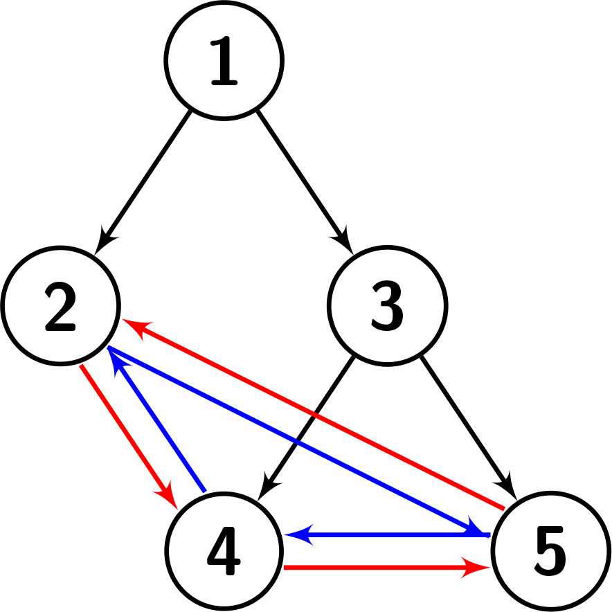
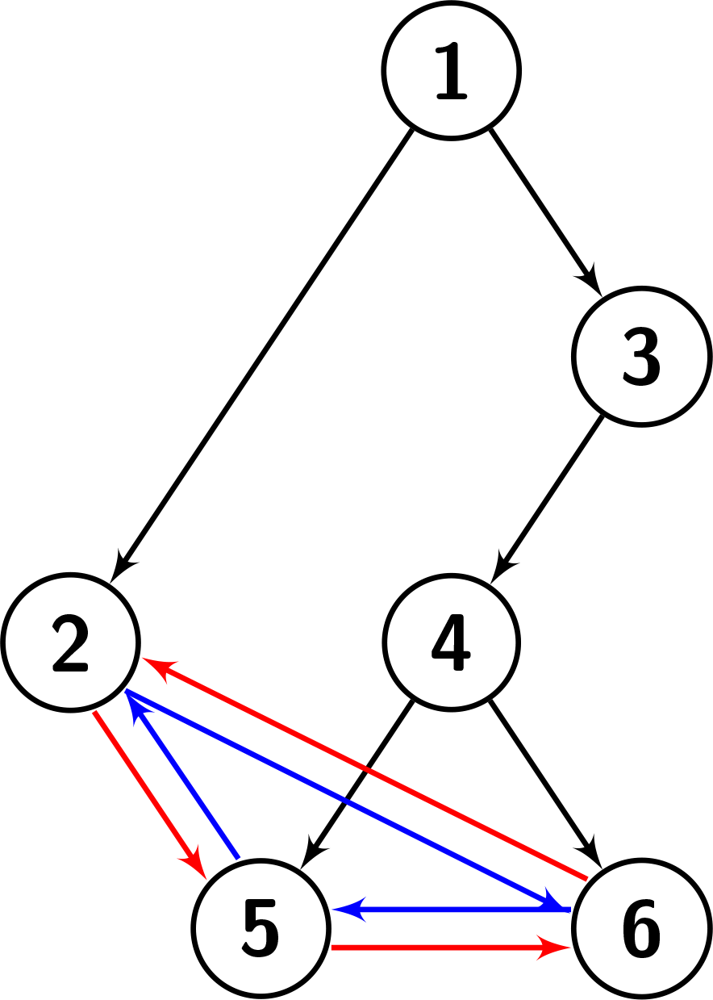

# 2773. Height of Special Binary Tree

## Problem

You are given `root`, the root of a **special binary tree** with `n` nodes.
The nodes are labeled from **1 to n**, and all values are unique.

Suppose the tree has `k` leaves in sorted order:

```
b1 < b2 < ... < bk
```

The leaves of the tree have a **special cyclic property**.

---

## Special Leaf Property

For every leaf `bi`:

### Right child

```
bi.right = bi + 1   if i < k
bi.right = b1       if i = k
```

### Left child

```
bi.left = bi - 1    if i > 1
bi.left = bk        if i = 1
```

So the leaves form a **circular doubly-linked structure**.

---

## Goal

Return the **height of the tree**.

### Height Definition

The height of a binary tree is:

```
the length of the longest path from the root to any node
```

---

# Example 1



### Input

```
root = [1,2,3,null,null,4,5]
```

### Output

```
2
```

### Explanation

The leaves are connected cyclically:

- Right edges connect leaves to the next leaf
- Left edges connect leaves to the previous leaf

The longest path from root to a node has length **2**.

---

# Example 2

### Input

```
root = [1,2]
```

### Output

```
1
```

### Explanation

Only one leaf exists, so it has no special left/right links.

The longest path from root to leaf has length **1**.

---

# Example 3



### Input

```
root = [1,2,3,null,null,4,null,5,6]
```

### Output

```
3
```

### Explanation

The cyclic leaf connections exist as defined.

The longest root-to-node path length is **3**.

---

# Constraints

```
n == number of nodes in the tree
2 ≤ n ≤ 10^4

1 ≤ node.val ≤ n
All node values are unique
```
