# 285. Inorder Successor in BST — Solution Approaches

## Overview

This is a very popular programming interview problem. There are multiple ways to solve it.

The **inorder successor** of a node is the node that appears **immediately after it in the inorder traversal** of the tree.

We will discuss two approaches:

1. A generic solution that works for **any binary tree**.
2. An optimized solution that **leverages BST properties**.

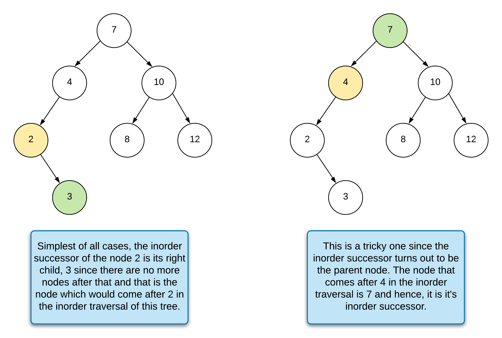

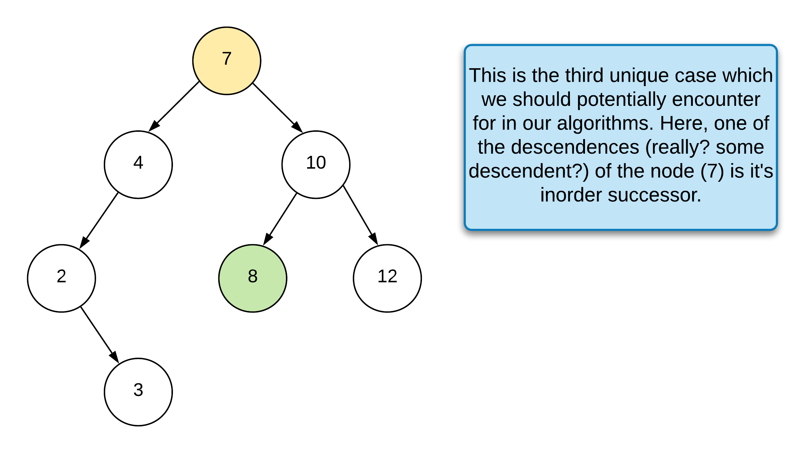

---

# Approach 1: Without Using BST Properties

## Intuition

This solution works for **any binary tree**, not specifically a BST.

We consider two cases when determining the inorder successor.

### Case 1 — Node Has a Right Child

If the node `p` has a right child:

The successor is the **leftmost node in the right subtree**.

Example:

```
p
 \
  right subtree
   \
    leftmost node → successor
```

If the right child has no left child, then the **right child itself is the successor**.

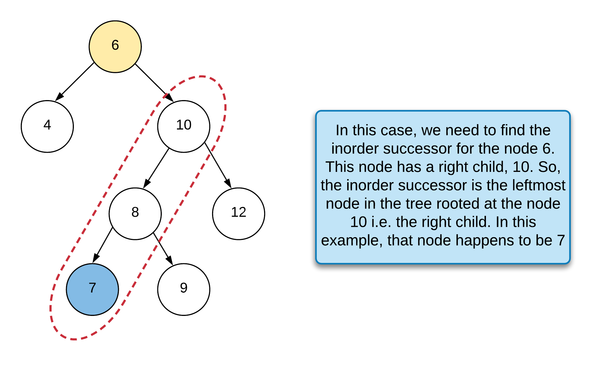

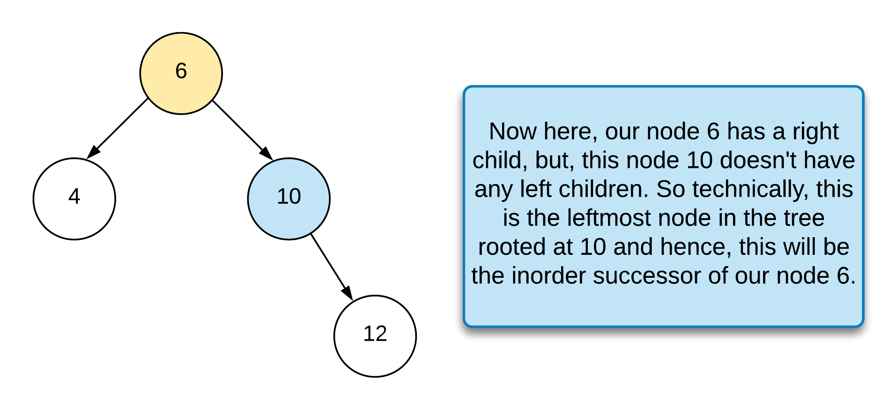

---

### Case 2 — Node Has No Right Child

In this case, the successor must be one of the **ancestors**.

To determine this:

1. Perform an **inorder traversal**.
2. Keep track of the **previous node**.
3. If `previous == p`, then the **current node is the successor**.

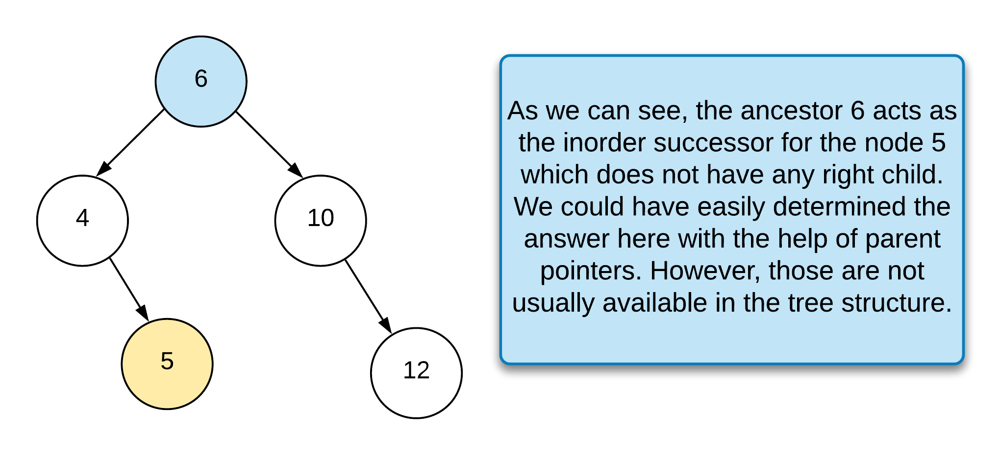

---

## Algorithm

1. Define two class variables:
   - `previous`
   - `inorderSuccessorNode`
2. If `p.right` exists:
   - Move to `p.right`
   - Keep moving left until reaching the leftmost node.
3. If `p.right` does not exist:
   - Perform inorder traversal.
   - Track the previous node.
   - If `previous == p`, record the current node as successor.
4. Return `inorderSuccessorNode`.

---

## Java Implementation

```java
class Solution {

    private TreeNode previous;
    private TreeNode inorderSuccessorNode;

    public TreeNode inorderSuccessor(TreeNode root, TreeNode p) {

        if (p.right != null) {

            TreeNode leftmost = p.right;

            while (leftmost.left != null) {
                leftmost = leftmost.left;
            }

            this.inorderSuccessorNode = leftmost;

        } else {

            this.inorderCase2(root, p);
        }

        return this.inorderSuccessorNode;
    }

    private void inorderCase2(TreeNode node, TreeNode p) {

        if (node == null) {
            return;
        }

        inorderCase2(node.left, p);

        if (this.previous == p && this.inorderSuccessorNode == null) {
            this.inorderSuccessorNode = node;
            return;
        }

        this.previous = node;

        inorderCase2(node.right, p);
    }
}
```

---

## Complexity Analysis

### Time Complexity

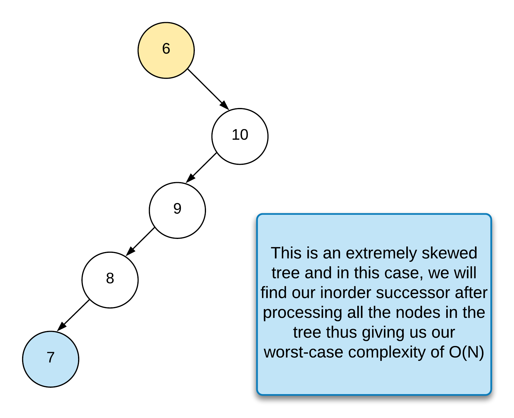

```
O(N)
```

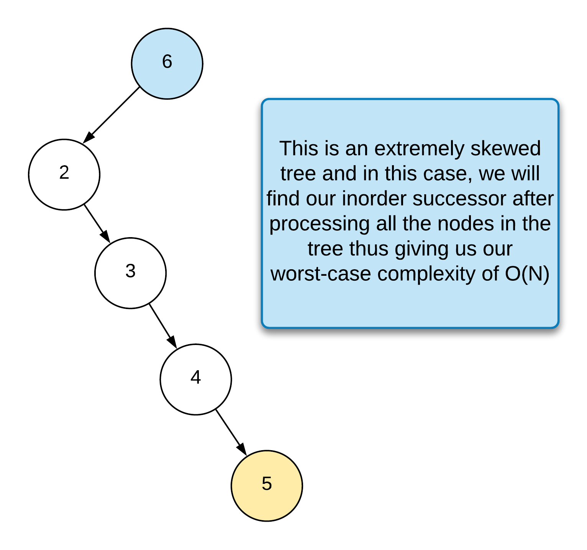

Worst case occurs when:

- Tree is skewed
- Entire tree must be traversed

---

### Space Complexity

```
O(N)
```

Due to recursion stack in skewed trees.

---

# Approach 2: Using BST Properties

## Intuition

This approach uses the **BST ordering property**:

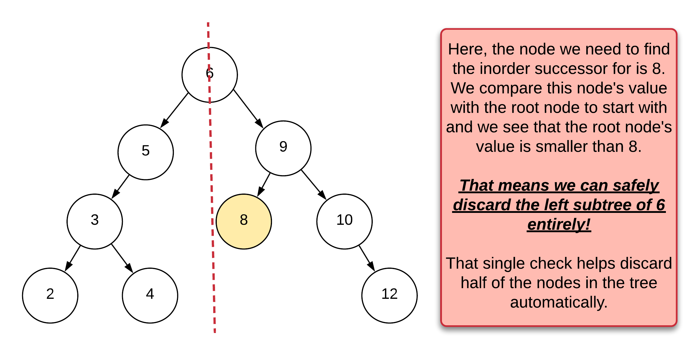

```
left subtree < node < right subtree
```

By comparing values with `p.val`, we can **discard half the tree at each step**.

---

## Key Observation

If:

```
p.val >= node.val
```

Then successor must be in the **right subtree**.

If:

```
p.val < node.val
```

Then:

- current node is a **potential successor**
- move to the **left subtree** to find a smaller candidate.

---

## Algorithm

1. Start from the root.
2. Maintain a variable `successor = null`.
3. While `root != null`:

   If `p.val >= root.val`
   - move right

   Else
   - update `successor = root`
   - move left

4. Return `successor`.

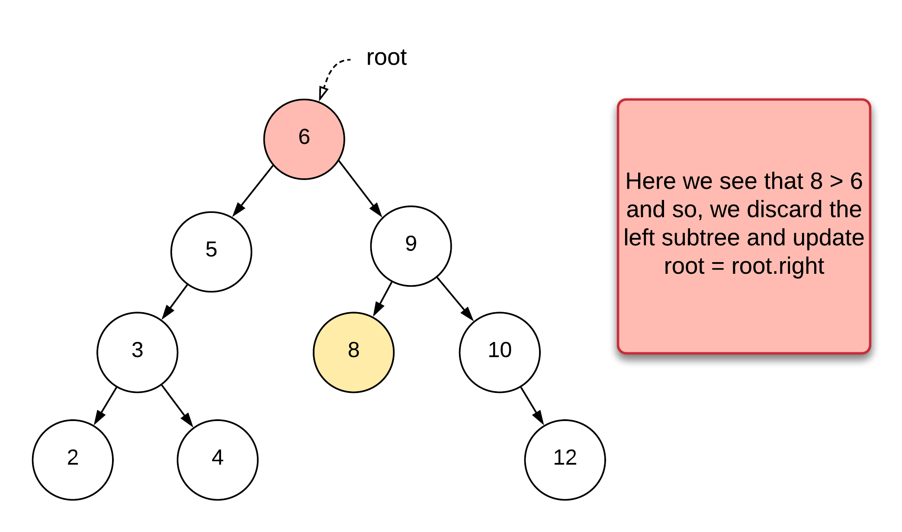

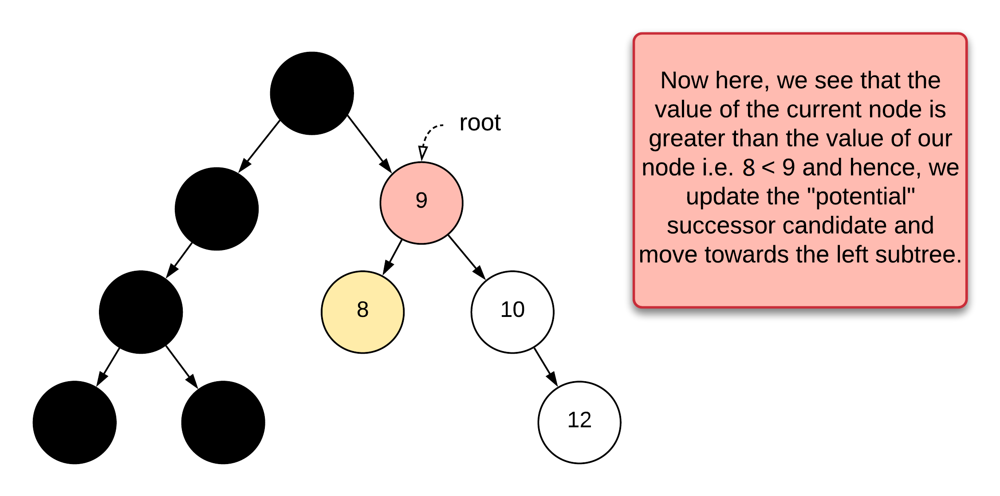

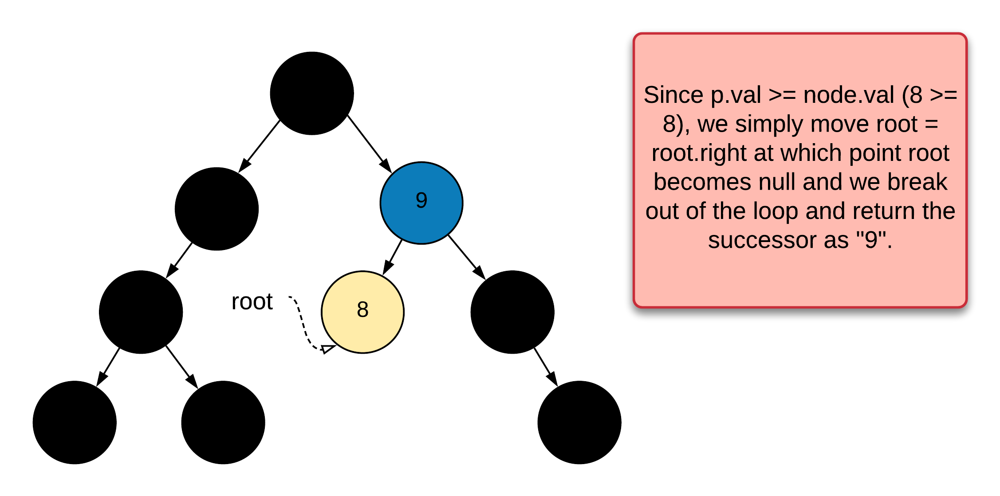

---

## Java Implementation

```java
class Solution {

    public TreeNode inorderSuccessor(TreeNode root, TreeNode p) {

        TreeNode successor = null;

        while (root != null) {

            if (p.val >= root.val) {
                root = root.right;
            } else {
                successor = root;
                root = root.left;
            }
        }

        return successor;
    }
}
```

---

## Complexity Analysis

### Time Complexity

Worst case:

```
O(N)
```

Balanced BST:

```
O(log N)
```

---

### Space Complexity

```
O(1)
```

No recursion or extra data structures are used.
