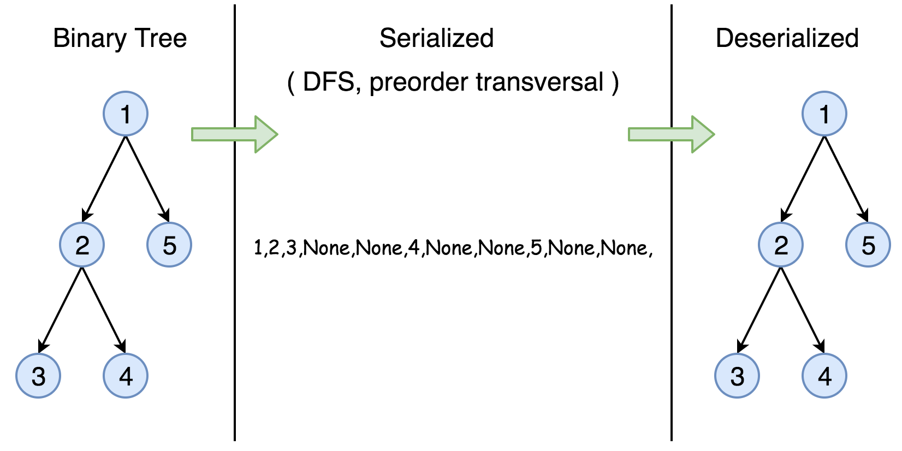

# Serialize and Deserialize Binary Tree — DFS Approach

## Approach 1: Depth First Search (DFS)



### Intuition

The serialization of a Binary Search Tree is essentially to encode:

- The **node values**
- The **tree structure**

To accomplish this, we can traverse the tree. Two general strategies exist:

### Breadth First Search (BFS)

- Traverses **level by level**
- Nodes at higher levels are visited before lower levels

### Depth First Search (DFS)

- Traverses **deep into a branch before backtracking**
- Variants:
  - Preorder
  - Inorder
  - Postorder

For serialization, **DFS preorder traversal** is very natural because the relationship between nodes is preserved in traversal order.

In this solution, we use **Preorder DFS**.

Traversal order:

```
root → left → right
```

---

# Algorithm

### TreeNode Definition

Assume the standard binary tree node definition:

```java
class TreeNode {
    int val;
    TreeNode left;
    TreeNode right;
}
```

---

## Serialization

During preorder traversal:

1. Visit the node
2. Record its value
3. Recursively serialize left subtree
4. Recursively serialize right subtree

To preserve the structure of the tree, we must also record **null nodes**.

Example serialization:

```
1,2,3,null,null,4,null,null,5,null,null
```

---

## Java Implementation — Serialization

```java
public class Codec {

  public String rserialize(TreeNode root, String str) {

    if (root == null) {
      str += "null,";
    } else {
      str += String.valueOf(root.val) + ",";
      str = rserialize(root.left, str);
      str = rserialize(root.right, str);
    }

    return str;
  }

  public String serialize(TreeNode root) {
    return rserialize(root, "");
  }
}
```

---

## Deserialization

To reconstruct the tree:

1. Split the serialized string into tokens.
2. Read values sequentially.
3. Recreate nodes recursively.

Whenever `"null"` is encountered, return `null`.

---

## Java Implementation — Deserialization

```java
public class Codec {

  public TreeNode rdeserialize(List<String> l) {

    if (l.get(0).equals("null")) {
      l.remove(0);
      return null;
    }

    TreeNode root = new TreeNode(Integer.valueOf(l.get(0)));
    l.remove(0);

    root.left = rdeserialize(l);
    root.right = rdeserialize(l);

    return root;
  }

  public TreeNode deserialize(String data) {

    String[] data_array = data.split(",");
    List<String> data_list = new LinkedList<>(Arrays.asList(data_array));

    return rdeserialize(data_list);
  }
}
```

---

# Complexity Analysis

## Time Complexity

```
O(N)
```

Both serialization and deserialization visit each node exactly once.

Where:

```
N = number of nodes in the tree
```

---

## Space Complexity

```
O(N)
```

Space is required for:

- Recursion stack
- Serialized string storage

---

# Further Space Optimization

The previous method stores:

- Node values → **N × V**
- Null markers → **2N**

Where `V` represents value size.

This is known as **natural serialization**.

However, the tree structure itself can be encoded more efficiently.

---

## Catalan Number Insight

The number of unique binary trees with `n` nodes is:

```
C(n)
```

Where `C(n)` is the **nth Catalan number**.

This means we could encode the structure using an index between:

```
0 ... C(n)-1
```

Which would require:

```
log₂(C(n))
```

bits.

---

## Catalan Growth Rate

Catalan numbers grow approximately as:

```
C(n) ≈ (4^n) / (n^(3/2) √π)
```

Therefore the theoretical minimum storage required for structure is approximately:

```
log(C(n)) ≈ 2n − (3/2)log(n) − (1/2)log(π)
```

This reduces the **tree structure storage from 2N to roughly log(N)**.

---

# Summary

| Method                        | Time        | Space   |
| ----------------------------- | ----------- | ------- |
| DFS Preorder Serialization    | O(N)        | O(N)    |
| Deserialization               | O(N)        | O(N)    |
| Optimized Structural Encoding | theoretical | ~log(N) |
