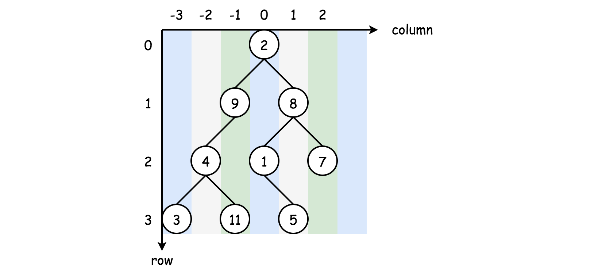
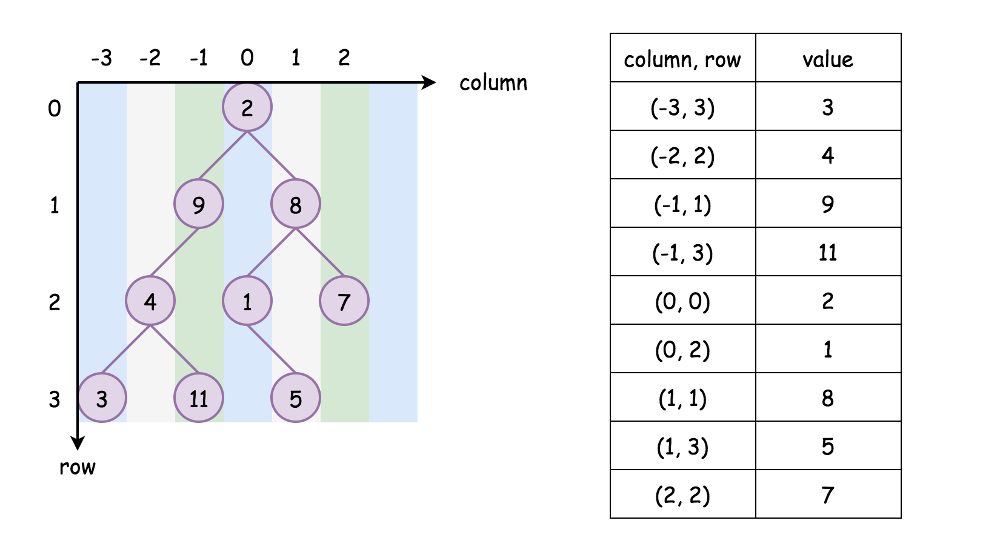

# 314. Binary Tree Vertical Order Traversal — Solutions

## Overview

This problem involves traversing a binary tree and grouping nodes by their **vertical columns**.

Common tree traversal strategies:

- **Breadth‑First Search (BFS)** — level-by-level traversal.
- **Depth‑First Search (DFS)** — explore depth first (preorder, inorder, postorder).

For vertical traversal, each node can be assigned **2‑dimensional coordinates**:



```
(column, row)
```

Rules:

- Root → `(0,0)`
- Left child → `(column - 1, row + 1)`
- Right child → `(column + 1, row + 1)`

Sorting order:

1. **Column first**
2. **Row second**
3. **Left → Right** for same row/column

---

# Approach 1: Breadth‑First Search (BFS)

## Intuition

BFS naturally processes nodes **row by row**, which preserves vertical ordering.

To group nodes by column:

- Use a **hash map**
- Key → column index
- Value → list of nodes in that column

Queue stores:

```
(node, column)
```

---

## Algorithm

1. Create a hashmap `columnTable`
2. Initialize queue with `(root, 0)`
3. Perform BFS traversal:
   - Extract `(node, column)`
   - Add node value to `columnTable[column]`
   - Push children:
     - `(node.left, column - 1)`
     - `(node.right, column + 1)`
4. Sort column keys
5. Return results column‑by‑column

---

## Java Implementation

```java
class Solution {
  public List<List<Integer>> verticalOrder(TreeNode root) {

    List<List<Integer>> output = new ArrayList();
    if (root == null) return output;

    Map<Integer, ArrayList> columnTable = new HashMap();
    Queue<Pair<TreeNode, Integer>> queue = new ArrayDeque();

    queue.offer(new Pair(root, 0));

    while (!queue.isEmpty()) {

      Pair<TreeNode, Integer> p = queue.poll();
      root = p.getKey();
      int column = p.getValue();

      if (root != null) {

        columnTable.putIfAbsent(column, new ArrayList<Integer>());
        columnTable.get(column).add(root.val);

        queue.offer(new Pair(root.left, column - 1));
        queue.offer(new Pair(root.right, column + 1));
      }
    }

    List<Integer> sortedKeys = new ArrayList<>(columnTable.keySet());
    Collections.sort(sortedKeys);

    for (int k : sortedKeys) {
      output.add(columnTable.get(k));
    }

    return output;
  }
}
```

---

## Complexity Analysis

### Time Complexity

```
O(N log N)
```

- BFS traversal → `O(N)`
- Sorting column keys → `O(N log N)`

### Space Complexity

```
O(N)
```

Used for:

- Hash map
- Queue
- Output storage

---

# Approach 2: BFS Without Sorting

## Intuition

Instead of sorting columns later, track the **column range** during traversal.

Maintain:

```
minColumn
maxColumn
```

Then iterate from `minColumn → maxColumn` to generate results.

---

## Algorithm

1. Perform BFS traversal
2. Track `minColumn` and `maxColumn`
3. Store nodes in `columnTable`
4. After traversal:
   - iterate columns from `minColumn` to `maxColumn`

---

## Java Implementation

```java
class Solution {

  public List<List<Integer>> verticalOrder(TreeNode root) {

    List<List<Integer>> output = new ArrayList();
    if (root == null) return output;

    Map<Integer, ArrayList> columnTable = new HashMap();
    Queue<Pair<TreeNode, Integer>> queue = new ArrayDeque();

    queue.offer(new Pair(root, 0));

    int minColumn = 0;
    int maxColumn = 0;

    while (!queue.isEmpty()) {

      Pair<TreeNode, Integer> p = queue.poll();
      root = p.getKey();
      int column = p.getValue();

      if (root != null) {

        columnTable.putIfAbsent(column, new ArrayList<Integer>());
        columnTable.get(column).add(root.val);

        minColumn = Math.min(minColumn, column);
        maxColumn = Math.max(maxColumn, column);

        queue.offer(new Pair(root.left, column - 1));
        queue.offer(new Pair(root.right, column + 1));
      }
    }

    for (int i = minColumn; i <= maxColumn; i++) {
      output.add(columnTable.get(i));
    }

    return output;
  }
}
```

---

## Complexity Analysis

### Time Complexity

```
O(N)
```

No sorting required.

### Space Complexity

```
O(N)
```

Same reasoning as BFS approach.

---

# Approach 3: Depth‑First Search (DFS)



## Intuition

DFS assigns coordinates to each node:

```
(column, row)
```

Store nodes as:

```
column → [(row, value)]
```

After traversal:

- Sort nodes **within each column by row**
- Output column by column

---

## Algorithm

1. Perform DFS traversal
2. Store `(row, value)` pairs per column
3. Track column range
4. Sort each column by row
5. Extract values in order

---

## Java Implementation

```java
class Solution {

  Map<Integer, ArrayList<Pair<Integer, Integer>>> columnTable = new HashMap();
  int minColumn = 0;
  int maxColumn = 0;

  private void DFS(TreeNode node, int row, int column) {

    if (node == null) return;

    columnTable.putIfAbsent(column, new ArrayList<>());

    columnTable.get(column).add(new Pair(row, node.val));

    minColumn = Math.min(minColumn, column);
    maxColumn = Math.max(maxColumn, column);

    DFS(node.left, row + 1, column - 1);
    DFS(node.right, row + 1, column + 1);
  }

  public List<List<Integer>> verticalOrder(TreeNode root) {

    List<List<Integer>> output = new ArrayList();
    if (root == null) return output;

    DFS(root, 0, 0);

    for (int i = minColumn; i <= maxColumn; i++) {

      Collections.sort(columnTable.get(i),
        (a,b) -> a.getKey() - b.getKey());

      List<Integer> column = new ArrayList();

      for (Pair<Integer,Integer> p : columnTable.get(i)) {
        column.add(p.getValue());
      }

      output.add(column);
    }

    return output;
  }
}
```

---

## Complexity Analysis

### Time Complexity

```
O(W × H log H)
```

Where:

- `W` = tree width
- `H` = tree height

Sorting nodes in each column dominates.

Worst case roughly:

```
O(N log N)
```

### Space Complexity

```
O(N)
```

Used for:

- Hash table
- Recursion stack
- Output
