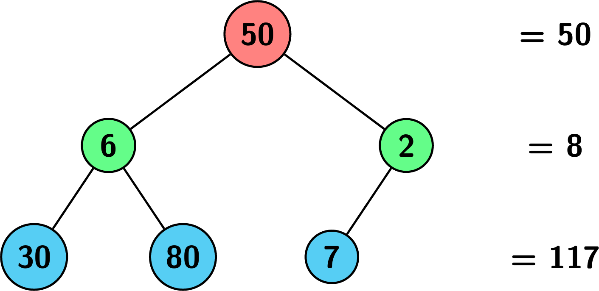
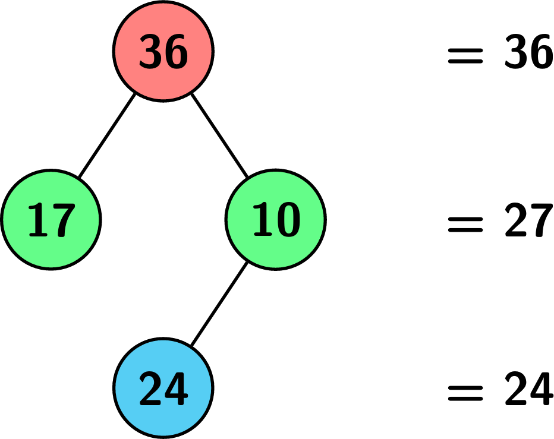
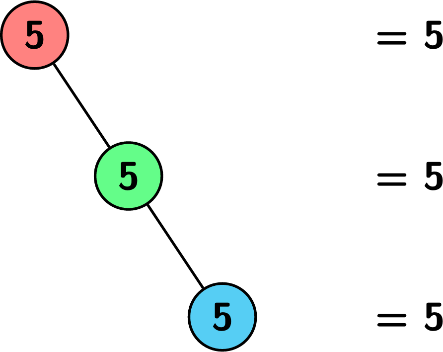

# Minimum Level Sum in a Binary Tree

## Problem

Given the root of a binary tree `root` where each node has a value, return the **level of the tree that has the minimum sum of values among all levels**.

If multiple levels have the same minimum sum, return the **lowest level number**.

---

## Level Definition

- The **root** is at **level 1**.
- The level of any other node is:

```
distance from root + 1
```

---

# Example 1



### Input

```
root = [50,6,2,30,80,7]
```

### Output

```
2
```

### Explanation

Tree levels:

```
Level 1 → 50
Level 2 → 6 + 2 = 8
Level 3 → 30 + 80 + 7 = 117
```

The **minimum sum** occurs at **level 2**.

---

# Example 2



### Input

```
root = [36,17,10,null,null,24]
```

### Output

```
3
```

### Explanation

Level sums:

```
Level 1 → 36
Level 2 → 17 + 10 = 27
Level 3 → 24
```

The smallest sum occurs at **level 3**.

---

# Example 3



### Input

```
root = [5,null,5,null,5]
```

### Output

```
1
```

### Explanation

Level sums:

```
Level 1 → 5
Level 2 → 5
Level 3 → 5
```

All levels have the same sum.

We return the **lowest level**, which is **1**.

---

# Constraints

```
1 ≤ number of nodes ≤ 10^5
1 ≤ Node.val ≤ 10^9
```
