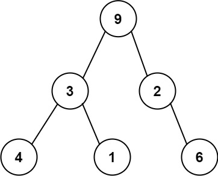

# 331. Verify Preorder Serialization of a Binary Tree

One way to serialize a binary tree is to use **preorder traversal**.



- When we encounter a **non-null node**, we record the node's value.
- If the node is **null**, we record a sentinel value such as `#`.

Example serialization:

```
9,3,4,#,#,1,#,#,2,#,6,#,#
```

Here `#` represents a **null node**.

---

## Problem

Given a string of comma-separated values `preorder`, return **true** if it is a correct preorder serialization of a binary tree.

### Important Notes

- Each value is either:
  - an integer
  - `#` representing a null pointer
- Input format is always valid.
- The string **will not contain invalid comma sequences** such as `"1,,3"`.
- **You are not allowed to reconstruct the tree.**

---

## Example 1

Input

```
preorder = "9,3,4,#,#,1,#,#,2,#,6,#,#"
```

Output

```
true
```

---

## Example 2

Input

```
preorder = "1,#"
```

Output

```
false
```

---

## Example 3

Input

```
preorder = "9,#,#,1"
```

Output

```
false
```

---

## Constraints

- `1 ≤ preorder.length ≤ 10^4`
- Values consist of:
  - integers in the range `[0, 100]`
  - `#`
- Elements are separated by commas `,`
