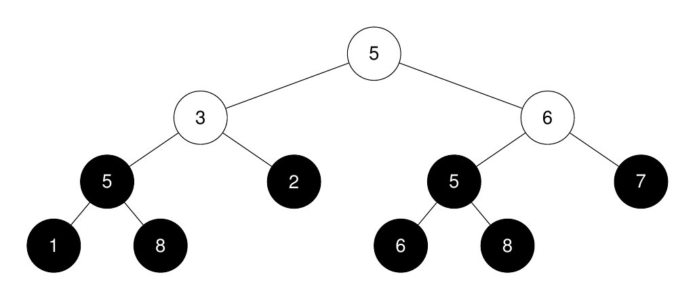
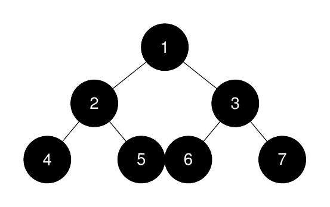
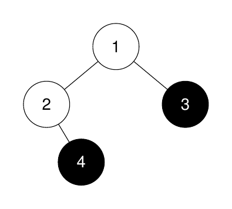

# 3319. K-th Largest Perfect Subtree Size in Binary Tree

## Problem

You are given the root of a binary tree and an integer `k`.

Return an integer denoting the **size of the k-th largest perfect binary subtree**, or **-1** if it does not exist.

A **perfect binary tree** is defined as a tree where:

- All leaves are on the **same level**
- Every parent has **exactly two children**

---

# Example 1



### Input

```
root = [5,3,6,5,2,5,7,1,8,null,null,6,8]
k = 2
```

### Output

```
3
```

### Explanation

The roots of the perfect binary subtrees are highlighted in black.

Their sizes in **non‑increasing order**:

```
[3, 3, 1, 1, 1, 1, 1, 1]
```

The **2nd largest** size is:

```
3
```

---

# Example 2



### Input

```
root = [1,2,3,4,5,6,7]
k = 1
```

### Output

```
7
```

### Explanation

Perfect subtree sizes:

```
[7, 3, 3, 1, 1, 1, 1]
```

The **largest** perfect subtree size is:

```
7
```

---

# Example 3



### Input

```
root = [1,2,3,null,4]
k = 3
```

### Output

```
-1
```

### Explanation

Perfect subtree sizes:

```
[1, 1]
```

There are fewer than **3 perfect subtrees**, so the result is:

```
-1
```

---

# Constraints

```
The number of nodes in the tree is in the range [1, 2000]
1 ≤ Node.val ≤ 2000
1 ≤ k ≤ 1024
```
