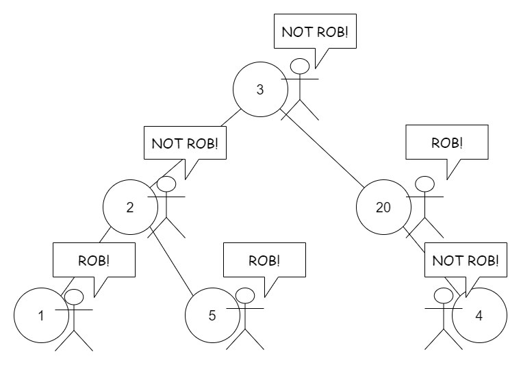
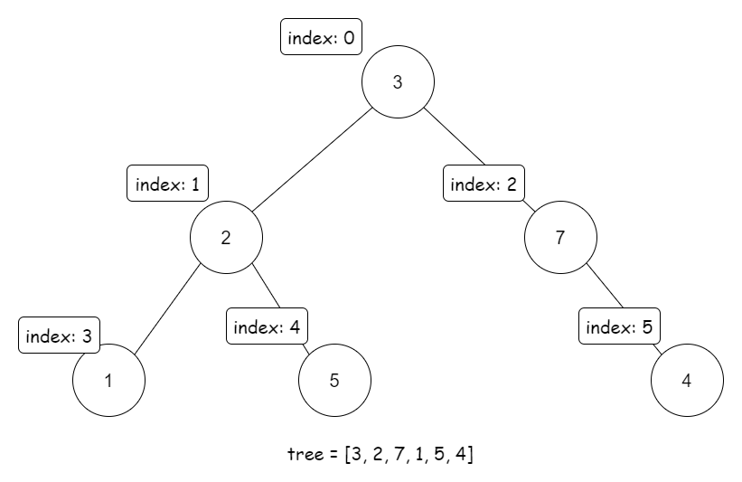
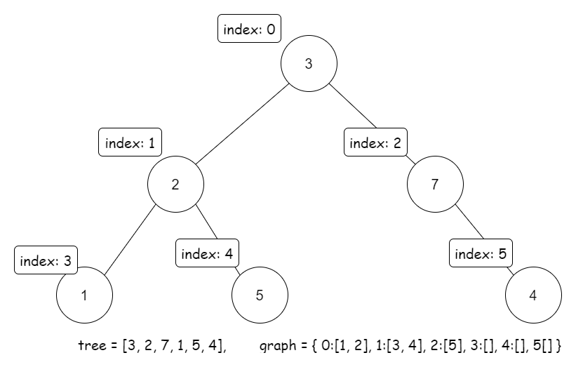

# 337. House Robber III — Detailed Approaches

## Overview

This problem is an extension of the classic **House Robber problem**, but instead of houses arranged in a line, the houses form a **binary tree**.

Rules:

- Each node represents a house.
- If two **directly connected houses** (parent and child) are robbed on the same night, the police are alerted.
- The goal is to **maximize the total amount of money robbed** without violating the constraint.

Because the structure is a **binary tree**, recursion and tree-based dynamic programming are natural strategies.

We discuss three approaches:

1. Recursion (Tree DP idea)
2. Recursion with Memoization
3. Dynamic Programming with explicit indexing



---

# Approach 1: Recursion

## Intuition

Binary trees are inherently recursive structures, so recursion fits naturally.

At each node we have **two choices**:

1. **Rob this node**
2. **Do not rob this node**

However:

- If we rob the current node, we **cannot rob its children**
- If we skip the current node, we are **free to rob its children**

To avoid recomputing the same states repeatedly, the recursive function returns **two values**:

```
[rob_current, not_rob_current]
```

Where:

- `rob_current` → maximum money if we rob this node
- `not_rob_current` → maximum money if we do NOT rob this node

---

## Algorithm

For each node:

```
left = helper(node.left)
right = helper(node.right)

rob = node.val + left[1] + right[1]

notRob = max(left[0], left[1]) + max(right[0], right[1])
```

Return:

```
[rob, notRob]
```

The final answer is:

```
max(result[0], result[1])
```

---

## Java Implementation

```java
class Solution {

    public int[] helper(TreeNode node) {

        if (node == null) {
            return new int[]{0,0};
        }

        int[] left = helper(node.left);
        int[] right = helper(node.right);

        int rob = node.val + left[1] + right[1];

        int notRob = Math.max(left[0], left[1])
                   + Math.max(right[0], right[1]);

        return new int[]{rob, notRob};
    }

    public int rob(TreeNode root) {

        int[] result = helper(root);

        return Math.max(result[0], result[1]);
    }
}
```

---

## Complexity

Time Complexity

```
O(N)
```

Each node is visited exactly once.

Space Complexity

```
O(N)
```

Recursion stack depth in the worst case.

---

# Approach 2: Recursion with Memoization

## Intuition

A naive recursive solution recalculates many states repeatedly.

We can avoid redundant calculations by **memoizing results**.

We maintain two maps:

```
robResult[node]
notRobResult[node]
```

Where:

- `robResult` → maximum if parent was robbed
- `notRobResult` → maximum if parent was not robbed

---

## Algorithm

Recursive function:

```
helper(node, parentRobbed)
```

If parent was robbed:

```
return helper(node.left,false) + helper(node.right,false)
```

Otherwise:

```
rob = node.val + helper(left,true) + helper(right,true)
notRob = helper(left,false) + helper(right,false)
```

Return:

```
max(rob, notRob)
```

Results are cached in maps.

---

## Java Implementation

```java
class Solution {

    HashMap<TreeNode,Integer> robResult = new HashMap<>();
    HashMap<TreeNode,Integer> notRobResult = new HashMap<>();

    public int helper(TreeNode node, boolean parentRobbed) {

        if (node == null) return 0;

        if (parentRobbed) {

            if (robResult.containsKey(node))
                return robResult.get(node);

            int result = helper(node.left,false)
                       + helper(node.right,false);

            robResult.put(node,result);

            return result;
        }
        else {

            if (notRobResult.containsKey(node))
                return notRobResult.get(node);

            int rob = node.val
                    + helper(node.left,true)
                    + helper(node.right,true);

            int notRob = helper(node.left,false)
                       + helper(node.right,false);

            int result = Math.max(rob,notRob);

            notRobResult.put(node,result);

            return result;
        }
    }

    public int rob(TreeNode root) {

        return helper(root,false);
    }
}
```

---

## Complexity

Time Complexity

```
O(N)
```

Each node state is computed once.

Space Complexity

```
O(N)
```

For memoization maps and recursion stack.

---

# Approach 3: Dynamic Programming

## Intuition

We can convert the tree into a **graph representation with indexed nodes**.

Then apply classical DP.

Define two arrays:

```
dp_rob[i]
dp_not_rob[i]
```

Where:

- `dp_rob[i]` → max money if node `i` is robbed
- `dp_not_rob[i]` → max money if node `i` is NOT robbed



---

## Transition Equations

If node `i` is robbed:

```
dp_rob[i] = value[i] + Σ dp_not_rob[child]
```

If node `i` is NOT robbed:

```
dp_not_rob[i] = Σ max(dp_rob[child], dp_not_rob[child])
```

The final answer:

```
max(dp_rob[0], dp_not_rob[0])
```



---

## Java Implementation

```java
class Solution {

    public int rob(TreeNode root) {

        if (root == null) return 0;

        ArrayList<Integer> tree = new ArrayList<>();
        HashMap<Integer,ArrayList<Integer>> graph = new HashMap<>();

        graph.put(-1,new ArrayList<>());

        int index = -1;

        Queue<TreeNode> qNode = new LinkedList<>();
        Queue<Integer> qIndex = new LinkedList<>();

        qNode.add(root);
        qIndex.add(index);

        while(qNode.size()>0){

            TreeNode node = qNode.poll();
            int parentIndex = qIndex.poll();

            if(node!=null){

                index++;

                tree.add(node.val);

                graph.put(index,new ArrayList<>());

                graph.get(parentIndex).add(index);

                qNode.add(node.left);
                qIndex.add(index);

                qNode.add(node.right);
                qIndex.add(index);
            }
        }

        int[] dpRob = new int[index+1];
        int[] dpNotRob = new int[index+1];

        for(int i=index;i>=0;i--){

            ArrayList<Integer> children = graph.get(i);

            if(children==null || children.size()==0){

                dpRob[i] = tree.get(i);
                dpNotRob[i] = 0;
            }
            else{

                dpRob[i] = tree.get(i);

                for(int child:children){

                    dpRob[i] += dpNotRob[child];

                    dpNotRob[i] += Math.max(dpRob[child],dpNotRob[child]);
                }
            }
        }

        return Math.max(dpRob[0],dpNotRob[0]);
    }
}
```

---

## Complexity

Time Complexity

```
O(N)
```

Each node is processed once.

Space Complexity

```
O(N)
```

For tree array, DP arrays, and graph representation.
