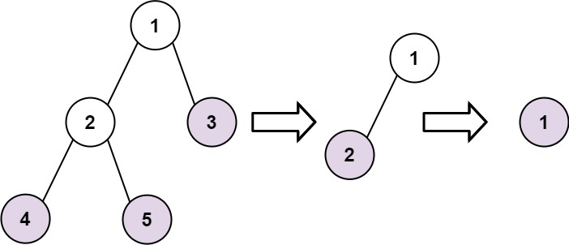

# 366. Find Leaves of Binary Tree

Given the root of a binary tree, collect the tree's nodes as if performing the following process repeatedly:

1. Collect all **leaf nodes**.
2. Remove all **leaf nodes** from the tree.
3. Repeat the process until the tree becomes empty.

---

## Example 1



```
root = [1,2,3,4,5]
```

Output

```
[[4,5,3],[2],[1]]
```

Explanation

Possible valid outputs include:

```
[[3,5,4],[2],[1]]
[[3,4,5],[2],[1]]
```

The order of nodes **within each level does not matter**.

---

## Example 2

Input

```
root = [1]
```

Output

```
[[1]]
```

---

## Constraints

```
1 ≤ number of nodes ≤ 100
-100 ≤ Node.val ≤ 100
```
