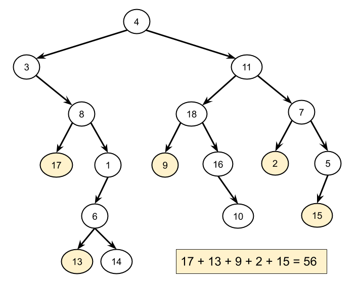
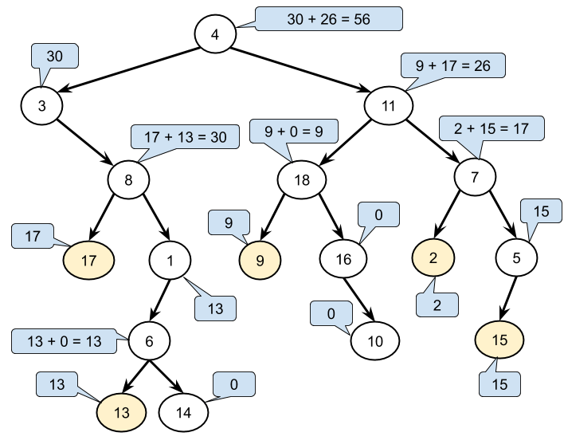

# 404. Sum of Left Leaves — Solutions

## Approach 1: Iterative Tree Traversal (Pre-order)

### Intuition



We must visit every node in the tree and identify **left leaf nodes**.

A **left leaf** is:

- A node that is a **left child**
- And has **no children**

To visit all nodes we can use **preorder traversal** (DFS) with a **stack**.

Instead of checking whether the current node is a left child (which requires access to the parent), we check:

> Whether the **left child of the current node** is a leaf.

---

### Algorithm

1. Push the root onto a stack.
2. While the stack is not empty:
   - Pop a node.
   - If its left child is a leaf → add its value to the sum.
   - Push right child to stack.
   - Push left child to stack.
3. Return the total sum.

---

### Java Implementation

```java
class Solution {

  private boolean isLeaf(TreeNode node) {
    return node != null && node.left == null && node.right == null;
  }

  public int sumOfLeftLeaves(TreeNode root) {

    if (root == null) return 0;

    int total = 0;
    Deque<TreeNode> stack = new ArrayDeque<>();
    stack.push(root);

    while (!stack.isEmpty()) {

      TreeNode node = stack.pop();

      if (isLeaf(node.left)) {
        total += node.left.val;
      }

      if (node.right != null) {
        stack.push(node.right);
      }

      if (node.left != null) {
        stack.push(node.left);
      }
    }

    return total;
  }
}
```

---

### Complexity

**Time Complexity**

```
O(N)
```

Each node is processed exactly once.

**Space Complexity**

```
O(N)
```

Worst-case stack size equals number of nodes.

---

# Approach 2: Recursive Tree Traversal (Pre-order)

### Intuition



Using recursion we treat every node as the root of a subtree.

We pass an extra boolean parameter:

```
isLeft
```

This indicates whether the current subtree is a **left child** of its parent.

If the node is a leaf:

```
return value if isLeft
else return 0
```

Otherwise recursively process children.

---

### Algorithm

```
processSubtree(node, isLeft):

    if node is null:
        return 0

    if node is leaf:
        if isLeft:
            return node.val
        else:
            return 0

    return processSubtree(node.left, true)
         + processSubtree(node.right, false)
```

---

### Java Implementation

```java
class Solution {

  public int sumOfLeftLeaves(TreeNode root) {
    return processSubtree(root, false);
  }

  private int processSubtree(TreeNode node, boolean isLeft) {

    if (node == null) return 0;

    if (node.left == null && node.right == null) {
      return isLeft ? node.val : 0;
    }

    return processSubtree(node.left, true)
         + processSubtree(node.right, false);
  }
}
```

---

### Complexity

**Time Complexity**

```
O(N)
```

Each node is visited once.

**Space Complexity**

```
O(N)
```

Worst-case recursion stack depth.

---

# Approach 3: Morris Tree Traversal (O(1) Space)

### Intuition

Morris Traversal performs tree traversal **without recursion or stack** by temporarily modifying the tree.

The algorithm:

1. Finds the **inorder predecessor** of the current node.
2. Creates temporary links to return to parent.
3. Removes the links after traversal.

This allows traversal using **constant extra space**.

We still detect left leaves by checking:

```
current.left is leaf
```

---

### Java Implementation

```java
class Solution {

  public int sumOfLeftLeaves(TreeNode root) {

    int total = 0;
    TreeNode current = root;

    while (current != null) {

      if (current.left == null) {
        current = current.right;
      }
      else {

        TreeNode prev = current.left;

        if (prev.left == null && prev.right == null) {
          total += prev.val;
        }

        while (prev.right != null && prev.right != current) {
          prev = prev.right;
        }

        if (prev.right == null) {
          prev.right = current;
          current = current.left;
        }
        else {
          prev.right = null;
          current = current.right;
        }
      }
    }

    return total;
  }
}
```

---

### Complexity

**Time Complexity**

```
O(N)
```

Each node is visited at most twice.

**Space Complexity**

```
O(1)
```

No recursion or auxiliary data structures.
