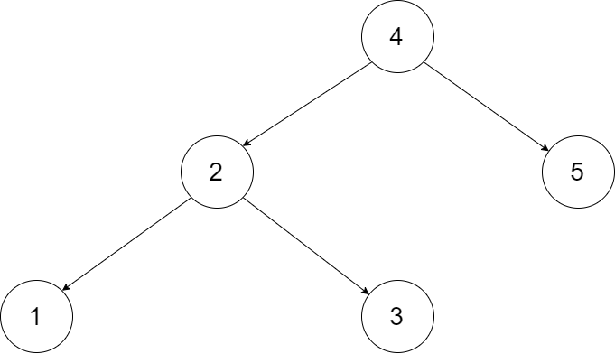
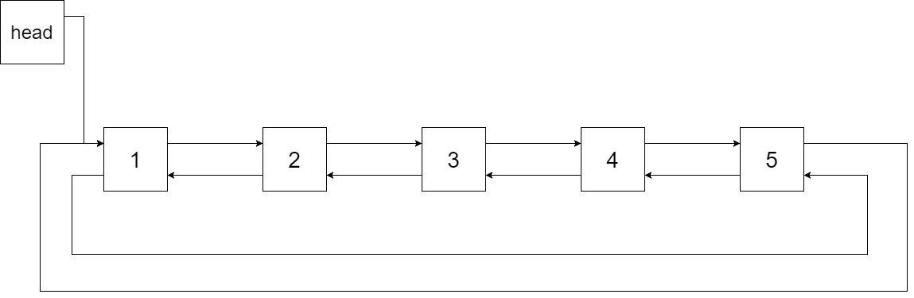
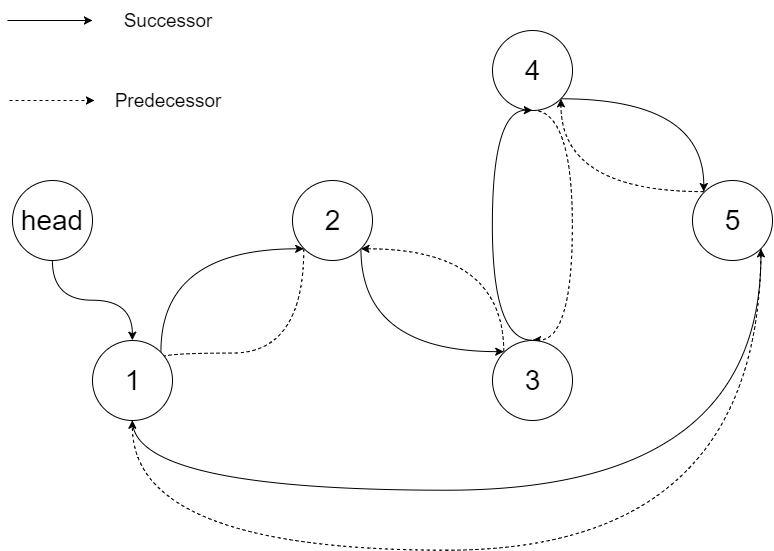

# 426. Convert Binary Search Tree to Sorted Doubly Linked List

Convert a **Binary Search Tree (BST)** to a **sorted circular doubly linked list** in place.

In this transformation:

- The **left pointer** of a node should act as the **predecessor** pointer.
- The **right pointer** should act as the **successor** pointer.

The resulting structure must be a **circular doubly linked list**, meaning:

- The **predecessor of the first node** is the **last node**
- The **successor of the last node** is the **first node**

You must perform the transformation **in-place**.

Finally, return the pointer to the **smallest element** of the linked list.

---

## Example 1



Input

```
root = [4,2,5,1,3]
```



Output

```
[1,2,3,4,5]
```

Explanation

The BST is transformed into a sorted circular doubly linked list.

- Solid arrows represent **successor relationships**
- Dashed arrows represent **predecessor relationships**



---

## Example 2

Input

```
root = [2,1,3]
```

Output

```
[1,2,3]
```

---

## Constraints

```
0 <= number of nodes <= 2000
-1000 <= Node.val <= 1000
All values in the tree are unique.
```
