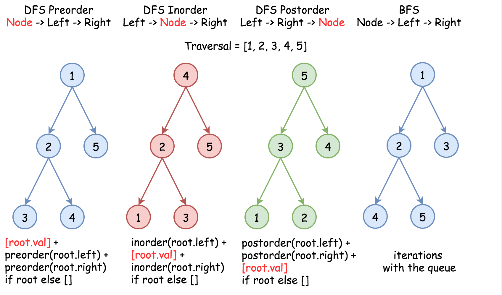
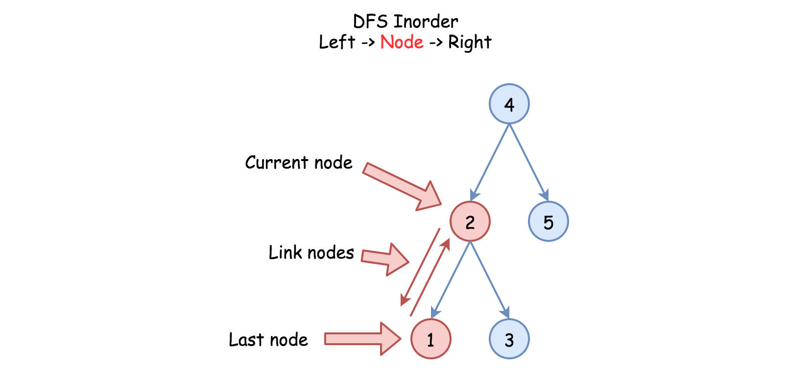

# Convert BST to Sorted Doubly Linked List — DFS Inorder Approach

## How to Traverse the Tree

There are two general strategies to traverse a tree.

### Depth First Search (DFS)

In this strategy, we prioritize depth. We start from the root and move all the way down to a leaf node before backtracking to explore other branches.

DFS can be categorized into three types depending on the order in which nodes are processed:

- **Preorder** → root → left → right
- **Inorder** → left → root → right
- **Postorder** → left → right → root

### Breadth First Search (BFS)

In this strategy, we traverse the tree **level by level** from top to bottom. Nodes on higher levels are visited before nodes on deeper levels.



---

## Problem Context

The task is to convert a **Binary Search Tree (BST)** into a **sorted circular doubly linked list** in place.

To preserve sorted order, we must use **inorder traversal**, because:

- Inorder traversal of a BST produces nodes in **sorted order**.

---

# Approach 1: Recursion

## Algorithm

Standard inorder recursion follows the order:

```
left → node → right
```

Where:

- **left** → recursive call on the left subtree
- **node** → process the current node
- **right** → recursive call on the right subtree



### Processing Logic

While traversing the tree:

- Maintain a pointer to the **previous node (`last`)**.
- Maintain a pointer to the **first node (`first`)**, which will become the head of the doubly linked list.

For each visited node:

1. Connect the previous node (`last`) with the current node.
2. Update `last` to the current node.
3. Continue traversal.

Finally, connect the **first and last nodes** to form a **circular doubly linked list**.

---

## Steps

1. Initialize:
   - `first = null`
   - `last = null`

2. Perform recursive **inorder traversal**.

3. During traversal:
   - Traverse the left subtree.
   - Link the previous node (`last`) with the current node.
   - Update `last`.
   - Traverse the right subtree.

4. After traversal:
   - Connect `first` and `last` to make the list circular.

---

## Implementation

```java
class Solution {

  // the smallest (first) and the largest (last) nodes
  Node first = null;
  Node last = null;

  public void helper(Node node) {
    if (node != null) {

      // left subtree
      helper(node.left);

      // process current node
      if (last != null) {
        last.right = node;
        node.left = last;
      } else {
        first = node;
      }

      last = node;

      // right subtree
      helper(node.right);
    }
  }

  public Node treeToDoublyList(Node root) {
    if (root == null) return null;

    helper(root);

    // close the circular doubly linked list
    last.right = first;
    first.left = last;

    return first;
  }
}
```

---

## Complexity Analysis

### Time Complexity

```
O(N)
```

Each node is processed exactly once during inorder traversal.

### Space Complexity

```
O(H)
```

Where **H** is the height of the tree.

- **Balanced tree** → `O(log N)`
- **Skewed tree** → `O(N)`

This space is used by the **recursion call stack**.
