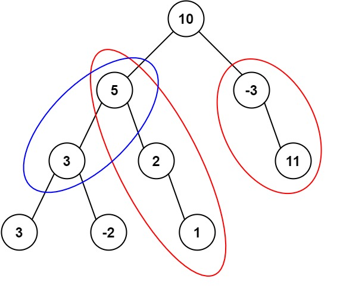

# 437. Path Sum III

Given the root of a binary tree and an integer **targetSum**, return the number of paths where the sum of the values along the path equals **targetSum**.

The path:

- **Does not need to start at the root**
- **Does not need to end at a leaf**
- **Must go downward** (from parent nodes to child nodes)

---

## Example 1



Input

```
root = [10,5,-3,3,2,null,11,3,-2,null,1]
targetSum = 8
```

Output

```
3
```

Explanation

The paths that sum to **8** are highlighted in the tree.

---

## Example 2

Input

```
root = [5,4,8,11,null,13,4,7,2,null,null,5,1]
targetSum = 22
```

Output

```
3
```

---

## Constraints

```
0 <= number of nodes <= 1000
-10^9 <= Node.val <= 10^9
-1000 <= targetSum <= 1000
```
