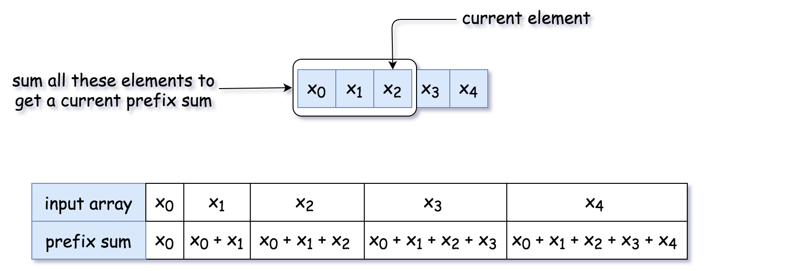
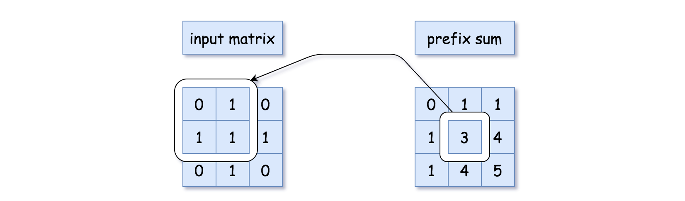
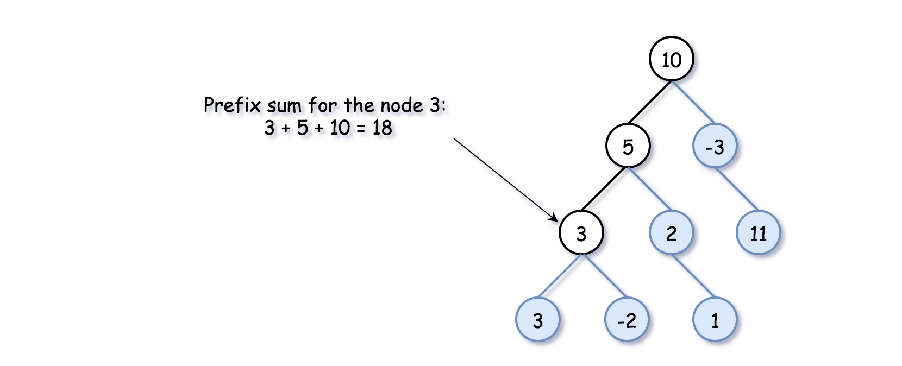

# Prefix Sum Technique and Path Sum III

## Prefix Sum: What Is It

A **prefix sum** is the cumulative sum of values from the beginning of a structure up to the current element.

Prefix sums can be applied to multiple data structures:



### 1D Arrays

The prefix sum is the sum of the current value and all previous values.

Example:

```
nums = [1, 2, 3, 4]

prefix sums:
[1, 3, 6, 10]
```



### 2D Arrays

The prefix sum represents the sum of elements above and to the left of a position.

### Binary Trees

The prefix sum represents the sum of the current node and all of its parent nodes along the path from the root.



---

# Using Prefix Sum

Prefix sums are useful for problems like:

- Number of subarrays with sum equal to target
- Number of submatrices with sum equal to target
- Number of tree paths with sum equal to target

Before applying the technique to trees, it helps to understand the array version.

---

# Example: Continuous Subarrays That Sum to Target

We track:

- `currSum` → current prefix sum
- `HashMap<prefixSum, frequency>` → how many times a prefix sum occurred

### Logic

While iterating through the array:

```
currSum += num
```

Two cases can produce a valid subarray.

---

## Case 1: Subarray Starts From Beginning

If:

```
currSum == target
```

Then the entire prefix is a valid subarray.

Increase counter by **1**.

---

## Case 2: Subarray Starts Somewhere in the Middle

If we previously saw:

```
currSum - target
```

then the elements between those two prefix sums equal the target.

```
count += hashmap[currSum - target]
```

Because:

```
currSum - (currSum - target) = target
```

---

# Java Implementation (Array Version)

```java
public class Solution {
    public int subarraySum(int[] nums, int k) {
        int count = 0, currSum = 0;
        HashMap<Integer, Integer> h = new HashMap();

        for (int num : nums) {

            currSum += num;

            if (currSum == k)
                count++;

            count += h.getOrDefault(currSum - k, 0);

            h.put(currSum, h.getOrDefault(currSum, 0) + 1);
        }

        return count;
    }
}
```

---

# Applying Prefix Sum to Binary Trees

The same logic can be reused for **Path Sum III** in binary trees.

However, trees introduce a complication:

Each node has **two directions** (left and right).

We must ensure prefix sums from one subtree do **not interfere with another subtree**.

This requires **backtracking** during recursion.

---

# Algorithm

1. Initialize

```
count = 0
HashMap<prefixSum, frequency>
```

2. Traverse the tree using **preorder traversal**

```
node → left → right
```

3. For each node:

```
currSum += node.val
```

4. Check two cases.

### Case 1: Path Starts From Root

```
if currSum == target
    count++
```

### Case 2: Path Starts Somewhere Below Root

```
count += hashmap[currSum - target]
```

5. Add current prefix sum to hashmap

```
hashmap[currSum]++
```

6. Traverse children

```
preorder(node.left)
preorder(node.right)
```

7. Remove prefix sum after finishing subtree

```
hashmap[currSum]--
```

This prevents mixing prefix sums across parallel branches.

---

# Java Implementation

```java
class Solution {

    int count = 0;
    int k;
    HashMap<Long, Integer> h = new HashMap();

    public void preorder(TreeNode node, long currSum) {

        if (node == null)
            return;

        currSum += node.val;

        if (currSum == k)
            count++;

        count += h.getOrDefault(currSum - k, 0);

        h.put(currSum, h.getOrDefault(currSum, 0) + 1);

        preorder(node.left, currSum);
        preorder(node.right, currSum);

        h.put(currSum, h.get(currSum) - 1);
    }

    public int pathSum(TreeNode root, int sum) {

        k = sum;

        preorder(root, 0L);

        return count;
    }
}
```

---

# Complexity Analysis

### Time Complexity

```
O(N)
```

Each node is visited exactly once during traversal.

### Space Complexity

```
O(N)
```

The hashmap may store prefix sums for each node along the current traversal path.
