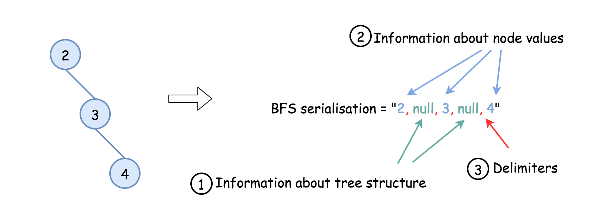
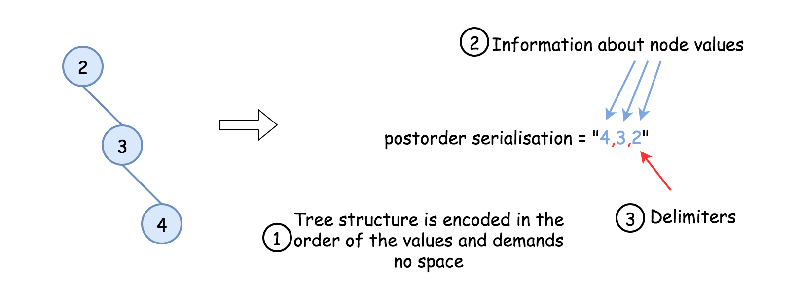

# Serialize and Deserialize BST — Compact Encoding Strategies

To serialize a binary tree efficiently, we must consider three aspects:

1. **Encoding the tree structure**
2. **Encoding the node values**
3. **Choosing delimiters to separate values**

These become the three axes of optimization when designing a compact serialization format.



---

# Approach 1: Postorder Traversal (Compact Tree Structure)

## Intuition

A **Binary Search Tree (BST)** can be reconstructed from **preorder or postorder traversal alone**.

This works because:

- A binary tree can be reconstructed from **(preorder/postorder + inorder)**.
- In a BST, the **inorder traversal is sorted**.
- Therefore:

```
inorder = sorted(preorder)
```

So the tree structure is implicitly encoded in preorder or postorder traversal.

Postorder is often preferred because it simplifies deserialization without requiring global variables.

---

## Algorithm

### Serialization

1. Perform **postorder traversal**:

```
left → right → node
```

2. Append each node value to a string.

3. Separate values with spaces.

---

### Deserialization

1. Read values into a stack-like structure.
2. Rebuild the BST using value bounds:

```
lower < node.val < upper
```

3. Process **right subtree first**, then **left subtree**, because we are reading values from the end of postorder.



---

## Java Implementation

```java
public class Codec {

    public StringBuilder postorder(TreeNode root, StringBuilder sb) {
        if (root == null)
            return sb;

        postorder(root.left, sb);
        postorder(root.right, sb);

        sb.append(root.val);
        sb.append(' ');

        return sb;
    }

    public String serialize(TreeNode root) {
        StringBuilder sb = postorder(root, new StringBuilder());

        if (sb.length() > 0)
            sb.deleteCharAt(sb.length() - 1);

        return sb.toString();
    }

    public TreeNode helper(Integer lower, Integer upper, ArrayDeque<Integer> nums) {

        if (nums.isEmpty())
            return null;

        int val = nums.getLast();

        if (val < lower || val > upper)
            return null;

        nums.removeLast();

        TreeNode root = new TreeNode(val);

        root.right = helper(val, upper, nums);
        root.left = helper(lower, val, nums);

        return root;
    }

    public TreeNode deserialize(String data) {

        if (data.isEmpty())
            return null;

        ArrayDeque<Integer> nums = new ArrayDeque<>();

        for (String s : data.split("\\\\s+"))
            nums.add(Integer.valueOf(s));

        return helper(Integer.MIN_VALUE, Integer.MAX_VALUE, nums);
    }
}
```

---

## Complexity Analysis

### Time Complexity

```
O(N)
```

Both serialization and deserialization visit each node once.

### Space Complexity

```
O(N)
```

We store N node values and delimiters.

---

# Approach 2: Encode Integers as 4‑Byte Strings

## Intuition

Approach 1 wastes space when node values are large.

Example:

```
[12345, null, 12346, null, 12347]
```

Serialized as:

```
"12347 12346 12345"
```

This consumes **15 bytes** for values.

But an integer requires only **4 bytes**, meaning we could store the values in **12 bytes**.

Therefore we encode each integer as a **4‑byte string**.

---

## Python Implementation

```python
class Codec:

    def postorder(self, root):
        return self.postorder(root.left) + self.postorder(root.right) + [root.val] if root else []

    def int_to_str(self, x):
        bytes = [chr(x >> (i * 8) & 0xff) for i in range(4)]
        bytes.reverse()
        return ''.join(bytes)

    def serialize(self, root):
        lst = self.postorder(root)
        lst = [self.int_to_str(x) for x in lst]
        return 'ç'.join(map(str, lst))

    def str_to_int(self, bytes_str):
        result = 0
        for ch in bytes_str:
            result = result * 256 + ord(ch)
        return result

    def deserialize(self, data):

        def helper(lower=float('-inf'), upper=float('inf')):
            if not data or data[-1] < lower or data[-1] > upper:
                return None

            val = data.pop()

            root = TreeNode(val)

            root.right = helper(val, upper)
            root.left = helper(lower, val)

            return root

        data = [self.str_to_int(x) for x in data.split('ç') if x]

        return helper()
```

---

# Approach 3: Remove Delimiters Completely

## Intuition

In Approach 2, we still used delimiters.

But if each integer always uses **exactly 4 bytes**, we can remove delimiters entirely.

We simply split the encoded string into **4‑byte chunks**.

This further reduces space usage.

---

## Java Implementation

```java
public class Codec {

    public void postorder(TreeNode root, StringBuilder sb) {
        if (root == null)
            return;

        postorder(root.left, sb);
        postorder(root.right, sb);

        sb.append(intToString(root.val));
    }

    public String intToString(int x) {

        char[] bytes = new char[4];

        for (int i = 3; i > -1; --i)
            bytes[3 - i] = (char) (x >> (i * 8) & 0xff);

        return new String(bytes);
    }

    public String serialize(TreeNode root) {

        StringBuilder sb = new StringBuilder();

        postorder(root, sb);

        return sb.toString();
    }

    public TreeNode helper(Integer lower, Integer upper, ArrayDeque<Integer> nums) {

        if (nums.isEmpty())
            return null;

        int val = nums.getLast();

        if (val < lower || val > upper)
            return null;

        nums.removeLast();

        TreeNode root = new TreeNode(val);

        root.right = helper(val, upper, nums);
        root.left = helper(lower, val, nums);

        return root;
    }

    public int stringToInt(String bytesStr) {

        int result = 0;

        for (char b : bytesStr.toCharArray())
            result = (result << 8) + (int) b;

        return result;
    }

    public TreeNode deserialize(String data) {

        ArrayDeque<Integer> nums = new ArrayDeque<>();

        int n = data.length();

        for (int i = 0; i < n / 4; ++i)
            nums.add(stringToInt(data.substring(4 * i, 4 * i + 4)));

        return helper(Integer.MIN_VALUE, Integer.MAX_VALUE, nums);
    }
}
```

---

# Complexity Analysis

### Time Complexity

```
O(N)
```

Both serialization and deserialization process each node exactly once.

### Space Complexity

```
O(N)
```

The encoded string contains exactly **4N bytes** for the node values, with no delimiters.
