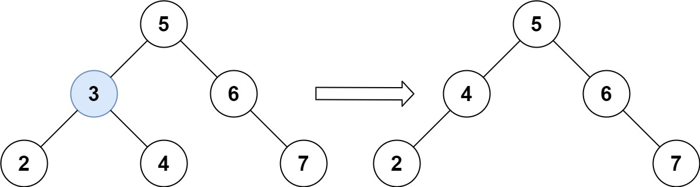
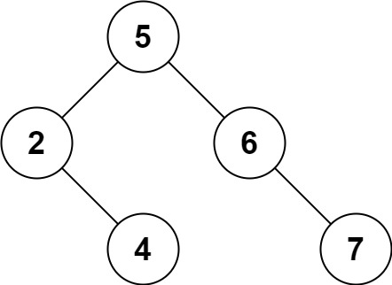

# 450. Delete Node in a BST

Given a root node reference of a **Binary Search Tree (BST)** and a **key**, delete the node with the given key in the BST.

Return the **root node reference** of the BST (which may be updated after deletion).

---

## Problem Breakdown

Deletion in a BST happens in **two stages**:

1. **Search for the node** that needs to be removed.
2. **Delete the node** while maintaining the BST properties.

---

## Example 1



**Input**

```
root = [5,3,6,2,4,null,7]
key = 3
```

**Output**

```
[5,4,6,2,null,null,7]
```

**Explanation**

The node with value **3** is found and removed.

One valid resulting BST is:

```
[5,4,6,2,null,null,7]
```

Another valid result is:

```
[5,2,6,null,4,null,7]
```

Both maintain the **BST property**, so both are acceptable.



---

## Example 2

**Input**

```
root = [5,3,6,2,4,null,7]
key = 0
```

**Output**

```
[5,3,6,2,4,null,7]
```

**Explanation**

The tree does **not contain the value 0**, so the tree remains unchanged.

---

## Example 3

**Input**

```
root = []
key = 0
```

**Output**

```
[]
```

---

## Constraints

```
0 <= number of nodes <= 10^4
-10^5 <= Node.val <= 10^5
Each node value is unique
root is a valid BST
-10^5 <= key <= 10^5
```

---

## Follow-Up

Can you solve the problem with time complexity:

```
O(height of the tree)
```
