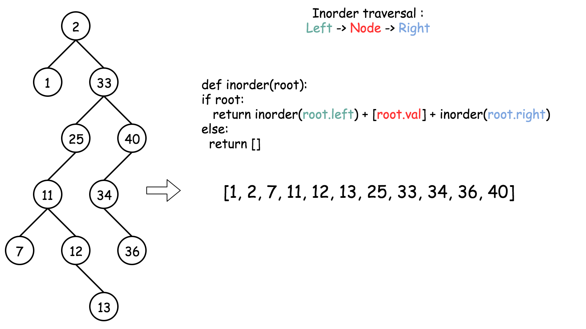
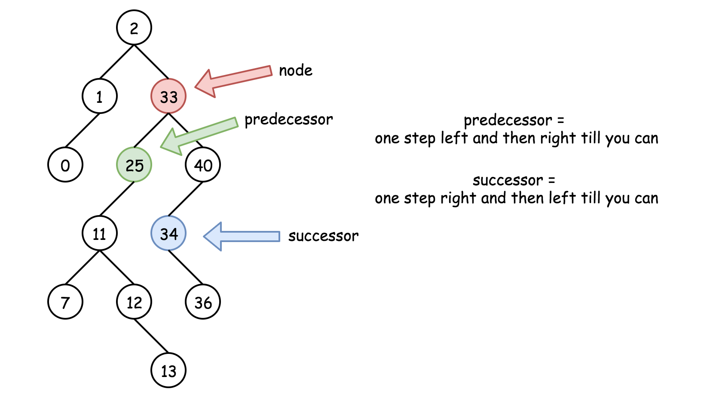
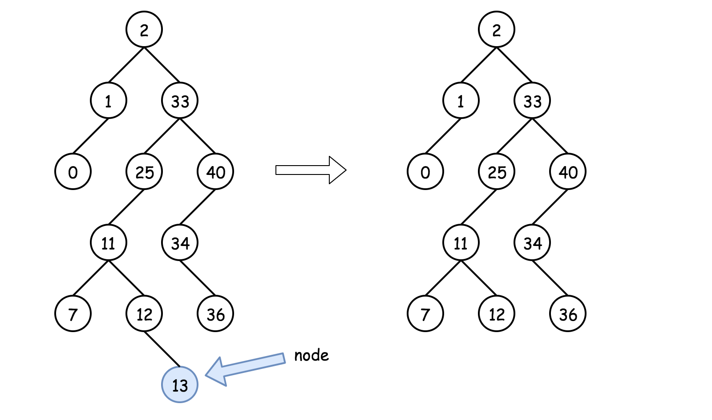
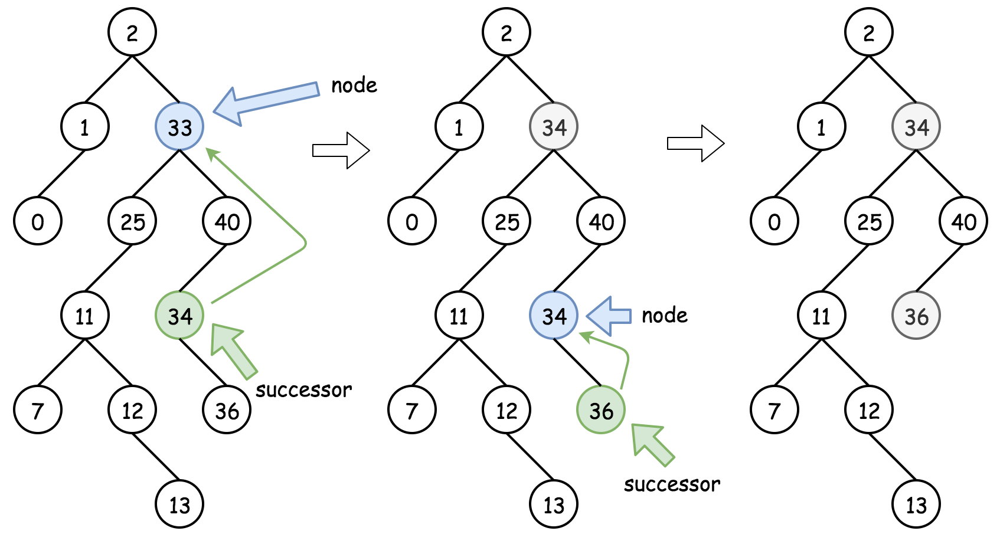
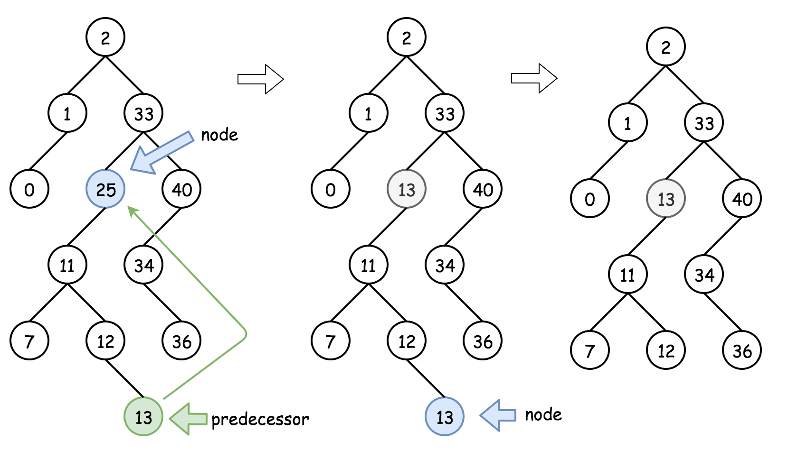
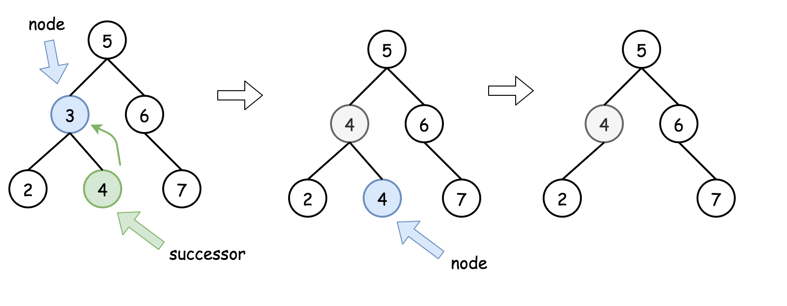

# Delete Node in a BST — Detailed Explanation

## Three Important Facts About BST

Before solving BST problems, these three facts are extremely useful.

---

### 1. Inorder Traversal of a BST Produces a Sorted Array

Inorder traversal follows:

```
Left → Node → Right
```

For a BST, this traversal always produces values in **ascending order**.

#### Example Code

```java
public LinkedList<Integer> inorder(TreeNode root, LinkedList<Integer> arr) {
  if (root == null) return arr;

  inorder(root.left, arr);
  arr.add(root.val);
  inorder(root.right, arr);

  return arr;
}
```



---

### 2. Successor

A **successor** is the **next node in sorted order**, meaning the **smallest node greater than the current node**.

In inorder traversal, it is the **next element**.

#### How to Find Successor

1. Move **one step right**
2. Then move **as far left as possible**

#### Code

```java
public TreeNode successor(TreeNode root) {
  root = root.right;

  while (root.left != null)
    root = root.left;

  return root;
}
```

---

### 3. Predecessor

A **predecessor** is the **previous node in sorted order**, meaning the **largest node smaller than the current node**.

In inorder traversal, it is the **previous element**.

#### How to Find Predecessor

1. Move **one step left**
2. Then move **as far right as possible**

#### Code

```java
public TreeNode predecessor(TreeNode root) {
  root = root.left;

  while (root.right != null)
    root = root.right;

  return root;
}
```



---

# Approach 1: Recursive Deletion

## Intuition

There are **three possible cases** when deleting a node from a BST.



---

### Case 1: Node is a Leaf

If the node has **no children**, it can be removed directly.

```
node = null
```


---

### Case 2: Node Has a Right Child

Replace the node with its **successor**.

Steps:

1. Find the successor.
2. Replace the node value with the successor value.
3. Recursively delete the successor from the right subtree.



---

### Case 3: Node Has No Right Child but Has a Left Child

Replace the node with its **predecessor**.

Steps:

1. Find the predecessor.
2. Replace the node value with the predecessor value.
3. Recursively delete the predecessor from the left subtree.



---

# Algorithm

1. If the key is **greater than root value**, search in the **right subtree**.

```
root.right = deleteNode(root.right, key)
```

2. If the key is **smaller than root value**, search in the **left subtree**.

```
root.left = deleteNode(root.left, key)
```

3. If the key equals the root value, the node must be deleted.

Handle three cases:

- **Leaf node** → remove it
- **Right child exists** → replace with successor
- **Only left child exists** → replace with predecessor

4. Return the updated root.



---

# Java Implementation

```java
class Solution {

  public int successor(TreeNode root) {
    root = root.right;

    while (root.left != null)
      root = root.left;

    return root.val;
  }

  public int predecessor(TreeNode root) {
    root = root.left;

    while (root.right != null)
      root = root.right;

    return root.val;
  }

  public TreeNode deleteNode(TreeNode root, int key) {

    if (root == null)
      return null;

    if (key > root.val)
      root.right = deleteNode(root.right, key);

    else if (key < root.val)
      root.left = deleteNode(root.left, key);

    else {

      if (root.left == null && root.right == null)
        root = null;

      else if (root.right != null) {

        root.val = successor(root);
        root.right = deleteNode(root.right, root.val);
      }

      else {

        root.val = predecessor(root);
        root.left = deleteNode(root.left, root.val);
      }
    }

    return root;
  }
}
```

---

# Complexity Analysis

### Time Complexity

```
O(H)
```

Where **H is the height of the tree**.

- Balanced BST → `O(log N)`
- Skewed BST → `O(N)`

The algorithm traverses the tree twice:

1. To find the node
2. To delete its successor/predecessor

---

### Space Complexity

```
O(H)
```

Used by the recursion stack.

- Balanced tree → `O(log N)`
- Worst case → `O(N)`
