# Find Mode in Binary Search Tree — Detailed Approaches

## Overview

This article presents multiple approaches to solving the **Find Mode in Binary Search Tree** problem.

The approaches vary in difficulty and implementation style:

- Some approaches differ in **time complexity**
- Others simply provide **different traversal strategies**
- Some exploit **BST properties**
- The final approach achieves **true O(1) space using Morris Traversal**

In interviews, usually only the first few approaches are expected.

We assume familiarity with:

- Binary tree representation
- Tree traversal techniques

---

# Approach 1: Count Frequency Using Hash Map (DFS)

## Intuition

This is the **most straightforward interview solution**.

Steps:

1. Traverse the tree using **DFS**
2. Count frequency of each value using a **HashMap**
3. Find the **maximum frequency**
4. Collect values whose frequency equals the maximum

Example frequencies:

| Value | Frequency |
| ----- | --------- |
| 4     | 2         |
| 7     | 1         |
| 8     | 2         |
| 10    | 1         |

Modes = **4 and 8**

---

## Algorithm

1. Initialize a hashmap `counter`
2. Perform DFS traversal
3. For each node increment `counter[node.val]`
4. Find `maxFreq`
5. Collect all values with frequency `maxFreq`

---

## Java Implementation

```java
class Solution {
    public int[] findMode(TreeNode root) {
        Map<Integer, Integer> counter = new HashMap();
        dfs(root, counter);
        int maxFreq = 0;

        for (int key : counter.keySet()) {
            maxFreq = Math.max(maxFreq, counter.get(key));
        }

        List<Integer> ans = new ArrayList();

        for (int key : counter.keySet()) {
            if (counter.get(key) == maxFreq) {
                ans.add(key);
            }
        }

        int[] result = new int[ans.size()];
        for (int i = 0; i < ans.size(); i++) {
            result[i] = ans.get(i);
        }

        return result;
    }

    public void dfs(TreeNode node, Map<Integer, Integer> counter) {
        if (node == null) return;

        counter.put(node.val, counter.getOrDefault(node.val, 0) + 1);

        dfs(node.left, counter);
        dfs(node.right, counter);
    }
}
```

### Complexity

Time: `O(n)`
Space: `O(n)`

---

# Approach 2: Iterative DFS

Instead of recursion, we use a **stack**.

Algorithm is identical except traversal is iterative.

```java
Stack<TreeNode> stack = new Stack();
stack.push(root);

while (!stack.empty()) {
    TreeNode node = stack.pop();
    counter.put(node.val, counter.getOrDefault(node.val, 0) + 1);

    if (node.left != null) stack.push(node.left);
    if (node.right != null) stack.push(node.right);
}
```

### Complexity

Time: `O(n)`
Space: `O(n)`

---

# Approach 3: Breadth First Search (BFS)

Instead of DFS we use **level order traversal** with a queue.

```java
Queue<TreeNode> queue = new LinkedList();
queue.add(root);

while (!queue.isEmpty()) {
    TreeNode node = queue.remove();

    counter.put(node.val, counter.getOrDefault(node.val, 0) + 1);

    if (node.left != null) queue.add(node.left);
    if (node.right != null) queue.add(node.right);
}
```

### Complexity

Time: `O(n)`
Space: `O(n)`

---

# Approach 4: No Hash Map (Use BST Property)

## Key Insight

Inorder traversal of a BST produces **sorted values**.

Example sorted output:

```
[1,1,2,2,2,3]
```

Duplicates appear **next to each other**.

We track:

- `currNum`
- `currStreak`
- `maxStreak`

If streak exceeds max → reset result list.

---

## Implementation

```java
class Solution {

    public int[] findMode(TreeNode root) {

        List<Integer> values = new ArrayList();
        dfs(root, values);

        int maxStreak = 0;
        int currStreak = 0;
        int currNum = 0;

        List<Integer> ans = new ArrayList();

        for (int num : values) {

            if (num == currNum) currStreak++;
            else {
                currStreak = 1;
                currNum = num;
            }

            if (currStreak > maxStreak) {
                ans = new ArrayList();
                maxStreak = currStreak;
            }

            if (currStreak == maxStreak) ans.add(num);
        }

        int[] result = new int[ans.size()];
        for (int i = 0; i < ans.size(); i++)
            result[i] = ans.get(i);

        return result;
    }

    public void dfs(TreeNode node, List<Integer> values) {
        if (node == null) return;

        dfs(node.left, values);
        values.add(node.val);
        dfs(node.right, values);
    }
}
```

### Complexity

Time: `O(n)`
Space: `O(n)`

---

# Approach 5: No Values Array

We apply the **same logic during inorder traversal** instead of storing values first.

Global variables track streaks.

```java
dfs(node.left)

process node.val

dfs(node.right)
```

### Complexity

Time: `O(n)`
Space: `O(h)` recursion stack

---

# Approach 6: True Constant Space (Morris Traversal)

This is an **advanced approach**.

Morris traversal allows inorder traversal **without recursion or stack**.

Idea:

- Find **inorder predecessor ("friend")**
- Temporarily link it to the current node
- Use that link to return after finishing left subtree

This allows traversal with **O(1) extra space**.

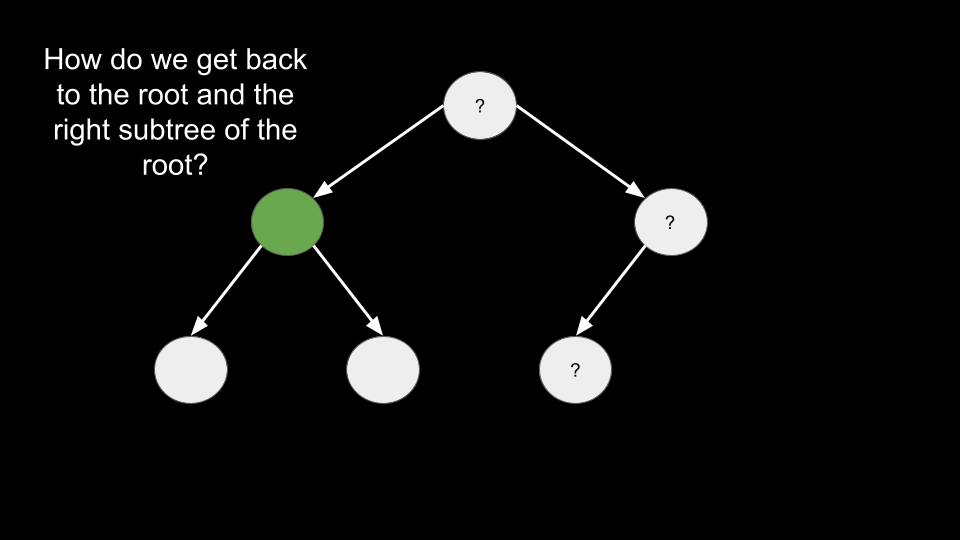

---

## Key Idea

For each node:

1. If `left == null` → process node
2. Otherwise find predecessor
3. Create temporary link
4. Traverse left subtree
5. Remove link when returning

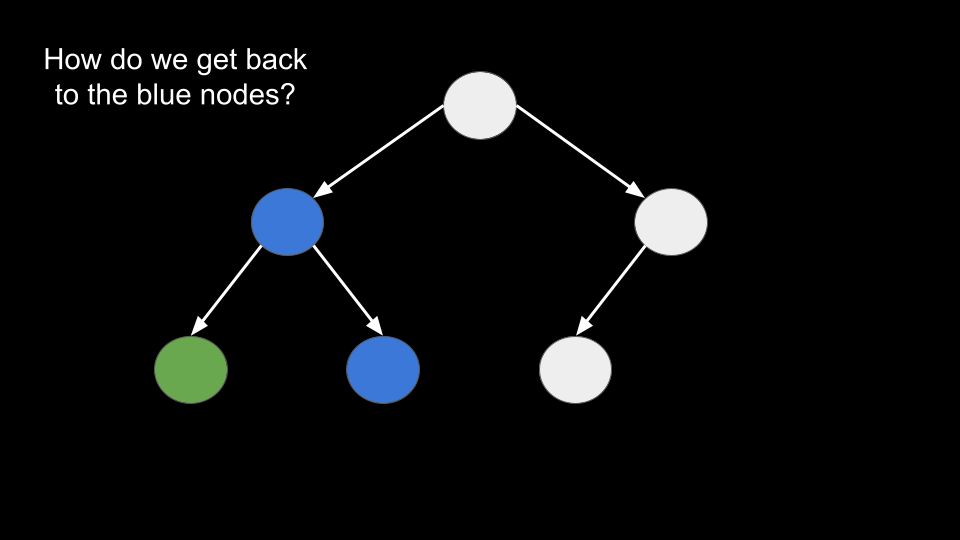

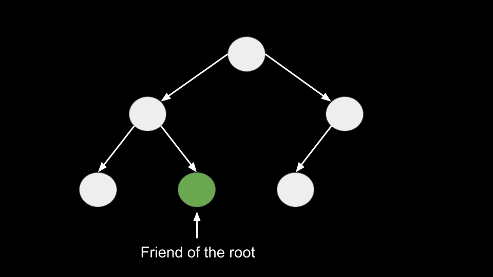

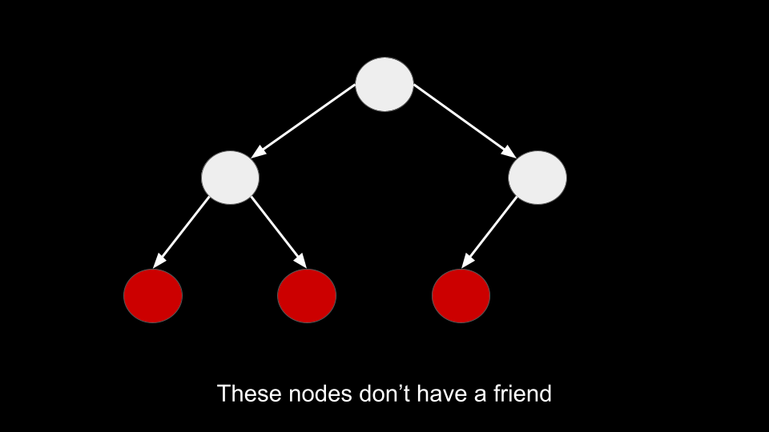

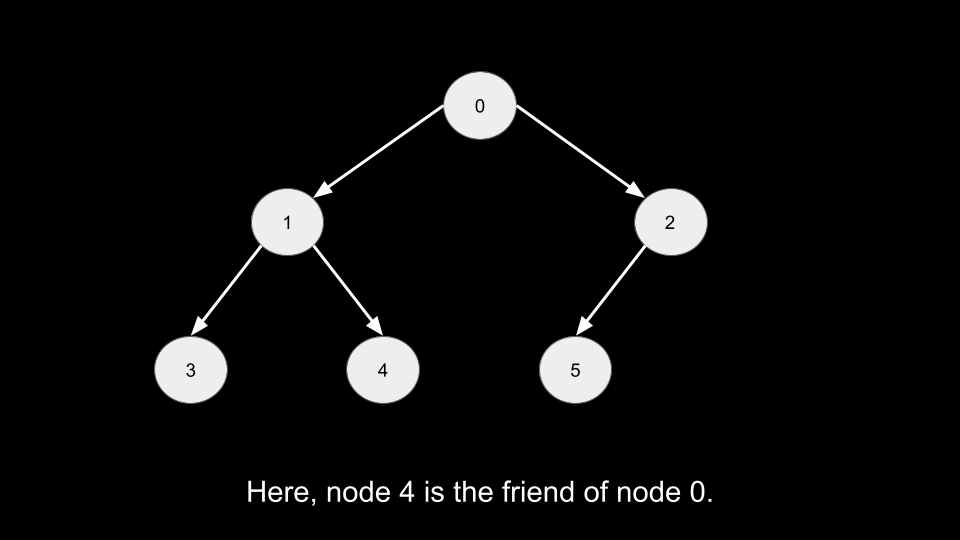

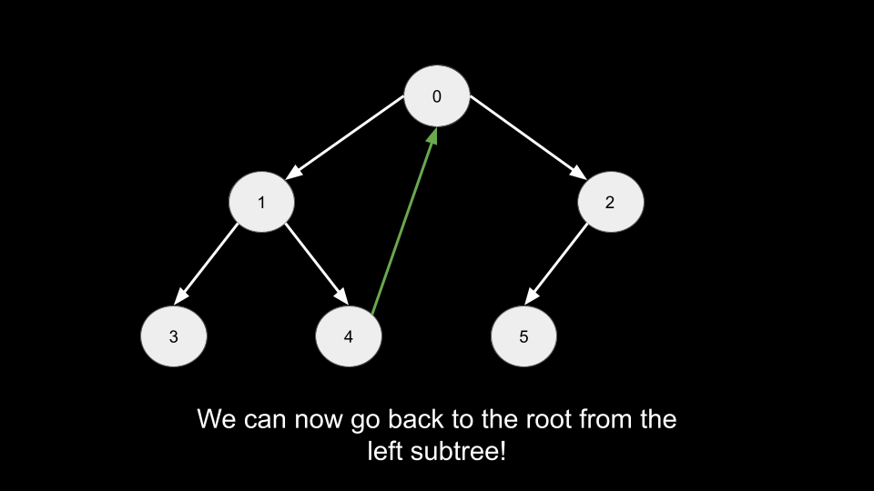

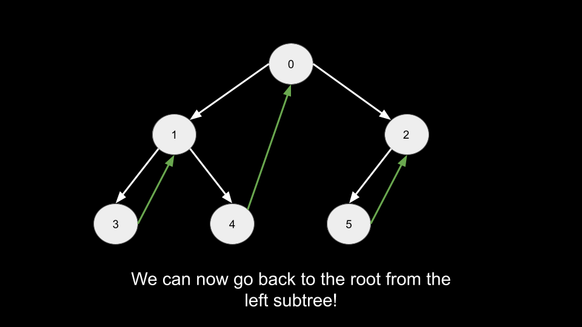

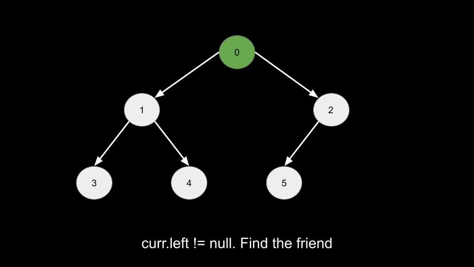

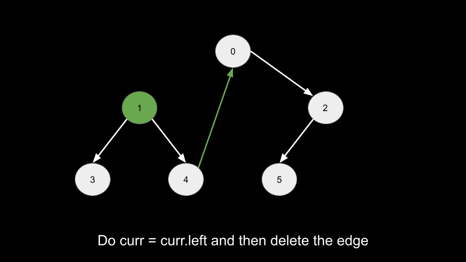

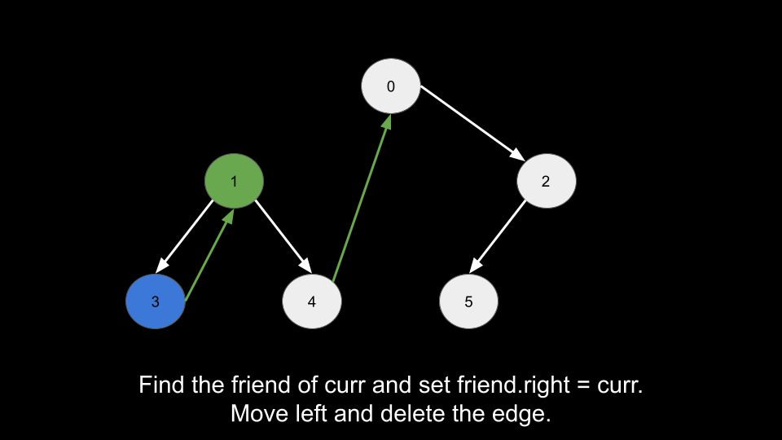

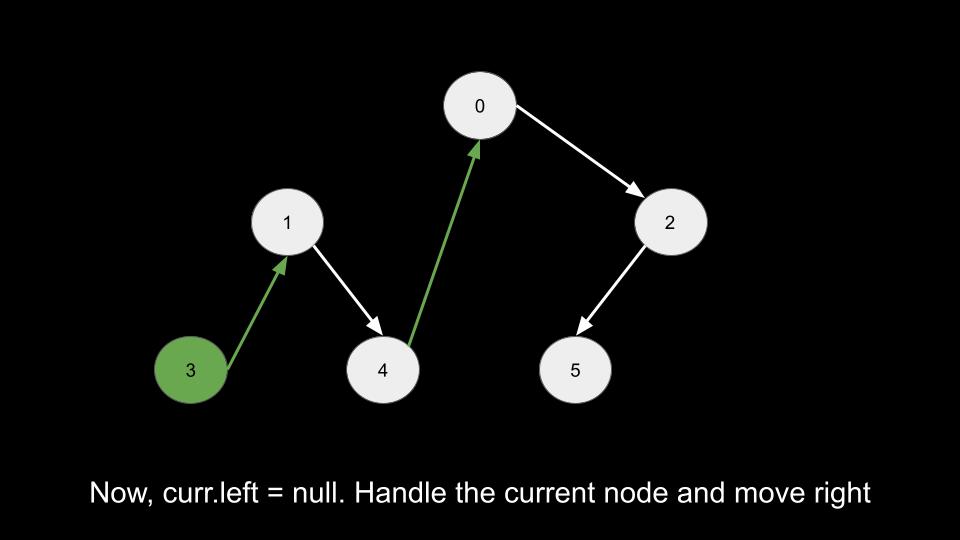

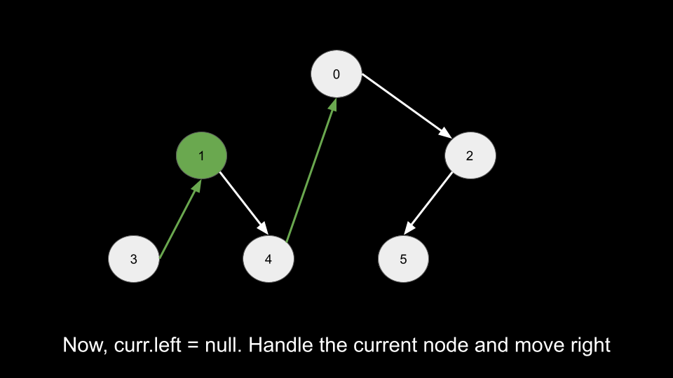

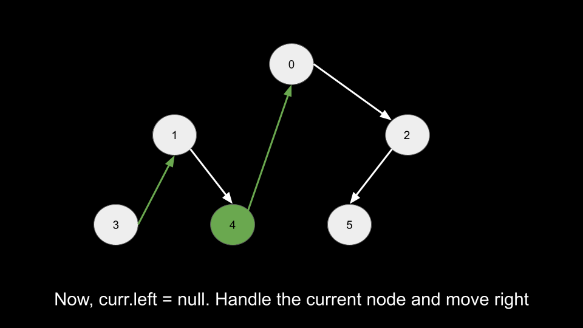

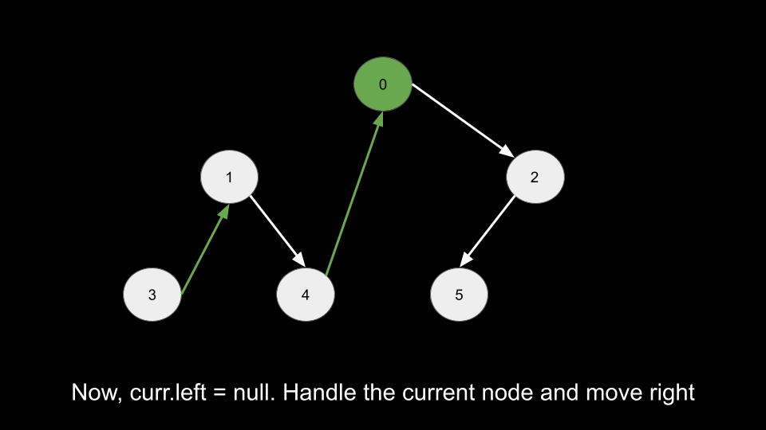

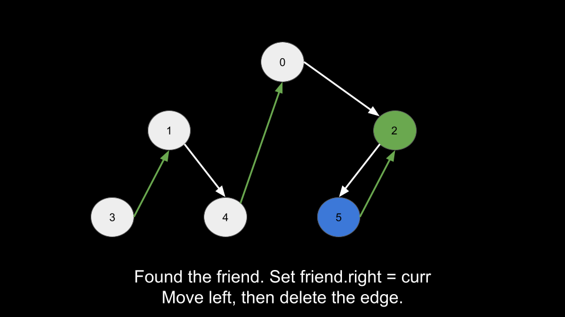

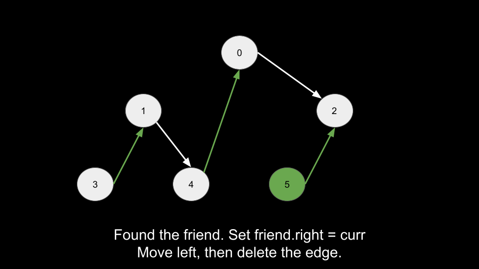

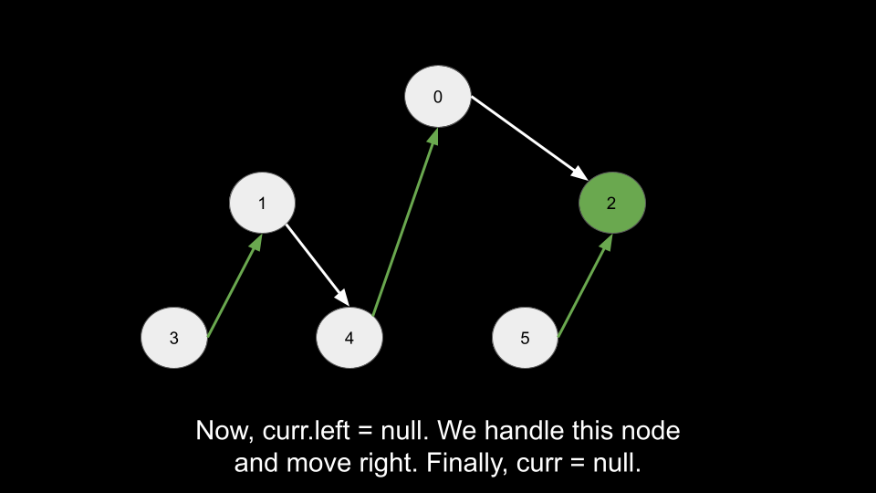

---

### Complexity

Time: `O(n)`
Space: `O(1)`

Note: This modifies the tree temporarily.

---

# Summary

| Approach          | Technique             | Time | Space |
| ----------------- | --------------------- | ---- | ----- |
| HashMap DFS       | Frequency counting    | O(n) | O(n)  |
| Iterative DFS     | Stack traversal       | O(n) | O(n)  |
| BFS               | Level order traversal | O(n) | O(n)  |
| BST property      | Inorder + streak      | O(n) | O(n)  |
| Optimized inorder | No values array       | O(n) | O(h)  |
| Morris traversal  | Threaded tree         | O(n) | O(1)  |
