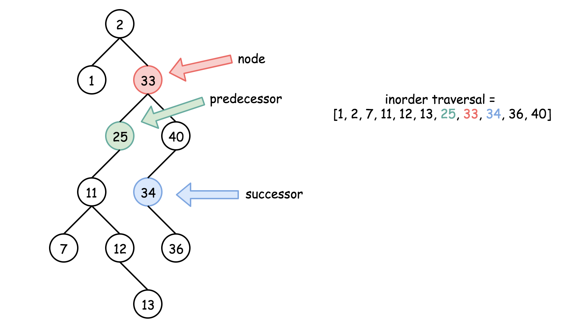
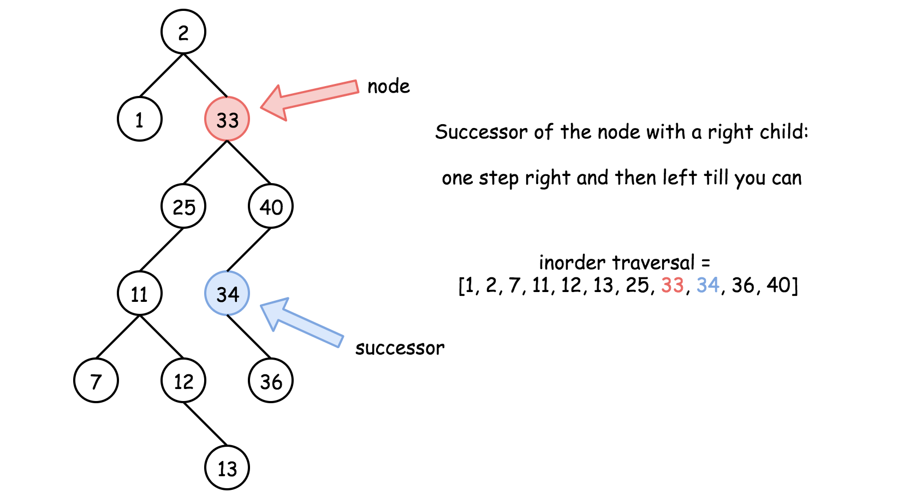
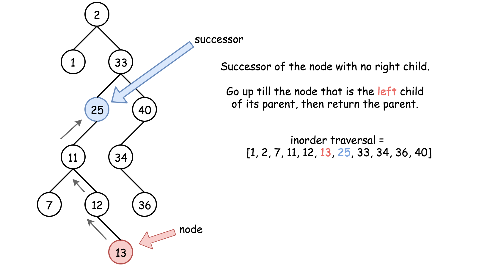
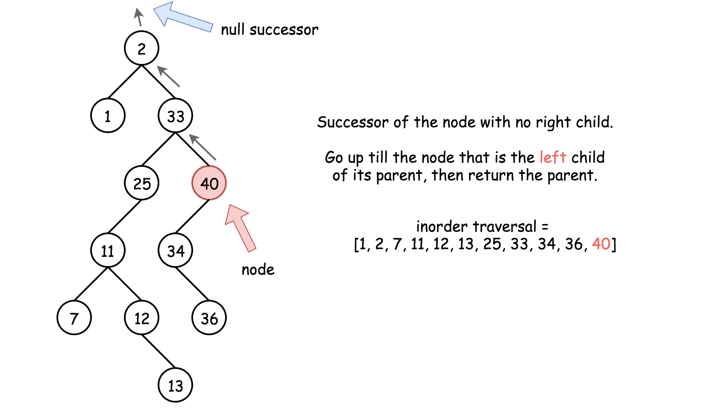

# Inorder Successor in BST II — Successor and Predecessor

## Definitions

### Successor

The **successor** of a node is the **next node in the inorder traversal**.

It is also defined as:

> The **smallest node whose value is greater than the current node's value**.

---

### Predecessor

The **predecessor** of a node is the **previous node in the inorder traversal**.

It is also defined as:

> The **largest node whose value is smaller than the current node's value**.



---

# Approach 1: Iteration

## Intuition

There are **two possible cases** when finding the inorder successor of a node.

---

### Case 1: Node has a Right Child

If the node has a **right child**, then the successor lies **somewhere in the right subtree**.

To find it:

1. Move **one step to the right child**
2. Then go **as far left as possible**

The node you reach is the **successor**.



---

### Case 2: Node Has No Right Child

If the node **does not have a right child**, the successor lies **somewhere above the node** in the tree.

To find it:

1. Move **up using parent pointers**
2. Continue until the current node becomes the **left child of its parent**
3. The **parent** will be the successor

If no such parent exists, then:

```
Successor = null
```

Meaning the node is the **largest node in the tree**.





---

# Algorithm

### Case 1: Right Subtree Exists

1. Move to `node.right`
2. While `node.left` exists:
   - Move to `node.left`
3. Return this node

### Case 2: No Right Subtree

1. Move upward using `parent` pointers
2. Continue until:

```
node == parent.left
```

3. Return `parent`

---

# Implementation

```java
class Solution {

  public Node inorderSuccessor(Node x) {

    // Case 1: successor is in the right subtree
    if (x.right != null) {

      x = x.right;

      while (x.left != null) {
        x = x.left;
      }

      return x;
    }

    // Case 2: successor is somewhere above
    while (x.parent != null && x == x.parent.right) {
      x = x.parent;
    }

    return x.parent;
  }
}
```

---

# Complexity Analysis

### Time Complexity

```
O(H)
```

Where **H = height of the tree**.

- Average case (balanced tree):

```
O(log N)
```

- Worst case (skewed tree):

```
O(N)
```

---

### Space Complexity

```
O(1)
```

No extra space is used.
Only pointers are moved during the traversal.
