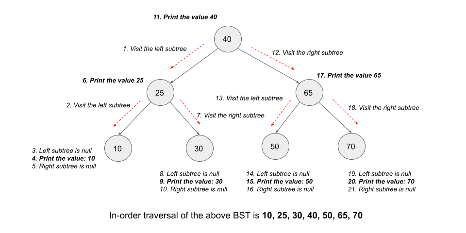

# 530. Minimum Absolute Difference in BST

## Overview

We are given the root of a **Binary Search Tree (BST)**.

Our task is to return the **minimum absolute difference** between the values of any two different nodes in the tree.

---

# Core Observation

The most important property of a BST is:

- all values in the left subtree are smaller than the current node
- all values in the right subtree are greater than the current node

Because of this, an **in-order traversal** of a BST visits the node values in **sorted order**.

That means this tree problem can be reduced to a much simpler array problem:

> If we had all node values in sorted order, the minimum absolute difference would always occur between two consecutive values.

This is the central idea behind the efficient solutions.

---

# Why Consecutive Sorted Values Are Enough

Suppose we have a sorted array:

```text
a[0] <= a[1] <= a[2] <= ... <= a[n-1]
```

If we want the minimum difference between any two values, we do **not** need to check every pair.

Why?

Because for any two elements `a[i]` and `a[j]` with `i < j`:

```text
a[j] - a[i]
```

must be at least as large as one of the consecutive differences between elements in that range.

So the minimum difference in a sorted list is always found among adjacent elements.

This is what makes the BST property so powerful here.

---

# Approach 1: Depth First Search + Sort

## Intuition

Let us first ignore the BST property and solve the problem for a general binary tree.

If we gather all node values into a list:

1. perform a DFS traversal to collect the values
2. sort the list
3. compare each pair of consecutive values
4. return the minimum difference found

This works because once the values are sorted, the minimum absolute difference must lie between adjacent elements.

---

## Why This Approach Works

Even though the tree is a BST, this method does not rely on that fact.

It simply:

- extracts all values
- sorts them
- computes the minimum adjacent difference in the sorted order

That makes it valid for any binary tree.

---

## Algorithm

1. Create a list `nodeValues` to store all node values.
2. Run DFS over the tree and add every node value to the list.
3. Sort the list.
4. Initialize `minDifference` to a very large value.
5. Traverse the sorted list from left to right.
6. For every index `i >= 1`, compute:

```text
nodeValues[i] - nodeValues[i - 1]
```

7. Keep updating the minimum.
8. Return the final answer.

---

## Java Code

```java
class Solution {
    // List to store the node values.
    List<Integer> nodeValues = new ArrayList<>();

    void dfs(TreeNode node) {
        if (node == null) {
            return;
        }

        nodeValues.add(node.val);
        dfs(node.left);
        dfs(node.right);
    }

    int getMinimumDifference(TreeNode root) {
        dfs(root);

        Collections.sort(nodeValues);
        int minDifference = Integer.MAX_VALUE;
        // Find the diff between every two consecutive values in the list.
        for (int i = 1; i < nodeValues.size(); i++) {
            minDifference = Math.min(minDifference, nodeValues.get(i) - nodeValues.get(i - 1));
        }

        return minDifference;
    }
};
```

---

## Detailed Walkthrough

### Step 1: DFS Collection

```java
void dfs(TreeNode node) {
    if (node == null) {
        return;
    }

    nodeValues.add(node.val);
    dfs(node.left);
    dfs(node.right);
}
```

This visits every node exactly once and stores its value.

The traversal order here does **not** matter, because we sort later anyway.

---

### Step 2: Sort All Values

```java
Collections.sort(nodeValues);
```

Now the node values are in ascending order.

---

### Step 3: Check Consecutive Differences

```java
for (int i = 1; i < nodeValues.size(); i++) {
    minDifference = Math.min(minDifference, nodeValues.get(i) - nodeValues.get(i - 1));
}
```

Since the list is sorted, the minimum difference must occur between two neighboring values.

---

## Complexity Analysis

Let `n` be the number of nodes.

### Time Complexity

```text
O(n log n)
```

Why?

- DFS visits all `n` nodes → `O(n)`
- Sorting `n` values → `O(n log n)`
- Scanning consecutive differences → `O(n)`

So the total is dominated by sorting:

```text
O(n log n)
```

---

### Space Complexity

```text
O(n)
```

Why?

- the recursion stack can take up to `O(n)` in the worst case
- the list stores all `n` node values

So auxiliary space is linear.

---

## Pros and Cons

### Pros

- simple
- works for any binary tree
- easy to reason about

### Cons

- does not use the BST property
- sorting adds extra `O(n log n)` time
- stores all values unnecessarily

This motivates a more BST-specific solution.

---

# Approach 2: In-order Traversal Using List

## Intuition

In the previous approach, we first collected all values and then sorted them.

But in a BST, we do not need to sort explicitly.

That is because:

> an in-order traversal of a BST already visits the values in sorted order

So instead of:

- DFS in arbitrary order
- then sort

we can directly:

- do an in-order traversal
- store the values in a list
- compare consecutive values

This eliminates the sorting step.

---

## Why In-order Traversal Gives Sorted Order

In-order traversal follows this order:

1. visit left subtree
2. visit current node
3. visit right subtree

Because of the BST property:

- all values in the left subtree are smaller
- the current node comes next
- all values in the right subtree are larger

So the traversal naturally produces a sorted list.



---

## Algorithm

1. Create a list `inorderNodes`.
2. Perform in-order traversal of the BST and append node values to the list.
3. Initialize `minDifference` to infinity.
4. Scan through the list and compare each value with the previous one.
5. Return the minimum difference.

---

## Java Code

```java
class Solution {
    // List to store the tree nodes in the inorder traversal.
    List<Integer> inorderNodes = new ArrayList<>();

    void inorderTraversal(TreeNode node) {
        if (node == null) {
            return;
        }

        inorderTraversal(node.left);
        // Store the nodes in the list.
        inorderNodes.add(node.val);
        inorderTraversal(node.right);
    }

    int getMinimumDifference(TreeNode root) {
       inorderTraversal(root);

        int minDifference = Integer.MAX_VALUE;
        // Find the diff between every two consecutive values in the list.
        for (int i = 1; i < inorderNodes.size(); i++) {
            minDifference = Math.min(minDifference, inorderNodes.get(i) - inorderNodes.get(i-1));
        }

        return minDifference;
    }
};
```

---

## Detailed Walkthrough

### Step 1: In-order Traversal

```java
void inorderTraversal(TreeNode node) {
    if (node == null) {
        return;
    }

    inorderTraversal(node.left);
    inorderNodes.add(node.val);
    inorderTraversal(node.right);
}
```

This stores the node values in ascending order.

---

### Step 2: Compare Consecutive Values

```java
for (int i = 1; i < inorderNodes.size(); i++) {
    minDifference = Math.min(minDifference, inorderNodes.get(i) - inorderNodes.get(i - 1));
}
```

Since `inorderNodes` is sorted, consecutive values are the only pairs we need to consider.

---

## Complexity Analysis

Let `n` be the number of nodes.

### Time Complexity

```text
O(n)
```

Why?

- in-order traversal visits each node once → `O(n)`
- scanning the list once → `O(n)`

So total time is linear.

---

### Space Complexity

```text
O(n)
```

Why?

- recursion stack takes up to `O(n)` in worst case
- list stores all `n` values

So auxiliary space remains linear.

---

## Pros and Cons

### Pros

- uses BST property properly
- avoids sorting
- faster than Approach 1

### Cons

- still stores all node values
- we only ever need the previous value, so the list is more than necessary

That leads to an even more optimized solution.

---

# Approach 3: In-order Traversal Without List

## Intuition

In Approach 2, notice what we actually used from the sorted list.

We did **not** need the whole list at once.

We only needed:

- the current node value
- the immediately previous value in sorted order

That means instead of storing all values, we can process them **on the fly** during in-order traversal.

As soon as we visit a node:

- compare it with the previous visited node
- update the answer
- move on

This removes the need for the list entirely.

---

## Why This Works

Since in-order traversal visits BST nodes in sorted order:

- the previously visited node is exactly the in-order predecessor of the current node
- the difference between them is the relevant adjacent sorted difference

So we can compute the minimum while traversing.

---

## Algorithm

1. Maintain a variable `minDifference`, initially infinity.
2. Maintain a variable `prevNode`, initially `null`.
3. Perform in-order traversal.
4. When visiting a node:
   - if `prevNode` is not null, compute:

```text
node.val - prevNode.val
```

- update `minDifference`
- set `prevNode = node`

5. Return `minDifference`.

---

## Java Code

```java
class Solution {
    int minDifference = Integer.MAX_VALUE;
    // Initially, it will be null.
    TreeNode prevNode;

    void inorderTraversal(TreeNode node) {
        if (node == null) {
            return;
        }

        inorderTraversal(node.left);
        // Find the difference with the previous value if it is there.
        if (prevNode != null) {
            minDifference = Math.min(minDifference, node.val - prevNode.val);
        }
        prevNode = node;
        inorderTraversal(node.right);
    }

    int getMinimumDifference(TreeNode root) {
        inorderTraversal(root);
        return minDifference;
    }
};
```

---

## Detailed Walkthrough

### Step 1: State Variables

```java
int minDifference = Integer.MAX_VALUE;
TreeNode prevNode;
```

- `minDifference` stores the best answer found so far
- `prevNode` remembers the previously visited node in in-order traversal

---

### Step 2: Recursive In-order Traversal

```java
inorderTraversal(node.left);
```

Visit all smaller values first.

---

### Step 3: Process Current Node

```java
if (prevNode != null) {
    minDifference = Math.min(minDifference, node.val - prevNode.val);
}
prevNode = node;
```

Since `prevNode` is the immediate predecessor in sorted order, the difference is a valid candidate.

Then update `prevNode` to the current node.

---

### Step 4: Traverse Right Subtree

```java
inorderTraversal(node.right);
```

Continue to larger values.

---

## Complexity Analysis

Let `n` be the number of nodes.

### Time Complexity

```text
O(n)
```

Why?

- each node is visited exactly once
- only constant extra work is done per node

---

### Space Complexity

```text
O(n)
```

in the worst case because of recursion depth.

More precisely:

- recursion stack = `O(h)` where `h` is tree height
- worst-case skewed tree → `O(n)`
- balanced tree → `O(log n)`

Unlike Approach 2, we do **not** store a list of all node values.

So in practice, this is more space-efficient.

---

## Pros and Cons

### Pros

- optimal linear time
- avoids storing all node values
- elegant and clean
- best recursive solution

### Cons

- still uses recursion, which can be deep in a skewed tree

If needed, this can be converted into an iterative in-order traversal.

---

# Optional Approach 4: Iterative In-order Traversal Without List

## Intuition

Approach 3 is already optimal in time, but it uses recursion.

We can simulate in-order traversal with an explicit stack to avoid recursion depth issues.

The logic stays the same:

- traverse in sorted order
- compare each node with the previous one
- track the minimum difference

---

## Java Code

```java
class Solution {
    public int getMinimumDifference(TreeNode root) {
        Stack<TreeNode> stack = new Stack<>();
        TreeNode current = root;
        TreeNode prevNode = null;
        int minDifference = Integer.MAX_VALUE;

        while (current != null || !stack.isEmpty()) {
            while (current != null) {
                stack.push(current);
                current = current.left;
            }

            current = stack.pop();

            if (prevNode != null) {
                minDifference = Math.min(minDifference, current.val - prevNode.val);
            }
            prevNode = current;

            current = current.right;
        }

        return minDifference;
    }
}
```

---

## Complexity Analysis

### Time Complexity

```text
O(n)
```

Each node is pushed and popped once.

### Space Complexity

```text
O(h)
```

Where `h` is the tree height.

- worst case: `O(n)`
- balanced BST: `O(log n)`

---

## Why This Version Is Useful

This version avoids recursion stack overflow and is often preferred in production-style code.

---

# Comparing the Approaches

## Approach 1: DFS + Sort

- Works for any binary tree
- Time: `O(n log n)`
- Space: `O(n)`

## Approach 2: In-order Traversal Using List

- Uses BST property
- Time: `O(n)`
- Space: `O(n)`

## Approach 3: In-order Traversal Without List

- Uses BST property fully
- Time: `O(n)`
- Space: `O(h)` recursion stack only

## Approach 4: Iterative In-order Traversal

- Same logic as Approach 3
- Avoids recursion
- Time: `O(n)`
- Space: `O(h)`

---

# Best Approach

The best approach conceptually is:

## In-order Traversal Without List

Because:

- BST in-order traversal is sorted
- only adjacent values matter
- only the previous value is needed

So we achieve:

- linear time
- low extra space
- very clean logic

If recursion depth is a concern, use the iterative version.

---

# Final Takeaway

This problem becomes easy once we notice two facts:

1. In a sorted sequence, the minimum difference must occur between consecutive elements.
2. In-order traversal of a BST produces node values in sorted order.

That means we never need to compare every pair of nodes.

We only need to walk the BST in in-order sequence and compare each node with the one visited just before it.

That is the entire essence of the optimal solution.

---

# Summary

- The problem asks for the minimum absolute difference between any two node values in a BST.
- In a sorted sequence, the minimum difference is always among adjacent elements.
- A BST’s in-order traversal gives node values in sorted order.
- Therefore, we only need to compare consecutive in-order values.

## Approaches

### 1. DFS + Sort

- Collect all values
- Sort them
- Compare adjacent values
- Time: `O(n log n)`

### 2. In-order Traversal Using List

- Collect values directly in sorted order
- Compare adjacent list elements
- Time: `O(n)`

### 3. In-order Traversal Without List

- Compare each node with its in-order predecessor on the fly
- Time: `O(n)`
- Cleaner and more space-efficient

### 4. Iterative In-order Traversal

- Same idea as Approach 3
- Avoids recursion
- Time: `O(n)`

## Recommended Solution

- Use **in-order traversal without a list**
- Or the **iterative in-order traversal** variant if recursion depth is a concern
