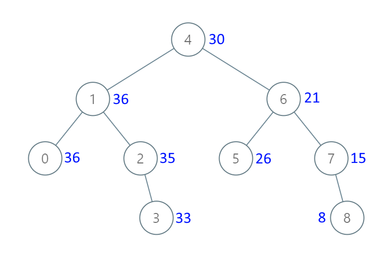

# Convert BST to Greater Tree

## Problem

Given the **root of a Binary Search Tree (BST)**, convert it into a **Greater Tree** such that:

Each node's new value becomes:

original value + sum of all node values greater than it in the BST.

---

## Binary Search Tree Reminder

A **Binary Search Tree (BST)** satisfies the following rules:

- The **left subtree** of a node contains only nodes with values **less than** the node’s value.
- The **right subtree** of a node contains only nodes with values **greater than** the node’s value.
- Both the left and right subtrees must also be BSTs.

---

# Objective

Transform the BST so that every node value becomes:

```
node.val = node.val + sum(all values greater than node.val)
```

---

# Example 1



## Input

```
root = [4,1,6,0,2,5,7,null,null,null,3,null,null,null,8]
```

## Output

```
[30,36,21,36,35,26,15,null,null,null,33,null,null,null,8]
```

---

# Example 2

## Input

```
root = [0,null,1]
```

## Output

```
[1,null,1]
```

---

# Constraints

```
The number of nodes in the tree is in the range [0, 10^4]

-10^4 <= Node.val <= 10^4

All values in the tree are unique.

root is guaranteed to be a valid Binary Search Tree.
```

---

# Important Note

This problem is the **same as LeetCode 1038**:

```
Binary Search Tree to Greater Sum Tree
```
