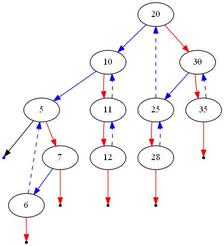

# Convert BST to Greater Tree

## Detailed Notes on Reverse In-order Traversal Approaches

## Initial Thoughts

This problem asks us to modify every node in a Binary Search Tree (BST) so that each node becomes:

```text
original value + sum of all values greater than it
```

A very efficient solution should visit each node only once, because there are an asymptotically linear number of nodes to update.

So the main question becomes:

> In what order should we visit the BST nodes so that, when we process a node, we have already seen all larger values?

In a BST, all larger values are located in the **right subtree**.

That means if we traverse the tree in this order:

1. right subtree
2. current node
3. left subtree

then we will visit nodes in **descending order**.

This traversal is called **reverse in-order traversal**.

While traversing in descending order, we keep a running sum of all node values already visited. Since those previously visited values are exactly the greater values, we can simply add that running sum to the current node.

That is the core idea behind all efficient solutions.

---

# Core BST Insight

Recall normal in-order traversal of a BST:

```text
left -> node -> right
```

This visits values in ascending order.

So reverse in-order traversal:

```text
right -> node -> left
```

visits values in descending order.

For example, if the BST contains:

```text
2, 4, 5, 7, 9
```

then reverse in-order traversal visits:

```text
9, 7, 5, 4, 2
```

Now suppose we maintain:

```text
sum = total of all visited node values so far
```

Then when we reach a node:

- `sum` already contains all values greater than the current node
- so we update:

```text
sum += node.val
node.val = sum
```

This immediately transforms the node to the required greater-tree value.

---

# Approach 1: Recursion

## Intuition

The simplest way to perform a reverse in-order traversal is recursively.

Recursion naturally uses the call stack to return to previous nodes after finishing a subtree.

So the recursive flow is:

1. recurse into the right subtree
2. process the current node
3. recurse into the left subtree

Because the right subtree contains all larger values, it must be processed first.

---

## Why This Works

At any node:

- every node in the right subtree has a greater value
- every node in the left subtree has a smaller value

So if we visit:

```text
right -> node -> left
```

then by the time we reach the current node, the running sum already contains all greater values.

That means we can safely update the current node’s value using the running sum.

---

## Algorithm

1. Maintain a class-level variable `sum`, initially `0`.
2. If the current node is `null`, return.
3. Recursively convert the right subtree.
4. Add the current node’s original value to `sum`.
5. Replace the current node’s value with `sum`.
6. Recursively convert the left subtree.
7. Return the root.

---

## Java Code

```java
class Solution {
    private int sum = 0;

    public TreeNode convertBST(TreeNode root) {
        if (root != null) {
            convertBST(root.right);
            sum += root.val;
            root.val = sum;
            convertBST(root.left);
        }
        return root;
    }
}
```

---

## Detailed Walkthrough

### 1. Global Running Sum

```java
private int sum = 0;
```

This stores the total of all node values we have visited so far in reverse in-order traversal.

Since traversal is descending, this sum always represents the total of all greater values for the current node.

---

### 2. Base Case

```java
if (root != null) {
    ...
}
```

If the node is `null`, there is nothing to process.

---

### 3. Visit Right Subtree First

```java
convertBST(root.right);
```

This ensures all greater values are processed before the current node.

---

### 4. Update Current Node

```java
sum += root.val;
root.val = sum;
```

This is the heart of the solution.

Suppose current node value is `v`.

Before this step:

- `sum` contains all values greater than `v`

After:

- `sum += v` means `sum` now contains `v + all greater values`
- assign that to `root.val`

So the node is transformed exactly as required.

---

### 5. Visit Left Subtree

```java
convertBST(root.left);
```

All smaller values are handled afterward.

---

## Example Walkthrough

Take:

```text
       4
     /   \\
    1     6
   / \\   / \\
  0   2 5   7
       \\      \\
        3       8
```

Reverse in-order traversal order is:

```text
8, 7, 6, 5, 4, 3, 2, 1, 0
```

Now maintain running sum:

- visit `8`: sum = 8, node becomes 8
- visit `7`: sum = 15, node becomes 15
- visit `6`: sum = 21, node becomes 21
- visit `5`: sum = 26, node becomes 26
- visit `4`: sum = 30, node becomes 30
- visit `3`: sum = 33, node becomes 33
- visit `2`: sum = 35, node becomes 35
- visit `1`: sum = 36, node becomes 36
- visit `0`: sum = 36, node becomes 36

Final tree values match the required output.

---

## Complexity Analysis

Let `n` be the number of nodes.

### Time Complexity

```text
O(n)
```

Why?

- every node is visited once
- each visit does constant work besides recursive calls

So the total time is linear.

---

### Space Complexity

```text
O(n)
```

in the worst case.

Why?

- recursion uses the call stack
- in a skewed tree, the recursion depth can become `n`

More precisely, space is:

```text
O(h)
```

where `h` is the height of the tree

- worst case: `O(n)`
- balanced BST: `O(log n)`

---

## Pros and Cons

### Pros

- very clean
- easy to understand
- optimal time complexity
- minimal code

### Cons

- uses recursion
- may risk stack overflow for very deep skewed trees

This motivates the iterative version.

---

# Approach 2: Iteration with a Stack

## Intuition

If we do not want recursion, we can simulate the same reverse in-order traversal explicitly using a stack.

This stack plays the same role as the call stack in the recursive version.

The reverse in-order order remains:

```text
right -> node -> left
```

So the iterative process is:

1. keep moving right and push nodes onto the stack
2. when no more right child exists, pop the top node
3. process it
4. move to its left child
5. repeat

---

## Why This Works

This is just the iterative form of recursive reverse in-order traversal.

The stack stores the path of nodes that still need to be processed after their right subtrees are done.

Because we always push down the right side first, nodes are popped in descending order.

That preserves the same correctness argument as the recursive solution.

---

## Algorithm

1. Initialize `sum = 0`
2. Initialize an empty stack
3. Set `node = root`
4. While the stack is not empty or `node != null`:
   - push all nodes on the path to the rightmost node
   - pop the top node
   - update `sum` and the node value
   - move into the left subtree
5. Return the root

---

## Java Code

```java
class Solution {
    public TreeNode convertBST(TreeNode root) {
        int sum = 0;
        TreeNode node = root;
        Stack<TreeNode> stack = new Stack<TreeNode>();

        while (!stack.isEmpty() || node != null) {
            /* push all nodes up to (and including) this subtree's maximum on
             * the stack. */
            while (node != null) {
                stack.add(node);
                node = node.right;
            }

            node = stack.pop();
            sum += node.val;
            node.val = sum;

            /* all nodes with values between the current and its parent lie in
             * the left subtree. */
            node = node.left;
        }

        return root;
    }
}
```

---

## Detailed Walkthrough

### 1. Initialization

```java
int sum = 0;
TreeNode node = root;
Stack<TreeNode> stack = new Stack<TreeNode>();
```

- `sum` stores the running total of greater values
- `node` is the current traversal pointer
- `stack` simulates recursion

---

### 2. Push the Entire Right Path

```java
while (node != null) {
    stack.add(node);
    node = node.right;
}
```

This step ensures we always go as far right as possible first.

That corresponds to processing larger values before smaller ones.

---

### 3. Pop the Next Node to Process

```java
node = stack.pop();
```

Now the popped node is the next largest unprocessed value.

---

### 4. Update Running Sum and Node Value

```java
sum += node.val;
node.val = sum;
```

Same logic as in recursion.

---

### 5. Move to the Left Subtree

```java
node = node.left;
```

Once the node is processed, the next smaller values are in its left subtree.

---

## Complexity Analysis

### Time Complexity

```text
O(n)
```

Each node is:

- pushed once
- popped once
- processed once

So total time is linear.

---

### Space Complexity

```text
O(n)
```

in the worst case.

Why?

- the stack can hold up to `n` nodes in a skewed tree

More precisely:

```text
O(h)
```

where `h` is the tree height.

---

## Pros and Cons

### Pros

- avoids recursion depth issues
- still linear time
- easy to derive from the recursive solution

### Cons

- still uses linear auxiliary space in worst case
- more verbose than recursion

This motivates the Morris traversal approach.

---

# Approach 3: Reverse Morris In-order Traversal

## Intuition

There is a clever way to do in-order traversal in:

- linear time
- constant extra space

This is called **Morris traversal**.

The main idea is:

- instead of using recursion or a stack to return to a node
- temporarily modify the tree’s pointers to create a path back

For normal Morris in-order traversal, we exploit empty right pointers in predecessors.

For this problem, we want reverse in-order traversal:

```text
right -> node -> left
```

So we flip the idea:

- exploit empty left pointers in successors

This allows us to traverse the tree in descending order without extra stack memory.

---

## Main Idea Behind Morris Traversal

Normally, when traversing a subtree, we need a way to get back to the parent.

Recursion uses the call stack.
Iteration uses an explicit stack.

Morris traversal instead creates a **temporary thread**:

- a temporary pointer from a node’s successor back to the current node

That way, after finishing the right subtree, we can return to the node without extra memory.

After using the temporary link, we remove it, restoring the original tree structure.

---

## Reverse Morris Traversal Logic

At each node:

### Case 1: No right subtree

If `node.right == null`, there are no greater values remaining in that direction.

So we can:

1. visit the current node
2. move to `node.left`

---

### Case 2: Right subtree exists

Then there are greater values that must be processed first.

We must find the **successor** of the current node within its right subtree.

The successor here is:

- the smallest-value node larger than the current one
- in a BST, that is the leftmost node in the right subtree

If the successor’s left pointer is null:

- create a temporary link from successor.left back to current node
- move into the right subtree

If the successor’s left pointer already points back to the current node:

- it means the right subtree has already been fully processed
- remove the temporary link
- visit the current node
- move into the left subtree



---

## Java Code

```java
class Solution {
    /* Get the node with the smallest value greater than this one. */
    private TreeNode getSuccessor(TreeNode node) {
        TreeNode succ = node.right;
        while (succ.left != null && succ.left != node) {
            succ = succ.left;
        }
        return succ;
    }

    public TreeNode convertBST(TreeNode root) {
        int sum = 0;
        TreeNode node = root;

        while (node != null) {
            /*
             * If there is no right subtree, then we can visit this node and
             * continue traversing left.
             */
            if (node.right == null) {
                sum += node.val;
                node.val = sum;
                node = node.left;
            }
            /*
             * If there is a right subtree, then there is at least one node that
             * has a greater value than the current one. therefore, we must
             * traverse that subtree first.
             */
            else {
                TreeNode succ = getSuccessor(node);
                /*
                 * If the left subtree is null, then we have never been here before.
                 */
                if (succ.left == null) {
                    succ.left = node;
                    node = node.right;
                }
                /*
                 * If there is a left subtree, it is a link that we created on a
                 * previous pass, so we should unlink it and visit this node.
                 */
                else {
                    succ.left = null;
                    sum += node.val;
                    node.val = sum;
                    node = node.left;
                }
            }
        }

        return root;
    }
}
```

---

## Detailed Walkthrough

### 1. `getSuccessor(node)`

```java
private TreeNode getSuccessor(TreeNode node) {
    TreeNode succ = node.right;
    while (succ.left != null && succ.left != node) {
        succ = succ.left;
    }
    return succ;
}
```

This finds the in-order successor of `node` inside its right subtree.

In reverse in-order traversal, this successor is the node we must visit immediately before the current one.

---

### 2. Start at Root

```java
int sum = 0;
TreeNode node = root;
```

---

### 3. Case: No Right Subtree

```java
if (node.right == null) {
    sum += node.val;
    node.val = sum;
    node = node.left;
}
```

If there is no right subtree, there are no larger values that must be visited first.

So we can directly process the node and move left.

---

### 4. Case: Right Subtree Exists

```java
TreeNode succ = getSuccessor(node);
```

We find the successor.

---

### 5. First Time Visiting This Structure

```java
if (succ.left == null) {
    succ.left = node;
    node = node.right;
}
```

This means:

- we have not yet explored the right subtree
- create a temporary thread so we can come back later
- move right

---

### 6. Returning After Finishing Right Subtree

```java
else {
    succ.left = null;
    sum += node.val;
    node.val = sum;
    node = node.left;
}
```

Now the temporary thread tells us:

- the right subtree is done
- remove the temporary link
- visit the current node
- move left

---

## Why Morris Traversal Is Correct

The temporary links guarantee that after exploring the right subtree, we return to the correct parent node without recursion or an explicit stack.

Each node is still effectively processed in reverse in-order order:

```text
right -> node -> left
```

So the same running-sum correctness argument applies.

The only difference is how we return from subtrees.

---

## Complexity Analysis

### Time Complexity

```text
O(n)
```

Although Morris traversal appears more complex, each edge is traversed only a constant number of times.

More specifically:

- each temporary link is created once
- each temporary link is removed once
- each node is visited once

So total work is still linear.

---

### Space Complexity

```text
O(1)
```

This is the major advantage.

Why?

- no recursion stack
- no explicit stack
- only a few pointer variables are used

The tree is temporarily modified, but no extra data structure proportional to `n` is allocated.

---

## Pros and Cons

### Pros

- linear time
- constant extra space
- elegant and optimal in memory usage

### Cons

- significantly harder to understand
- temporarily modifies the tree
- trickier to implement correctly

---

# Comparing the Approaches

## Approach 1: Recursion

### Idea

Use reverse in-order traversal recursively.

### Time

```text
O(n)
```

### Space

```text
O(h), worst-case O(n)
```

### Best For

- clarity
- interviews
- easiest implementation

---

## Approach 2: Iteration with Stack

### Idea

Simulate reverse in-order traversal using an explicit stack.

### Time

```text
O(n)
```

### Space

```text
O(h), worst-case O(n)
```

### Best For

- avoiding recursion depth issues
- keeping logic close to recursive version

---

## Approach 3: Reverse Morris Traversal

### Idea

Use temporary pointer threading to traverse in reverse in-order without extra memory.

### Time

```text
O(n)
```

### Space

```text
O(1)
```

### Best For

- memory optimization
- advanced tree traversal understanding

---

# Which Approach Should You Prefer?

## For simplicity

Use **Approach 1: Recursion**

It is short, elegant, and directly expresses the core insight.

---

## For avoiding recursion depth concerns

Use **Approach 2: Iteration with a Stack**

It is still straightforward and safer for very deep trees.

---

## For constant extra space

Use **Approach 3: Reverse Morris Traversal**

This is the most space-efficient solution, but also the most subtle.

---

# Final Takeaway

The heart of the problem is recognizing that we need to process BST values in **descending order**.

That immediately suggests:

```text
reverse in-order traversal = right -> node -> left
```

Then, by maintaining a running sum of all previously visited values, we can transform each node in one pass.

So the real insight is not the arithmetic itself, but the traversal order.

Once that is clear, all three solutions follow naturally:

- recursion uses the call stack
- iteration uses an explicit stack
- Morris traversal uses temporary pointer threading

All of them rely on the exact same descending-order idea.

---

# Summary

- We must transform each BST node into:

  ```text
  node.val + sum(all greater values)
  ```

- Since BST values can be visited in descending order using:

  ```text
  right -> node -> left
  ```

  we can maintain a running sum of already-visited values.

- At each node:
  ```text
  sum += node.val
  node.val = sum
  ```

## Approaches

### 1. Recursion

- easiest to write
- linear time
- uses recursion stack

### 2. Iteration with Stack

- avoids recursion
- same idea as recursive solution
- still uses linear auxiliary space in worst case

### 3. Reverse Morris Traversal

- linear time
- constant extra space
- most advanced approach

## Recommended

- use **recursion** for clarity
- use **iteration** if recursion depth is a concern
- use **Morris traversal** if constant-space traversal is specifically required
