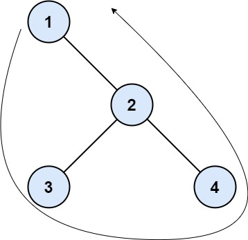
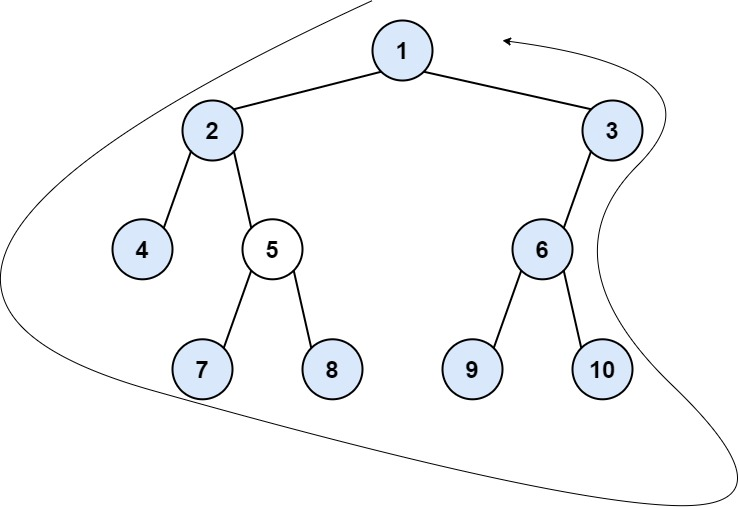

# 545. Boundary of Binary Tree

The **boundary of a binary tree** is defined as the concatenation of:

1. The **root**
2. The **left boundary**
3. The **leaves** (from left to right)
4. The **right boundary in reverse order**

---

## Left Boundary

The **left boundary** is defined as follows:

- The **root node's left child** is part of the left boundary.
- If the root **does not have a left child**, the left boundary is empty.
- If a node in the left boundary **has a left child**, the left child continues the boundary.
- If a node **does not have a left child but has a right child**, the right child continues the boundary.
- The **leftmost leaf is NOT included** in the left boundary.

---

## Right Boundary

The **right boundary** is similar to the left boundary but applied to the **right side**.

Rules:

- It starts from the **root's right child**.
- If a node **has a right child**, it continues the boundary.
- If a node **does not have a right child but has a left child**, the left child continues the boundary.
- The **rightmost leaf is NOT included** in the right boundary.
- The right boundary is **added in reverse order** to the result.

---

## Leaves

Leaves are nodes that:

```
have no children
```

Important notes:

- Leaves are collected **from left to right**.
- The **root is not considered a leaf** for this problem.

---

# Example 1



Input

```
root = [1,null,2,3,4]
```

Output

```
[1,3,4,2]
```

Explanation

- Left boundary: empty (root has no left child)
- Right boundary path: `2 -> 4`
  - 4 is a leaf → excluded
  - Right boundary = `[2]`
- Leaves (left → right) = `[3,4]`

Final result:

```
[1] + [] + [3,4] + [2] = [1,3,4,2]
```

---

# Example 2



Input

```
root = [1,2,3,4,5,6,null,null,null,7,8,9,10]
```

Output

```
[1,2,4,7,8,9,10,6,3]
```

Explanation

Left boundary path

```
2 -> 4
```

- 4 is a leaf → excluded
- Left boundary = `[2]`

Right boundary path

```
3 -> 6 -> 10
```

- 10 is a leaf → excluded
- Right boundary = `[3,6]`
- Reverse order = `[6,3]`

Leaves (left → right)

```
[4,7,8,9,10]
```

Final result

```
[1] + [2] + [4,7,8,9,10] + [6,3]
= [1,2,4,7,8,9,10,6,3]
```

---

# Constraints

```
1 <= number of nodes <= 10^4
-1000 <= Node.val <= 1000
```
