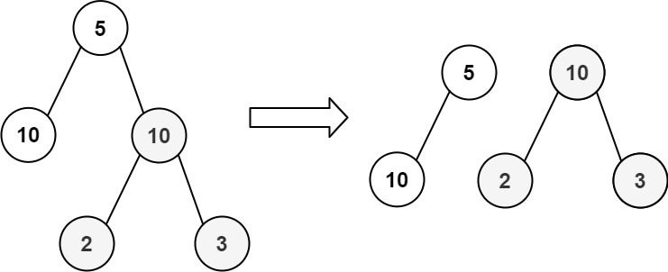
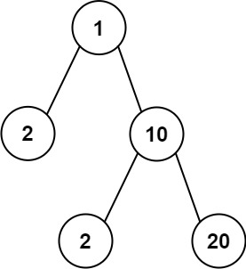

# 663. Equal Tree Partition

Given the root of a binary tree, return **true** if you can partition the tree into **two trees with equal sums** of values **after removing exactly one edge** from the original tree.

---

## Problem Description

You are given the **root of a binary tree**.

Your task is to determine whether it is possible to:

- Remove **exactly one edge**
- Split the tree into **two separate trees**
- Such that the **sum of node values in both trees is equal**

If such a partition is possible, return:

```
true
```

Otherwise return:

```
false
```

---

## Example 1



**Input**

```
root = [5,10,10,null,null,2,3]
```

**Output**

```
true
```

**Explanation**

The tree can be split into two subtrees having equal sums after removing one edge.

---

## Example 2



**Input**

```
root = [1,2,10,null,null,2,20]
```

**Output**

```
false
```

**Explanation**

There is **no edge** that can be removed such that the resulting trees have equal sums.

---

## Constraints

```
1 <= number of nodes <= 10^4
-10^5 <= Node.val <= 10^5
```
