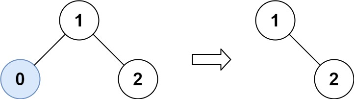
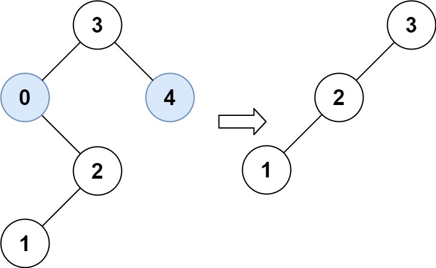

# 669. Trim a Binary Search Tree

## Problem

Given the **root of a Binary Search Tree (BST)** and two integers **low** and **high**, trim the tree so that **all its elements lie within the range [low, high]**.

The trimming must preserve the **relative structure** of the nodes that remain in the tree.
In other words:

- If a node remains in the tree, its descendants must remain its descendants.
- Nodes outside the range should be removed while maintaining valid BST structure.

It is guaranteed that the resulting tree has a **unique valid structure**.

Finally, return the **root of the trimmed BST**.

> Note: The root itself may change depending on the given range.

---

# Binary Search Tree Reminder

A **Binary Search Tree (BST)** satisfies the following rules:

- The **left subtree** of a node contains only nodes with values **less than** the node’s value.
- The **right subtree** of a node contains only nodes with values **greater than** the node’s value.
- Both the left and right subtrees must also be BSTs.

---

# Objective

Modify the BST so that **all node values satisfy**:

```
low ≤ node.val ≤ high
```

Any node outside this range must be removed.

---

# Example 1



## Input

```
root = [1,0,2]
low = 1
high = 2
```

## Tree Structure

```
    1
   / \\
  0   2
```

## Output

```
[1,null,2]
```

## Explanation

Node **0** is less than the allowed range `[1,2]`, so it is removed.

The resulting tree becomes:

```
    1
     \\
      2
```

---

# Example 2



## Input

```
root = [3,0,4,null,2,null,null,1]
low = 1
high = 3
```

## Original Tree

```
        3
       / \\
      0   4
       \\
        2
       /
      1
```

## Output

```
[3,2,null,1]
```

## Explanation

Nodes outside `[1,3]` are removed:

- Node **0** is less than 1 → removed
- Node **4** is greater than 3 → removed

Remaining structure becomes:

```
      3
     /
    2
   /
  1
```

---

# Constraints

```
The number of nodes in the tree is in the range [1, 10^4]

0 <= Node.val <= 10^4

The value of each node in the tree is unique.

root is guaranteed to be a valid Binary Search Tree.

0 <= low <= high <= 10^4
```
