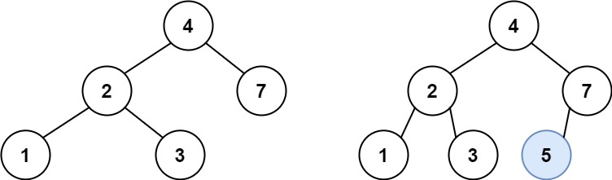
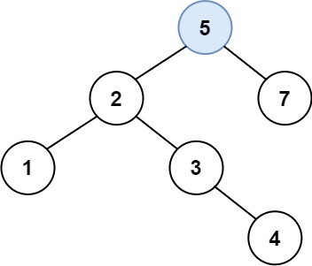

# 701. Insert into a Binary Search Tree

## Problem

You are given the **root node of a Binary Search Tree (BST)** and a value `val` to insert into the tree.

Your task is to **insert the value into the BST** and return the **root of the tree after insertion**.

It is guaranteed that the value being inserted **does not already exist** in the original BST.

---

## Binary Search Tree Reminder

A **Binary Search Tree (BST)** satisfies the following properties:

- The **left subtree** of a node contains only nodes with values **less than** the node’s value.
- The **right subtree** of a node contains only nodes with values **greater than** the node’s value.
- Both left and right subtrees must also be BSTs.

---

# Objective

Insert a new node with value `val` into the BST such that the **BST property remains valid**.

Multiple valid insertion positions may exist. Any valid BST structure after insertion is acceptable.

---

# Example 1



## Input

```
root = [4,2,7,1,3]
val = 5
```



## Output

```
[4,2,7,1,3,5]
```

## Explanation

The value `5` must be inserted into the correct location according to BST rules.

Original tree:

```
      4
     / \\
    2   7
   / \\
  1   3
```

After insertion:

```
      4
     / \\
    2   7
   / \\  /
  1   3 5
```

Another valid BST structure may also be accepted.

---

# Example 2

## Input

```
root = [40,20,60,10,30,50,70]
val = 25
```

## Output

```
[40,20,60,10,30,50,70,null,null,25]
```

## Explanation

The value `25` must be inserted into the correct BST position.

Original tree:

```
        40
       /  \\
     20    60
    / \\   / \\
  10  30 50  70
```

After insertion:

```
        40
       /  \\
     20    60
    / \\   / \\
  10  30 50  70
      /
     25
```

---

# Example 3

## Input

```
root = [4,2,7,1,3,null,null,null,null,null,null]
val = 5
```

## Output

```
[4,2,7,1,3,5]
```

---

# Constraints

```
The number of nodes in the tree will be in the range [0, 10^4]

-10^8 <= Node.val <= 10^8

All node values in the tree are unique.

-10^8 <= val <= 10^8

It is guaranteed that val does not exist in the original BST.
```
