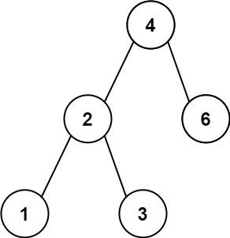
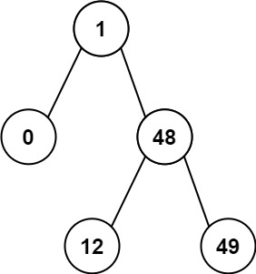

# 783. Minimum Distance Between BST Nodes

## Problem

Given the **root of a Binary Search Tree (BST)**, return the **minimum difference** between the values of any two different nodes in the tree.

---

## Binary Search Tree Reminder

A **Binary Search Tree (BST)** satisfies the following properties:

- The **left subtree** of a node contains only nodes with values **less than** the node’s value.
- The **right subtree** of a node contains only nodes with values **greater than** the node’s value.
- Both the left and right subtrees must also be BSTs.

---

# Objective

Find the minimum difference between the values of any two **different** nodes in the BST.

Formally, find:

```text
min(|a - b|)
```

where `a` and `b` are values of two distinct nodes in the tree.

---

# Example 1



## Input

```text
root = [4,2,6,1,3]
```

## Output

```text
1
```

## Explanation

The BST values in sorted order are:

```text
[1, 2, 3, 4, 6]
```

The adjacent differences are:

```text
2 - 1 = 1
3 - 2 = 1
4 - 3 = 1
6 - 4 = 2
```

So the minimum difference is:

```text
1
```

---

# Example 2



## Input

```text
root = [1,0,48,null,null,12,49]
```

## Output

```text
1
```

## Explanation

The BST values in sorted order are:

```text
[0, 1, 12, 48, 49]
```

The adjacent differences are:

```text
1 - 0 = 1
12 - 1 = 11
48 - 12 = 36
49 - 48 = 1
```

So the minimum difference is:

```text
1
```

---

# Constraints

```text
The number of nodes in the tree is in the range [2, 100]

0 <= Node.val <= 10^5
```

---

# Note

This problem is the **same as LeetCode 530**:

```text
Minimum Absolute Difference in BST
```
