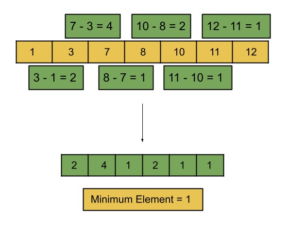

# Minimum Distance in BST

## Detailed Notes on In-order Traversal Approaches

## Overview

We are given the root of a **Binary Search Tree (BST)**.

Our goal is to find the **minimum difference between the values of any two different nodes**.

This problem relies heavily on one crucial BST property:

> An in-order traversal of a BST visits the node values in sorted order.

Once the values are in sorted order, the problem becomes much simpler.

This document explains two approaches in detail:

1. **In-order Traversal with List**
2. **In-order Traversal Without List**

---

# Core Insight

Let us first solve a simpler problem:

> Given a sorted array of integers, find the minimum difference between any two values.

Suppose the sorted array is:

```text
[1, 3, 7, 8, ...]
```

If we fix one value, say `7`, then the closest value to `7` must be either:

- the value immediately to its left → `3`
- or the value immediately to its right → `8`

We do **not** need to compare `7` with every element in the array.

That means in a sorted array, the minimum difference must occur between **two consecutive elements**.

So instead of checking all pairs, we only check:

```text
arr[i] - arr[i - 1]
```

for every `i >= 1`.

---

# Why This Helps for a BST

In this problem, the values are stored in a BST instead of an array.

But a BST has a special property:

> In-order traversal of a BST produces the values in sorted ascending order.

So we can transform the tree problem into the sorted-array problem by doing an in-order traversal.

That leads directly to the first approach.

---

# Approach 1: In-order Traversal with List

## Intuition

If we perform an in-order traversal of the BST, we will obtain all node values in sorted order.

Once we have that sorted list, the minimum difference is just the smallest difference between consecutive values.

So the plan is:

1. generate the in-order sequence
2. scan the sequence once
3. compute the minimum adjacent difference

---

## Why This Works

This works because:

- in-order traversal gives sorted values
- in a sorted list, the closest values must be adjacent
- therefore, checking consecutive elements is sufficient



---

## Algorithm

1. Initialize a variable `minDistance` to `Integer.MAX_VALUE`.
2. Perform an in-order traversal of the BST and store the node values in a list `inorderNodes`.
3. Starting from index `1`, compare each element with the previous one.
4. Update `minDistance` whenever a smaller difference is found.
5. Return `minDistance`.

---

## Java Code

```java
class Solution {
    // List to store the tree nodes in the inorder traversal.
    List<Integer> inorderNodes = new ArrayList<>();

    void inorderTraversal(TreeNode root) {
        if (root == null) {
            return;
        }

        inorderTraversal(root.left);
        // Store the nodes in the list.
        inorderNodes.add(root.val);
        inorderTraversal(root.right);
    }

    public int minDiffInBST(TreeNode root) {
       inorderTraversal(root);

        int minDistance = Integer.MAX_VALUE;
        // Find the diff between every two consecutive values in the list.
        for (int i = 1; i < inorderNodes.size(); i++) {
            minDistance = Math.min(minDistance, inorderNodes.get(i) - inorderNodes.get(i-1));
        }

        return minDistance;
    }
};
```

---

## Detailed Walkthrough

### 1. Store the In-order Traversal

```java
List<Integer> inorderNodes = new ArrayList<>();
```

This list will hold the BST values in sorted order.

---

### 2. Recursive In-order Traversal

```java
void inorderTraversal(TreeNode root) {
    if (root == null) {
        return;
    }

    inorderTraversal(root.left);
    inorderNodes.add(root.val);
    inorderTraversal(root.right);
}
```

This visits nodes in the order:

```text
left -> node -> right
```

Because the tree is a BST, this produces a sorted sequence.

---

### 3. Scan Adjacent Elements

```java
for (int i = 1; i < inorderNodes.size(); i++) {
    minDistance = Math.min(minDistance, inorderNodes.get(i) - inorderNodes.get(i-1));
}
```

Since the values are sorted, checking adjacent differences is enough.

---

## Example

Suppose the BST values in sorted order are:

```text
[1, 3, 6, 10]
```

The candidate differences are:

```text
3 - 1 = 2
6 - 3 = 3
10 - 6 = 4
```

So the answer is:

```text
2
```

We do not need to check:

```text
6 - 1
10 - 3
10 - 1
```

because those cannot be smaller than some adjacent difference.

---

## Complexity Analysis

Let `N` be the number of nodes in the BST.

### Time Complexity

```text
O(N)
```

Why?

- in-order traversal visits all nodes once → `O(N)`
- scanning the list once also takes `O(N)`

So the total time is linear.

---

### Space Complexity

```text
O(N)
```

Why?

There are two contributors:

1. **Recursion stack**
   - in the worst case, the tree could be a straight line
   - that gives recursion depth `O(N)`

2. **In-order list**
   - stores all `N` node values

So total auxiliary space is linear.

---

## Strengths and Weaknesses

### Strengths

- easy to understand
- directly uses the sorted-order property of BST
- linear time

### Weaknesses

- stores all values unnecessarily
- we only need the previous in-order value, not the full list

That observation leads to the second approach.

---

# Approach 2: In-order Traversal Without List

## Intuition

In the previous approach, we used the list only to compare each node with its immediate predecessor in sorted order.

But we do not actually need the entire list.

We only need one thing at any moment:

> the previously visited node in the in-order traversal

So instead of storing all values, we can process the minimum difference **on the fly** during traversal.

---

## Key Observation

Because in-order traversal visits values in sorted order:

- when we are at the current node
- the previous node visited is exactly its in-order predecessor

So we can compute:

```text
current.val - previous.val
```

immediately and update the answer.

There is no need to keep all past values.

---

## Algorithm

1. Initialize `minDistance` to `Integer.MAX_VALUE`.
2. Initialize `prevValue` to `null`.
3. Perform in-order traversal of the BST.
4. For each current node:
   - if `prevValue` is not null, compute the difference between current node and `prevValue`
   - update `minDistance`
   - assign current node to `prevValue`
5. Return `minDistance`.

---

## Java Code

```java
class Solution {
  int minDistance = Integer.MAX_VALUE;
  // Initially, it will be null.
  TreeNode prevValue;

  void inorderTraversal(TreeNode root) {
    if (root == null) {
      return;
    }

    inorderTraversal(root.left);

    // Find the difference with the previous value if it is there.
    if (prevValue != null) {
      minDistance = Math.min(minDistance, root.val - prevValue.val);
    }
    prevValue = root;

    inorderTraversal(root.right);
  }

  public int minDiffInBST(TreeNode root) {
    inorderTraversal(root);

    return minDistance;
  }
};
```

---

## Detailed Walkthrough

### 1. Running Answer

```java
int minDistance = Integer.MAX_VALUE;
```

This stores the smallest difference found so far.

---

### 2. Previous Node Tracker

```java
TreeNode prevValue;
```

This keeps track of the previously visited node in sorted order.

Initially it is null because no node has been visited yet.

---

### 3. In-order Traversal

```java
inorderTraversal(root.left);
```

We still visit nodes in sorted order.

---

### 4. Compare with Previous Value

```java
if (prevValue != null) {
    minDistance = Math.min(minDistance, root.val - prevValue.val);
}
```

Since `prevValue` is the immediate predecessor, this difference is a valid adjacent difference in sorted order.

---

### 5. Update Previous Value

```java
prevValue = root;
```

The current node becomes the previous node for the next visited node.

---

### 6. Continue to Right Subtree

```java
inorderTraversal(root.right);
```

Now we move to larger values.

---

## Example

Suppose the in-order traversal visits the nodes in this order:

```text
1, 3, 6, 10
```

Then the traversal computes differences as:

- when visiting `1` → no previous value yet
- when visiting `3` → `3 - 1 = 2`
- when visiting `6` → `6 - 3 = 3`
- when visiting `10` → `10 - 6 = 4`

Minimum stays:

```text
2
```

Exactly as required.

---

## Complexity Analysis

Let:

- `N` = number of nodes
- `H` = height of the tree

### Time Complexity

```text
O(N)
```

Why?

Each node is visited exactly once during the in-order traversal.

So the total work is linear.

---

### Space Complexity

```text
O(H)
```

Why?

We no longer store all values in a list.

The only extra memory comes from the recursion stack.

So the auxiliary space is proportional to the height of the tree.

That means:

- balanced BST → `O(log N)`
- worst-case skewed BST → `O(N)`

This is better than Approach 1 in average practical space usage.

---

## Strengths and Weaknesses

### Strengths

- linear time
- avoids storing all values
- more memory efficient
- elegant once the inorder-predecessor idea is understood

### Weaknesses

- still recursive
- recursion depth can be large in a skewed tree

---

# Comparing the Two Approaches

## Approach 1: In-order Traversal with List

### Idea

Store all BST values in sorted order, then compare adjacent values.

### Time

```text
O(N)
```

### Space

```text
O(N)
```

### Best For

- simple understanding
- clean separation between traversal and processing

---

## Approach 2: In-order Traversal Without List

### Idea

During in-order traversal, compare each node with the immediately previous node.

### Time

```text
O(N)
```

### Space

```text
O(H)
```

### Best For

- optimized memory usage
- more elegant solution

---

# Which Approach Should You Prefer?

## For simpler reasoning

Use **Approach 1**.

It is very easy to understand because it explicitly converts the BST into a sorted array problem.

## For a better solution

Use **Approach 2**.

It keeps the same linear time complexity while reducing space usage.

This is usually the preferred solution.

---

# Final Takeaway

The heart of the problem is the same in both approaches:

1. The minimum difference in sorted data occurs between adjacent values.
2. In-order traversal of a BST gives values in sorted order.

Once those two facts are connected, the problem becomes straightforward.

The first approach stores the whole sorted order.
The second approach realizes that only the immediate predecessor is needed and computes the answer on the fly.

---

# Summary

## Main Insight

- In a sorted sequence, the minimum difference is always between consecutive elements.
- In-order traversal of a BST produces values in sorted order.

---

## Approach 1: In-order Traversal with List

### Steps

- perform in-order traversal
- store values in a list
- compare consecutive values

### Java Code

```java
class Solution {
    List<Integer> inorderNodes = new ArrayList<>();

    void inorderTraversal(TreeNode root) {
        if (root == null) {
            return;
        }

        inorderTraversal(root.left);
        inorderNodes.add(root.val);
        inorderTraversal(root.right);
    }

    public int minDiffInBST(TreeNode root) {
       inorderTraversal(root);

        int minDistance = Integer.MAX_VALUE;
        for (int i = 1; i < inorderNodes.size(); i++) {
            minDistance = Math.min(minDistance, inorderNodes.get(i) - inorderNodes.get(i-1));
        }

        return minDistance;
    }
};
```

### Complexity

- **Time:** `O(N)`
- **Space:** `O(N)`

---

## Approach 2: In-order Traversal Without List

### Steps

- perform in-order traversal
- keep only the previous visited node
- update the minimum difference on the fly

### Java Code

```java
class Solution {
  int minDistance = Integer.MAX_VALUE;
  TreeNode prevValue;

  void inorderTraversal(TreeNode root) {
    if (root == null) {
      return;
    }

    inorderTraversal(root.left);

    if (prevValue != null) {
      minDistance = Math.min(minDistance, root.val - prevValue.val);
    }
    prevValue = root;

    inorderTraversal(root.right);
  }

  public int minDiffInBST(TreeNode root) {
    inorderTraversal(root);
    return minDistance;
  }
};
```

### Complexity

- **Time:** `O(N)`
- **Space:** `O(H)`

## Recommended

Use **Approach 2** for the more space-efficient solution.
