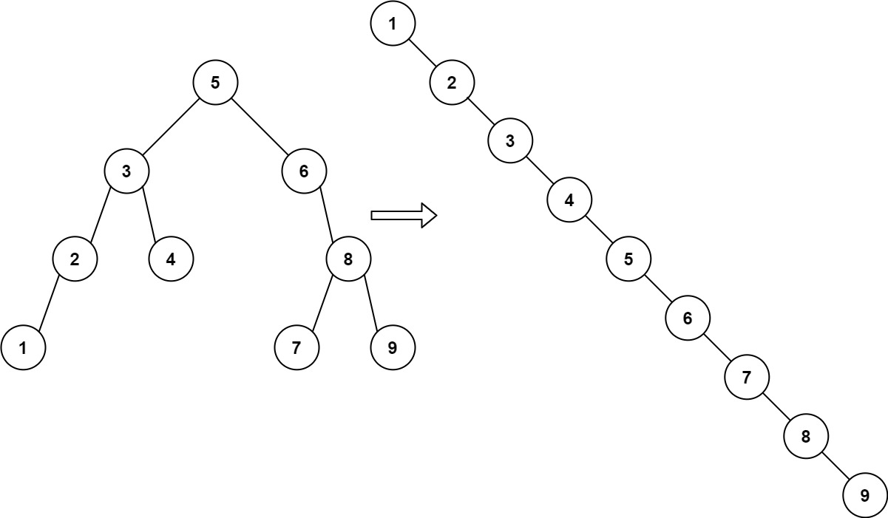
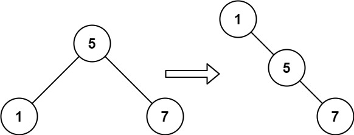

# 897. Increasing Order Search Tree

## Problem

Given the **root of a Binary Search Tree (BST)**, rearrange the tree so that:

- The **leftmost node becomes the new root**
- Every node has **no left child**
- Every node has **only one right child**

The resulting tree should represent the **in-order traversal of the original BST**.

---

## Objective

Transform the BST so that it becomes a **right-skewed tree** where:

- nodes appear in **ascending order**
- each node's **left pointer is null**
- each node's **right pointer points to the next larger node**

---

## Example 1



### Input

```
root = [5,3,6,2,4,null,8,1,null,null,null,7,9]
```

### Output

```
[1,null,2,null,3,null,4,null,5,null,6,null,7,null,8,null,9]
```

### Explanation

Original BST:

```
        5
       / \\
      3   6
     / \\   \\
    2   4   8
   /       / \\
  1       7   9
```

In-order traversal produces:

```
1, 2, 3, 4, 5, 6, 7, 8, 9
```

The tree is rearranged so that each node points to the next element:

```
1
 \
  2
   \
    3
     \
      4
       \
        5
         \
          6
           \
            7
             \
              8
               \
                9
```

---

## Example 2



### Input

```
root = [5,1,7]
```

### Output

```
[1,null,5,null,7]
```

### Explanation

Original BST:

```
   5
  / \\
 1   7
```

In-order traversal:

```
1, 5, 7
```

Resulting tree:

```
1
 \
  5
   \
    7
```

---

## Constraints

```
The number of nodes in the tree is in the range [1, 100]

0 <= Node.val <= 1000
```
