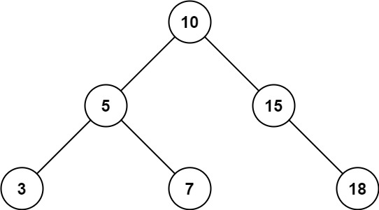
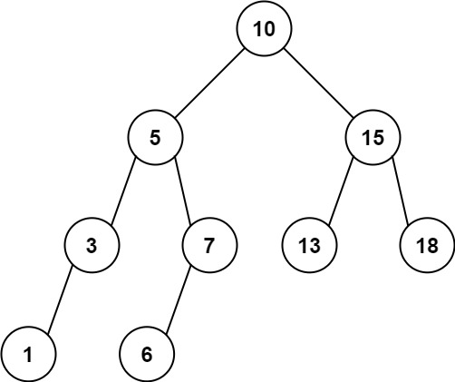

# 938. Range Sum of BST

## Problem

Given the **root node of a Binary Search Tree (BST)** and two integers **low** and **high**, return the **sum of the values of all nodes** whose value lies in the inclusive range:

```
[low, high]
```

---

## Binary Search Tree Reminder

A **Binary Search Tree (BST)** satisfies the following properties:

- The **left subtree** of a node contains only nodes with values **less than** the node's value.
- The **right subtree** of a node contains only nodes with values **greater than** the node's value.
- Both the left and right subtrees must also be BSTs.

These properties allow us to **efficiently skip entire subtrees** when searching for values within a range.

---

# Objective

Compute the **sum of all node values** in the BST such that:

```
low <= node.val <= high
```

---

# Example 1



## Input

```
root = [10,5,15,3,7,null,18]
low = 7
high = 15
```

## Output

```
32
```

## Explanation

The BST:

```
       10
      /  \\
     5    15
    / \\     \\
   3   7     18
```

Values inside range **[7, 15]** are:

```
7, 10, 15
```

Sum:

```
7 + 10 + 15 = 32
```

---

# Example 2



## Input

```
root = [10,5,15,3,7,13,18,1,null,6]
low = 6
high = 10
```

## Output

```
23
```

## Explanation

BST:

```
         10
        /  \\
       5    15
      / \\   / \\
     3   7 13  18
    /   /
   1   6
```

Values inside range **[6, 10]**:

```
6, 7, 10
```

Sum:

```
6 + 7 + 10 = 23
```

---

# Constraints

```
The number of nodes in the tree is in the range [1, 2 * 10^4]

1 <= Node.val <= 10^5

1 <= low <= high <= 10^5

All Node.val values are unique.
```
