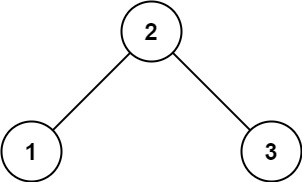

## Problem Description

Given the root of a binary tree, determine if it is a **valid Binary Search Tree (BST)**.

A valid BST is defined by the following properties:

1. The **left subtree** of a node contains only nodes with keys **strictly less than** the node's key.
2. The **right subtree** of a node contains only nodes with keys **strictly greater than** the node's key.
3. Both the **left and right subtrees must also be valid BSTs**.

---

## Example 1



### Input

```
root = [2,1,3]
```

### Output

```
true
```

### Explanation

```
    2
   / \\
  1   3
```

All nodes satisfy the BST property.

---

## Example 2


### Input

```
root = [5,1,4,null,null,3,6]
```

### Output

```
false
```

### Explanation

```
      5
     / \\
    1   4
       / \\
      3   6
```

The node `4` is in the **right subtree of 5** but is **less than 5**, which violates the BST rule.

---

## Constraints

```
The number of nodes in the tree is in the range [1, 10^4].
-2^31 <= Node.val <= 2^31 - 1
```
