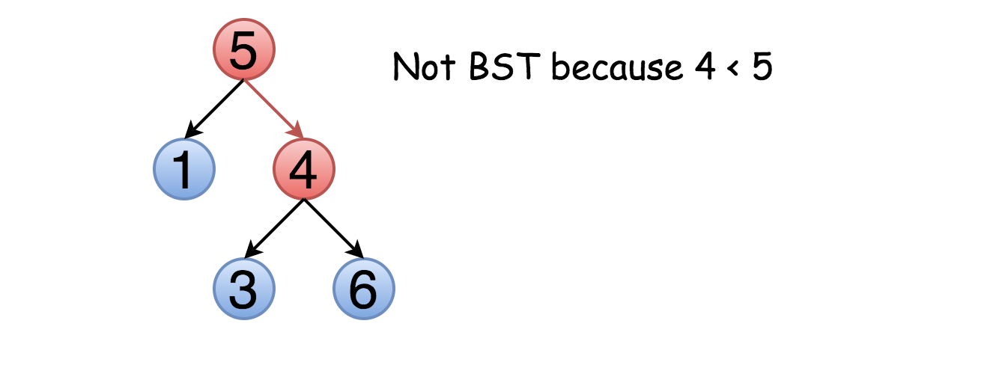
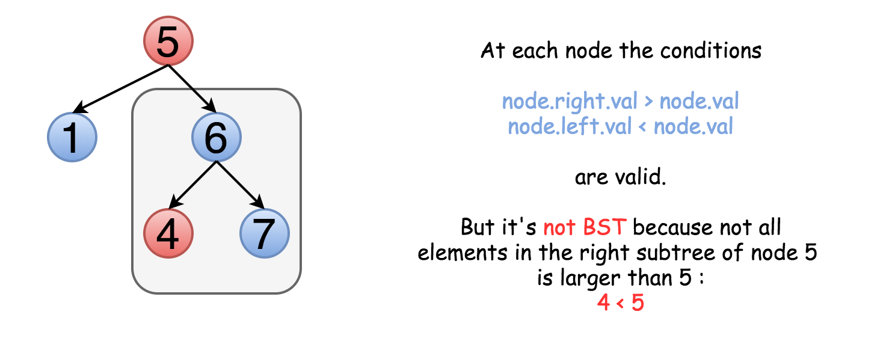
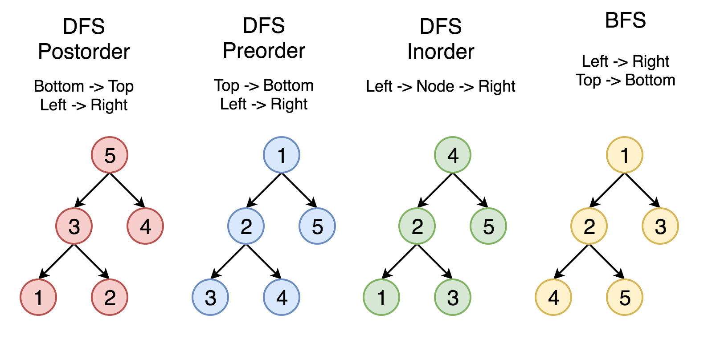
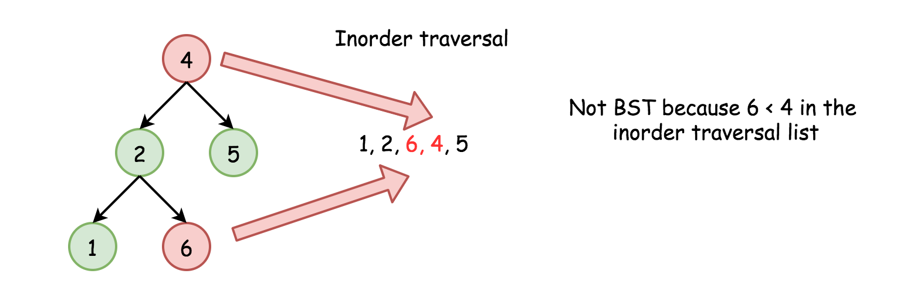

# 98. Validate Binary Search Tree — Detailed Approaches

## Intuition

At first glance, the problem appears simple. One might attempt to check at every node:

- `node.left.val < node.val`
- `node.right.val > node.val`



However, this approach **does not work for all cases**.

Why? Because the BST property applies to **entire subtrees**, not just direct children.

Example of an invalid BST:

```
      5
     / \\
    1   6
       / \\
      3   7
```

Although `6 > 5`, the node `3` lies in the **right subtree of 5**, yet `3 < 5`, which violates the BST property.

Therefore:

> Each node must satisfy a **range constraint** defined by all its ancestors.

Every node must lie within:

```
(low < node.val < high)
```

These bounds propagate down the tree during traversal.



---

# Approach 1: Recursive Traversal with Valid Range

## Idea

For each node maintain:

- **Lower bound**
- **Upper bound**

Check whether the node value lies strictly between them.

Then update bounds when traversing children:

```
Left subtree  -> high = node.val
Right subtree -> low = node.val
```

## Java Implementation

```java
class Solution {
    public boolean validate(TreeNode root, Integer low, Integer high) {
        if (root == null) {
            return true;
        }

        if ((low != null && root.val <= low) ||
            (high != null && root.val >= high)) {
            return false;
        }

        return validate(root.right, root.val, high) &&
               validate(root.left, low, root.val);
    }

    public boolean isValidBST(TreeNode root) {
        return validate(root, null, null);
    }
}
```

## Complexity Analysis

**Time Complexity**

```
O(N)
```

Every node is visited exactly once.

**Space Complexity**

```
O(N)
```

Due to recursion stack in worst-case skewed tree.

---

# Approach 2: Iterative Traversal with Valid Range

## Idea

The recursive approach can be converted into **iteration using an explicit stack**.

Each stack element keeps:

```
(node, lowerLimit, upperLimit)
```

DFS traversal is used.

## Java Implementation

```java
class Solution {
    private Deque<TreeNode> stack = new LinkedList<>();
    private Deque<Integer> upperLimits = new LinkedList<>();
    private Deque<Integer> lowerLimits = new LinkedList<>();

    public void update(TreeNode root, Integer low, Integer high) {
        stack.add(root);
        lowerLimits.add(low);
        upperLimits.add(high);
    }

    public boolean isValidBST(TreeNode root) {
        Integer low = null, high = null, val;
        update(root, low, high);

        while (!stack.isEmpty()) {
            root = stack.poll();
            low = lowerLimits.poll();
            high = upperLimits.poll();

            if (root == null) continue;

            val = root.val;

            if (low != null && val <= low) {
                return false;
            }

            if (high != null && val >= high) {
                return false;
            }

            update(root.right, val, high);
            update(root.left, low, val);
        }

        return true;
    }
}
```

## Complexity Analysis

**Time Complexity**

```
O(N)
```

**Space Complexity**

```
O(N)
```

Stack stores up to `N` nodes.

---

# Approach 3: Recursive Inorder Traversal



## Key Property of BST

An **inorder traversal** of a BST produces a **strictly increasing sequence**.

Traversal order:

```
Left → Node → Right
```

So if the tree is a valid BST:

```
inorder[i] < inorder[i+1]
```



Instead of storing the entire traversal list, we only keep track of the **previous visited node**.

## Java Implementation

```java
class Solution {
    private Integer prev;

    public boolean isValidBST(TreeNode root) {
        prev = null;
        return inorder(root);
    }

    private boolean inorder(TreeNode root) {
        if (root == null) {
            return true;
        }

        if (!inorder(root.left)) {
            return false;
        }

        if (prev != null && root.val <= prev) {
            return false;
        }

        prev = root.val;

        return inorder(root.right);
    }
}
```

## Complexity Analysis

**Time Complexity**

```
O(N)
```

Worst case when the tree is valid or the violation is near the end.

**Space Complexity**

```
O(N)
```

Due to recursion stack.

---

# Approach 4: Iterative Inorder Traversal

The recursive inorder traversal can also be implemented using an explicit stack.

## Algorithm

1. Traverse left subtree pushing nodes into stack
2. Pop node
3. Compare with previous value
4. Move to right subtree

## Java Implementation

```java
class Solution {
    public boolean isValidBST(TreeNode root) {
        Deque<TreeNode> stack = new ArrayDeque<>();
        Integer prev = null;

        while (!stack.isEmpty() || root != null) {

            while (root != null) {
                stack.push(root);
                root = root.left;
            }

            root = stack.pop();

            if (prev != null && root.val <= prev) {
                return false;
            }

            prev = root.val;

            root = root.right;
        }

        return true;
    }
}
```

## Complexity Analysis

**Time Complexity**

```
O(N)
```

**Space Complexity**

```
O(N)
```

Stack stores nodes during traversal.

---

# Comparison of Approaches

| Approach          | Technique       | Time | Space | Notes                          |
| ----------------- | --------------- | ---- | ----- | ------------------------------ |
| Recursive Range   | DFS with bounds | O(N) | O(N)  | Clean and safe                 |
| Iterative Range   | DFS stack       | O(N) | O(N)  | Avoid recursion                |
| Recursive Inorder | Sorted property | O(N) | O(N)  | Elegant                        |
| Iterative Inorder | Stack traversal | O(N) | O(N)  | Most common interview solution |

---

# Recommended Approach

Most production implementations prefer:

```
Inorder Traversal (Iterative)
```

Reasons:

- Simple
- No explicit bound tracking
- Uses fundamental BST property
