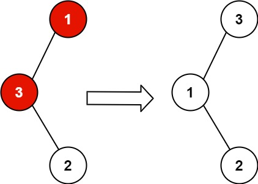
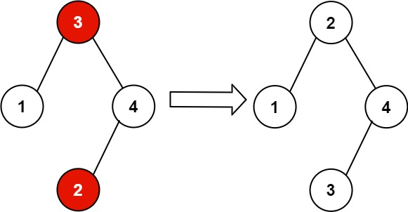

## Problem Description

You are given the root of a **Binary Search Tree (BST)** in which the values of **exactly two nodes were swapped by mistake**.

Your task is to **recover the tree without changing its structure**, restoring the correct BST ordering.

---

## Binary Search Tree Property

For a valid BST:

```
All values in the left subtree  < node.val
All values in the right subtree > node.val
```

Also, the **inorder traversal of a BST produces a strictly increasing sequence**.

---

## Example 1



### Input

```
root = [1,3,null,null,2]
```

### Output

```
[3,1,null,null,2]
```

### Explanation

```
Original Tree:

    1
   /
  3
   \
    2
```

Here `1` and `3` were swapped.

Correct BST:

```
    3
   /
  1
   \
    2
```

---

## Example 2



### Input

```
root = [3,1,4,null,null,2]
```

### Output

```
[2,1,4,null,null,3]
```

### Explanation

```
Original Tree:

      3
     / \
    1   4
       /
      2
```

Nodes `2` and `3` were swapped.

Correct BST:

```
      2
     / \
    1   4
       /
      3
```

---

## Constraints

```
2 <= number of nodes <= 1000
-2^31 <= Node.val <= 2^31 - 1
```

---

## Follow-Up

A solution using:

```
O(n) space
```

is straightforward using inorder traversal.

However, the challenge is to solve it using:

```
O(1) extra space
```

which can be achieved using **Morris Inorder Traversal**.

---

## Key Insight

The inorder traversal of a correct BST should produce:

```
sorted increasing values
```

If two nodes are swapped, there will be **two violations** in this sorted order.

Example inorder sequence:

```
1 5 3 4 2 6
```

Violations:

```
5 > 3
4 > 2
```

The nodes that must be swapped are:

```
first = 5
second = 2
```

After swapping them the BST becomes valid.

---

## Goal

Detect the two incorrect nodes during inorder traversal and swap their values to recover the BST.
