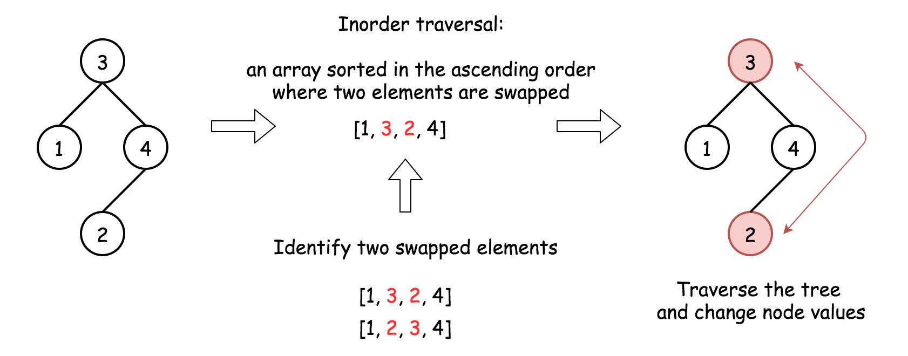

# 99. Recover Binary Search Tree — Detailed Approaches

## Intuition

The inorder traversal of a Binary Search Tree (BST) produces a **sorted ascending sequence**.

If exactly **two nodes are swapped**, the inorder traversal becomes an **almost sorted array** where only two elements are out of order.

Example:

```
Correct inorder:
1 2 3 4 5 6

Swapped inorder:
1 5 3 4 2 6
```

Violations:

```
5 > 3
4 > 2
```

The nodes to swap are:

```
x = 5
y = 2
```

Recovering the BST simply means **detecting these two nodes and swapping them back**.

---

# Approach 1: Sort an Almost Sorted Array Where Two Elements Are Swapped

## Idea

Steps:

1. Compute **inorder traversal**
2. Detect the two swapped elements in the resulting array
3. Traverse the tree again and **swap their values**

Since inorder traversal of BST should be sorted, detecting the swapped elements becomes a classical problem.

---

## Step 1: Inorder Traversal

```java
public void inorder(TreeNode root, List<Integer> nums) {
    if (root == null) return;
    inorder(root.left, nums);
    nums.add(root.val);
    inorder(root.right, nums);
}
```

---

## Step 2: Detect Swapped Elements

```java
public int[] findTwoSwapped(List<Integer> nums) {
    int n = nums.size();
    int x = -1, y = -1;
    boolean swapped_first_occurrence = false;

    for (int i = 0; i < n - 1; ++i) {
        if (nums.get(i + 1) < nums.get(i)) {
            y = nums.get(i + 1);

            if (!swapped_first_occurrence) {
                x = nums.get(i);
                swapped_first_occurrence = true;
            } else {
                break;
            }
        }
    }

    return new int[]{x, y};
}
```

---

## Step 3: Recover Tree

```java
public void recover(TreeNode r, int count, int x, int y) {
    if (r != null) {
        if (r.val == x || r.val == y) {
            r.val = r.val == x ? y : x;
            if (--count == 0) return;
        }

        recover(r.left, count, x, y);
        recover(r.right, count, x, y);
    }
}
```



---

## Complete Implementation

```java
class Solution {

    public void inorder(TreeNode root, List<Integer> nums) {
        if (root == null) return;

        inorder(root.left, nums);
        nums.add(root.val);
        inorder(root.right, nums);
    }

    public int[] findTwoSwapped(List<Integer> nums) {
        int n = nums.size();
        int x = -1, y = -1;
        boolean swapped_first_occurrence = false;

        for (int i = 0; i < n - 1; ++i) {
            if (nums.get(i + 1) < nums.get(i)) {
                y = nums.get(i + 1);

                if (!swapped_first_occurrence) {
                    x = nums.get(i);
                    swapped_first_occurrence = true;
                } else {
                    break;
                }
            }
        }

        return new int[]{x, y};
    }

    public void recover(TreeNode r, int count, int x, int y) {
        if (r != null) {

            if (r.val == x || r.val == y) {
                r.val = r.val == x ? y : x;
                if (--count == 0) return;
            }

            recover(r.left, count, x, y);
            recover(r.right, count, x, y);
        }
    }

    public void recoverTree(TreeNode root) {
        List<Integer> nums = new ArrayList<>();

        inorder(root, nums);
        int[] swapped = findTwoSwapped(nums);

        recover(root, 2, swapped[0], swapped[1]);
    }
}
```

---

## Complexity Analysis

### Time Complexity

```
O(N)
```

- Inorder traversal → O(N)
- Detect swapped elements → O(N)
- Recover tree → O(N)

### Space Complexity

```
O(N)
```

For storing inorder traversal.

---

# What Is Coming Next

Approach 1 divides the problem into three subproblems:

1. Build inorder traversal
2. Detect swapped elements
3. Swap nodes

Next approaches improve efficiency by **detecting swapped nodes during traversal itself**.

Traversal options:

- Iterative Inorder
- Recursive Inorder
- Morris Traversal (constant space)

---

# Approach 2: Iterative Inorder Traversal

## Idea

Perform inorder traversal **using a stack** and detect swapped nodes during traversal.

Track:

```
pred = previous node in inorder
```

Violation condition:

```
current.val < pred.val
```

---

## Implementation

```java
class Solution {

    public void swap(TreeNode a, TreeNode b) {
        int tmp = a.val;
        a.val = b.val;
        b.val = tmp;
    }

    public void recoverTree(TreeNode root) {

        Deque<TreeNode> stack = new ArrayDeque<>();

        TreeNode x = null;
        TreeNode y = null;
        TreeNode pred = null;

        while (!stack.isEmpty() || root != null) {

            while (root != null) {
                stack.add(root);
                root = root.left;
            }

            root = stack.removeLast();

            if (pred != null && root.val < pred.val) {
                y = root;

                if (x == null)
                    x = pred;
                else
                    break;
            }

            pred = root;
            root = root.right;
        }

        swap(x, y);
    }
}
```

---

## Complexity

Time:

```
O(N)
```

Space:

```
O(H)
```

Where `H` is tree height.

Worst case:

```
O(N)
```

---

# Approach 3: Recursive Inorder Traversal

Recursive inorder traversal performs the same detection logic.

Traversal order:

```
Left → Node → Right
```

---

## Implementation

```java
class Solution {

    TreeNode x = null;
    TreeNode y = null;
    TreeNode pred = null;

    public void swap(TreeNode a, TreeNode b) {
        int tmp = a.val;
        a.val = b.val;
        b.val = tmp;
    }

    public void findTwoSwapped(TreeNode root) {

        if (root == null) return;

        findTwoSwapped(root.left);

        if (pred != null && root.val < pred.val) {
            y = root;

            if (x == null)
                x = pred;
            else
                return;
        }

        pred = root;

        findTwoSwapped(root.right);
    }

    public void recoverTree(TreeNode root) {
        findTwoSwapped(root);
        swap(x, y);
    }
}
```

---

## Complexity

Time:

```
O(N)
```

Space:

```
O(H)
```

Due to recursion stack.

---

# Approach 4: Morris Inorder Traversal (O(1) Space)

## Motivation

Both recursive and iterative inorder traversal use **O(H) space**.

Morris traversal eliminates stack usage by creating **temporary threaded links**.

Idea:

For each node:

1. Find its inorder predecessor
2. Temporarily link predecessor.right → current node
3. Traverse left subtree
4. Remove link later

---

## Implementation

```java
class Solution {

    public void swap(TreeNode a, TreeNode b) {
        int tmp = a.val;
        a.val = b.val;
        b.val = tmp;
    }

    public void recoverTree(TreeNode root) {

        TreeNode x = null;
        TreeNode y = null;
        TreeNode pred = null;
        TreeNode predecessor = null;

        while (root != null) {

            if (root.left != null) {

                predecessor = root.left;

                while (predecessor.right != null &&
                       predecessor.right != root)
                    predecessor = predecessor.right;

                if (predecessor.right == null) {
                    predecessor.right = root;
                    root = root.left;
                }
                else {

                    if (pred != null && root.val < pred.val) {
                        y = root;
                        if (x == null)
                            x = pred;
                    }

                    pred = root;
                    predecessor.right = null;
                    root = root.right;
                }

            } else {

                if (pred != null && root.val < pred.val) {
                    y = root;
                    if (x == null)
                        x = pred;
                }

                pred = root;
                root = root.right;
            }
        }

        swap(x, y);
    }
}
```

---

## Complexity

Time:

```
O(N)
```

Each node visited at most twice.

Space:

```
O(1)
```

No recursion or stack required.

---

# Comparison of Approaches

| Approach   | Technique         | Time | Space |
| ---------- | ----------------- | ---- | ----- |
| Approach 1 | Inorder + array   | O(N) | O(N)  |
| Approach 2 | Iterative inorder | O(N) | O(H)  |
| Approach 3 | Recursive inorder | O(N) | O(H)  |
| Approach 4 | Morris traversal  | O(N) | O(1)  |

---

# Recommended Approach

Most interviewers expect:

```
Morris Traversal (Approach 4)
```

because it achieves:

```
O(N) time
O(1) space
```
