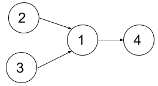
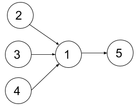

# 1494. Parallel Courses II

## Problem Description

You are given an integer `n`, representing the number of courses labeled from **1 to n**.

You are also given an array:

```
relations
```

Where:

```
relations[i] = [prevCourse, nextCourse]
```

This means:

```
prevCourse must be completed before nextCourse
```

You are also given an integer:

```
k
```

In a single semester:

- You can take **at most `k` courses**
- You can only take a course if **all its prerequisites were completed in previous semesters**

Your task is to determine:

> The **minimum number of semesters** required to complete **all courses**.

The test cases guarantee that it is possible to complete all courses.

---

# Example 1



### Input

```
n = 4
relations = [[2,1],[3,1],[1,4]]
k = 2
```

### Output

```
3
```

### Explanation

Course dependency graph:

```
2 → 1 → 4
3 → 1
```

Semester schedule:

```
Semester 1: take courses 2 and 3
Semester 2: take course 1
Semester 3: take course 4
```

---

# Example 2



### Input

```
n = 5
relations = [[2,1],[3,1],[4,1],[1,5]]
k = 2
```

### Output

```
4
```

### Explanation

Dependency graph:

```
2 → 1 → 5
3 → 1
4 → 1
```

Semester schedule:

```
Semester 1: courses 2 and 3
Semester 2: course 4
Semester 3: course 1
Semester 4: course 5
```

---

# Constraints

```
1 <= n <= 15
```

```
1 <= k <= n
```

```
0 <= relations.length <= n * (n - 1) / 2
```

```
relations[i].length == 2
```

```
1 <= prevCourse_i, nextCourse_i <= n
```

```
prevCourse_i != nextCourse_i
```

```
All prerequisite pairs are unique
```

```
The graph is a Directed Acyclic Graph (DAG)
```

---

# Notes

- Each course may have **multiple prerequisites**.
- Courses can only be taken **after all prerequisites are completed**.
- In each semester you may take **up to `k` available courses**.
- The goal is to **minimize the total number of semesters**.
