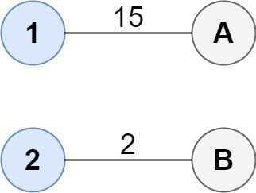
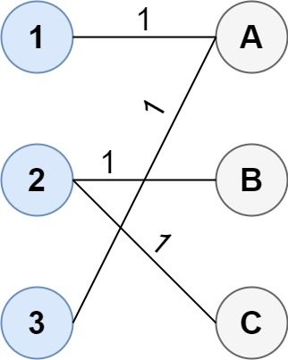

# 1595. Minimum Cost to Connect Two Groups of Points

## Problem Description

You are given two groups of points:

- The first group contains **size1** points.
- The second group contains **size2** points.

It is guaranteed that:

size1 >= size2

You are also given a **cost matrix**:

cost[size1][size2]

Where:

cost[i][j] = cost of connecting point i from group1 to point j from group2

### Goal

Connect the two groups such that:

- Every point in **group1** is connected to **at least one** point in **group2**
- Every point in **group2** is connected to **at least one** point in **group1**

Return the **minimum total cost** required to make the groups fully connected.

Note:

- A point may connect to **multiple points** in the other group.
- There is **no limit** to the number of connections.
- The objective is **minimum total cost**.

---

# Example 1

### Input

cost = [[15,96],
        [36,2]]

### Output

17

### Explanation

Optimal connections:

1 -- A
2 -- B

Total cost:

15 + 2 = 17

---

# Example 2

### Input

cost = [[1,3,5],
        [4,1,1],
        [1,5,3]]

### Output

4

### Explanation

Optimal connections:

1 -- A
2 -- B
2 -- C
3 -- A

Total cost:

1 + 1 + 1 + 1 = 4

Multiple connections to the same node are allowed.

---

# Example 3

### Input

cost = [[2,5,1],
        [3,4,7],
        [8,1,2],
        [6,2,4],
        [3,8,8]]

### Output

10

---

# Constraints

size1 == cost.length
size2 == cost[i].length

1 <= size1, size2 <= 12

size1 >= size2

0 <= cost[i][j] <= 100

---

# Key Observations

- Every node in **group1 must connect at least once**
- Every node in **group2 must connect at least once**
- Nodes can have **multiple connections**
- This is a **minimum cost covering problem between two sets**
- With small constraints (`<=12`), it is usually solved using:

Bitmask Dynamic Programming

---

# Important Properties

Maximum states:

2^12 = 4096

Which makes **bitmask DP feasible**.

Typical solution strategies include:

- DP with bitmasking
- State compression DP
- Memoized DFS with bitmask
