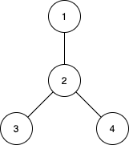

# 1617. Count Subtrees With Max Distance Between Cities

## Problem Description

There are **n cities** numbered from **1 to n**.

You are given a list of edges representing a **tree**:

```
edges[i] = [ui, vi]
```

This indicates a **bidirectional edge** between city `ui` and city `vi`.

Because the graph is a **tree**:

- There are exactly **n - 1 edges**
- There is a **unique path** between every pair of cities

---

## Definition: Subtree

A **subtree** is a subset of cities such that:

- Every city is reachable from every other city in the subset
- All paths between cities in the subset use **only cities from the subset**

Two subtrees are considered **different** if their sets of cities differ.

---

## Goal

For every distance `d` from **1 to n − 1**, determine:

> The number of subtrees where the **maximum distance between any two cities** equals `d`.

The **distance** between two cities is the **number of edges** in the path between them.

Return an array of size `n − 1`:

```
result[d-1] = number of subtrees with maximum distance = d
```

---

# Example 1



### Input

```
n = 4
edges = [[1,2],[2,3],[2,4]]
```

### Output

```
[3,4,0]
```

### Explanation

Subtrees with **max distance = 1**:

```
{1,2}
{2,3}
{2,4}
```

Subtrees with **max distance = 2**:

```
{1,2,3}
{1,2,4}
{2,3,4}
{1,2,3,4}
```

No subtree has maximum distance **3**.

---

# Example 2

### Input

```
n = 2
edges = [[1,2]]
```

### Output

```
[1]
```

Explanation:

```
{1,2}
```

has distance `1`.

---

# Example 3

### Input

```
n = 3
edges = [[1,2],[2,3]]
```

### Output

```
[2,1]
```

Explanation:

Distance **1**:

```
{1,2}
{2,3}
```

Distance **2**:

```
{1,2,3}
```

---

# Constraints

```
2 <= n <= 15
```

```
edges.length == n - 1
```

```
edges[i].length == 2
```

```
1 <= ui, vi <= n
```

```
All pairs (ui, vi) are distinct
```

---

# Key Observations

- The graph is a **tree**
- Maximum nodes `n = 15`
- Total subsets of nodes:

```
2^15 = 32768
```

This suggests a typical solution using:

```
Bitmask Enumeration
+ BFS/DFS to compute diameter
```

Common approach:

1. Enumerate all subsets of nodes
2. Check if the subset forms a **connected subtree**
3. Compute the **diameter** of that subtree
4. Count occurrences of each diameter
