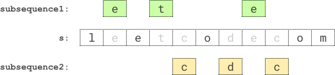

# 2002. Maximum Product of the Length of Two Palindromic Subsequences

## Problem Statement

Given a string `s`, find **two disjoint palindromic subsequences** of `s` such that the **product of their lengths is maximized**.

The two subsequences are **disjoint** if they do **not both pick a character at the same index**.

Return the **maximum possible product** of the lengths of the two palindromic subsequences.

---

## Definitions

### Subsequence

A **subsequence** is a string that can be derived from another string by deleting some or no characters **without changing the order** of the remaining characters.

Example:

```
s = "abcde"

Possible subsequences:
"a"
"ace"
"bde"
"abcde"
```

---

### Palindromic String

A **palindromic string** reads the same **forward and backward**.

Examples:

```
"aba"
"racecar"
"aa"
"b"
```

Non‑examples:

```
"ab"
"abc"
```

---

## Examples

### Example 1



Input

```
s = "leetcodecom"
```

Output

```
9
```

Explanation

An optimal solution is:

```
First subsequence  = "ete"
Second subsequence = "cdc"
```

Both are palindromes and do not share indices.

Product:

```
3 * 3 = 9
```

---

### Example 2

Input

```
s = "bb"
```

Output

```
1
```

Explanation

```
First subsequence  = "b" (index 0)
Second subsequence = "b" (index 1)
```

Product:

```
1 * 1 = 1
```

---

### Example 3

Input

```
s = "accbcaxxcxx"
```

Output

```
25
```

Explanation

```
First subsequence  = "accca"
Second subsequence = "xxcxx"
```

Both are palindromes and disjoint.

Product:

```
5 * 5 = 25
```

---

## Constraints

```
2 <= s.length <= 12
s consists of lowercase English letters only
```
