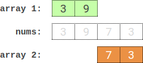
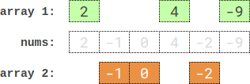

# 2035. Partition Array Into Two Arrays to Minimize Sum Difference

## Problem Statement

You are given an integer array `nums` containing `2 * n` integers.

Your task is to partition `nums` into **two arrays of length `n` each** such that the **absolute difference between the sums of the two arrays is minimized**.

To partition the array, every element in `nums` must be placed into **exactly one** of the two arrays.

Return the **minimum possible absolute difference**.

---

## Explanation

If the two arrays are:

```
A = n elements
B = n elements
```

Then the goal is to minimize:

```
abs(sum(A) - sum(B))
```

Every element from `nums` must belong to either `A` or `B`, and both must contain exactly `n` elements.

---

## Example 1



**Input**

```
nums = [3,9,7,3]
```

**Output**

```
2
```

**Explanation**

One optimal partition:

```
A = [3,9]
B = [7,3]
```

Sums:

```
sum(A) = 3 + 9 = 12
sum(B) = 7 + 3 = 10
```

Difference:

```
abs(12 - 10) = 2
```

---

## Example 2

**Input**

```
nums = [-36,36]
```

**Output**

```
72
```

**Explanation**

One optimal partition:

```
A = [-36]
B = [36]
```

Sums:

```
sum(A) = -36
sum(B) = 36
```

Difference:

```
abs(-36 - 36) = 72
```

---

## Example 3



**Input**

```
nums = [2,-1,0,4,-2,-9]
```

**Output**

```
0
```

**Explanation**

One optimal partition:

```
A = [2,4,-9]
B = [-1,0,-2]
```

Sums:

```
sum(A) = 2 + 4 - 9 = -3
sum(B) = -1 + 0 - 2 = -3
```

Difference:

```
abs(-3 - (-3)) = 0
```

---

## Constraints

```
1 <= n <= 15
nums.length == 2 * n
-10^7 <= nums[i] <= 10^7
```
