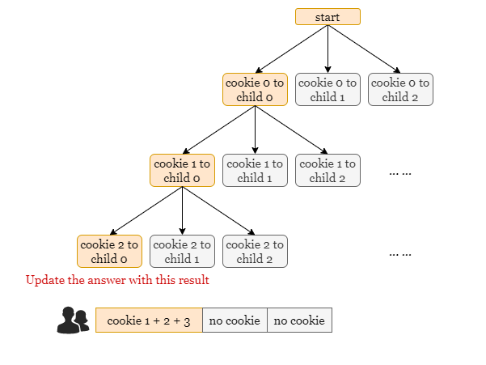
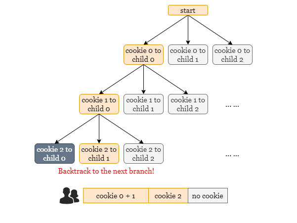
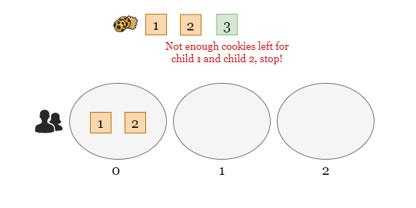
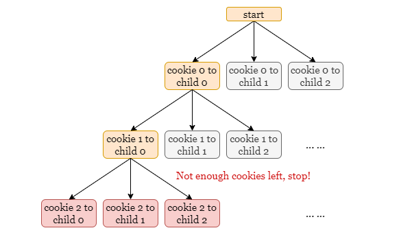

# Fair Distribution of Cookies – Backtracking Approach

## Intuition

Backtracking attempts **all possible distributions of cookies** among the children.

For each cookie:

1. Assign it to one child.
2. Recursively distribute the next cookie.
3. After all cookies are distributed, compute the **unfairness** (maximum cookies any child receives).
4. Track the **minimum unfairness** across all valid distributions.

This explores the entire decision tree of assignments.





---

## Example Scenario

Consider:

```
cookies = 3
children = 3
```

### Step 1

First, all cookies may be assigned to **child 0**.

However, this results in:

```
child0 = 3 cookies
child1 = 0 cookies
child2 = 0 cookies
```

This distribution is **invalid** because some children receive nothing.

Backtracking moves to the next possible distribution.

---

### Step 2

The algorithm tries distributing the last cookie to **child 1** instead.

It continues exploring recursively until **all cookies are distributed**.

Then it calculates:

```
unfairness = max(cookies received by any child)
```

and updates the **minimum unfairness found**.





---

## Optimization – Early Stopping

Backtracking can be optimized using **early termination**.

Define:

```
zero_count = number of children who have not received any cookie
```

If:

```
remaining_cookies < zero_count
```

then it is **impossible** for every child to receive at least one cookie.

Thus the current branch **cannot produce a valid distribution** and recursion stops early.

This pruning eliminates many unnecessary recursive calls.

---

## Algorithm

1. Create an array:

```
distribute[k]
```

This stores the total cookies received by each child.

2. Define recursive function:

```
dfs(i, zero_count)
```

where:

- `i` = index of cookie being distributed
- `zero_count` = number of children without cookies

3. If:

```
remaining cookies < zero_count
```

return a very large value (`Integer.MAX_VALUE`) because the distribution is invalid.

4. If all cookies are distributed:

```
i == n
```

return the **maximum value in distribute**, which represents the unfairness.

5. Otherwise:

- Try assigning cookie `i` to every child `j`
- Update the child's total cookies
- Recursively distribute the next cookie
- Track the minimum unfairness
- **Backtrack** by removing the cookie from that child

6. Return the minimum unfairness found.

---

## Java Implementation

```java
class Solution {
    private int dfs(int i, int[] distribute, int[] cookies, int k, int zeroCount) {
        // If there are not enough cookies remaining, return Integer.MAX_VALUE
        if (cookies.length - i < zeroCount) {
            return Integer.MAX_VALUE;
        }

        // All cookies distributed
        if (i == cookies.length) {
            int unfairness = Integer.MIN_VALUE;
            for (int value : distribute) {
                unfairness = Math.max(unfairness, value);
            }
            return unfairness;
        }

        int answer = Integer.MAX_VALUE;

        for (int j = 0; j < k; ++j) {
            zeroCount -= distribute[j] == 0 ? 1 : 0;
            distribute[j] += cookies[i];

            answer = Math.min(answer, dfs(i + 1, distribute, cookies, k, zeroCount));

            distribute[j] -= cookies[i];
            zeroCount += distribute[j] == 0 ? 1 : 0;
        }

        return answer;
    }

    public int distributeCookies(int[] cookies, int k) {
        int[] distribute = new int[k];
        return dfs(0, distribute, cookies, k, k);
    }
}
```

---

## Complexity Analysis

Let:

```
n = number of cookies
k = number of children
```

### Time Complexity

```
O(k^n)
```

Each cookie can be assigned to **any of the k children**, producing at most `k^n` distributions.

---

### Space Complexity

```
O(k + n)
```

- `distribute` array requires `O(k)` space.
- Recursion depth is at most `n`, so the call stack uses `O(n)` space.

Total space complexity:

```
O(k + n)
```

---

## Key Idea

Backtracking explores all distributions but uses **pruning (early stop)** to avoid invalid paths, dramatically reducing the search space.

This makes it feasible even though the theoretical complexity is exponential.
