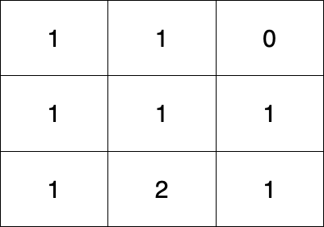
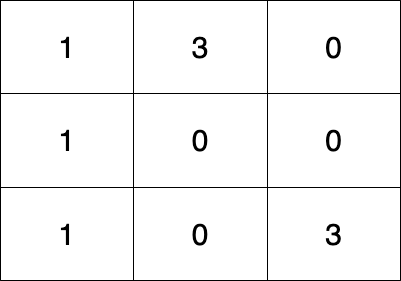

# 2850. Minimum Moves to Spread Stones Over Grid

## Problem Statement

You are given a **0-indexed 2D integer matrix `grid` of size `3 x 3`**.

Each cell contains the **number of stones** in that position. The total number of stones in the grid is **exactly 9**, but multiple stones may be present in the same cell.

Your goal is to **redistribute the stones** such that:

```
Each cell contains exactly 1 stone.
```

---

## Allowed Move

In one move, you may:

```
Move a single stone to an adjacent cell (up, down, left, or right).
```

Two cells are considered adjacent if they **share a side**.

---

## Objective

Return the **minimum number of moves** required to ensure that every cell in the grid contains **exactly one stone**.

---

# Example 1



### Input

```
grid = [[1,1,0],
        [1,1,1],
        [1,2,1]]
```

### Output

```
3
```

### Explanation

One possible sequence of moves:

1. Move a stone from **(2,1)** → **(2,2)**
2. Move a stone from **(2,2)** → **(1,2)**
3. Move a stone from **(1,2)** → **(0,2)**

Total moves:

```
3
```

This is the **minimum number of moves** required.

---

# Example 2



### Input

```
grid = [[1,3,0],
        [1,0,0],
        [1,0,3]]
```

### Output

```
4
```

### Explanation

One possible sequence:

1. Move a stone from **(0,1)** → **(0,2)**
2. Move a stone from **(0,1)** → **(1,1)**
3. Move a stone from **(2,2)** → **(1,2)**
4. Move a stone from **(2,2)** → **(2,1)**

Total moves:

```
4
```

This is the **minimum number of moves** required.

---

# Constraints

```
grid.length == grid[i].length == 3
0 <= grid[i][j] <= 9
Sum of all elements in grid = 9
```

---

# Key Observations

- The grid always contains **9 cells**.
- The **total number of stones is fixed at 9**.
- The final configuration must be:

```
Every cell = 1 stone
```

This means some cells may have:

- **extra stones** (greater than 1)
- **missing stones** (equal to 0)

The task becomes redistributing extra stones to empty cells using **minimum Manhattan distance moves via adjacent steps**.

---

# Summary

To solve this problem, we need to:

1. Identify cells with **extra stones**
2. Identify cells with **missing stones**
3. Move stones from extra cells to empty cells
4. Minimize the **total number of moves**
