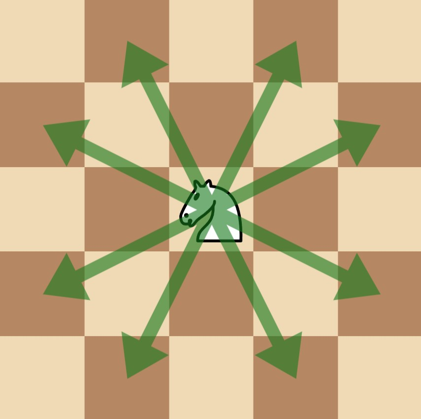

# 3283. Maximum Number of Moves to Kill All Pawns

## Problem Statement

There is a **50 × 50 chessboard** with:

- One **knight**
- Several **pawns**

You are given:

```
kx, ky
```

which represent the position of the knight.

You are also given:

```
positions[i] = [xi, yi]
```

which represent the positions of the pawns.

---

## Game Rules

Two players **Alice and Bob** play a turn-based game.

- **Alice moves first**
- The players alternate turns.

### On each turn

1. The player selects **any pawn that still exists on the board**.
2. The knight captures the selected pawn using the **minimum number of knight moves**.
3. The knight may **pass over other pawns without capturing them**.
4. **Only the chosen pawn is removed from the board**.

---

## Objective

- **Alice** wants to **maximize** the total number of moves made during the game.
- **Bob** wants to **minimize** the total number of moves.

Both players play **optimally**.

Return the **maximum total number of moves** that Alice can guarantee.

---

# Knight Movement

A knight moves in an **L-shape**:

- Two squares in one direction
- One square perpendicular

This produces **8 possible moves** from any position.

Example knight moves:

```
(x ± 2, y ± 1)
(x ± 1, y ± 2)
```



---

# Example 1

## Input

```
kx = 1
ky = 1
positions = [[0,0]]
```

## Output

```
4
```

## Explanation

The knight requires **4 moves** to reach `(0,0)` from `(1,1)`.

---

# Example 2

## Input

```
kx = 0
ky = 2
positions = [[1,1],[2,2],[3,3]]
```

## Output

```
8
```

## Explanation

1. **Alice** captures pawn `(2,2)` in **2 moves**
   `(0,2) → (1,4) → (2,2)`

2. **Bob** captures pawn `(3,3)` in **2 moves**
   `(2,2) → (4,1) → (3,3)`

3. **Alice** captures pawn `(1,1)` in **4 moves**
   `(3,3) → (4,1) → (2,2) → (0,3) → (1,1)`

Total moves:

```
2 + 2 + 4 = 8
```

---

# Example 3

## Input

```
kx = 0
ky = 0
positions = [[1,2],[2,4]]
```

## Output

```
3
```

## Explanation

1. **Alice** captures `(2,4)` in **2 moves**

```
(0,0) → (1,2) → (2,4)
```

Note that `(1,2)` is passed over but **not captured**.

2. **Bob** captures `(1,2)` in **1 move**

```
(2,4) → (1,2)
```

Total moves:

```
2 + 1 = 3
```

---

# Constraints

```
0 <= kx, ky <= 49
1 <= positions.length <= 15
positions[i].length == 2
0 <= positions[i][0], positions[i][1] <= 49
All pawn positions are unique
positions[i] != [kx, ky]
```

---

# Key Observations

- The board size is fixed at **50 × 50**.
- The knight must always capture a pawn using the **shortest path**.
- The number of pawns is **≤ 15**, which suggests possible solutions involving:
  - **Bitmask Dynamic Programming**
  - **Minimax / Game Theory**
  - **State Compression**

---

# Summary

The game consists of repeatedly:

1. Choosing a pawn.
2. Moving the knight to capture it using the **minimum number of moves**.
3. Removing the pawn from the board.
4. Updating the knight's position.

Alice wants to **maximize the total moves**, while Bob wants to **minimize them**.

The goal is to compute the **optimal total move count** under perfect play.
