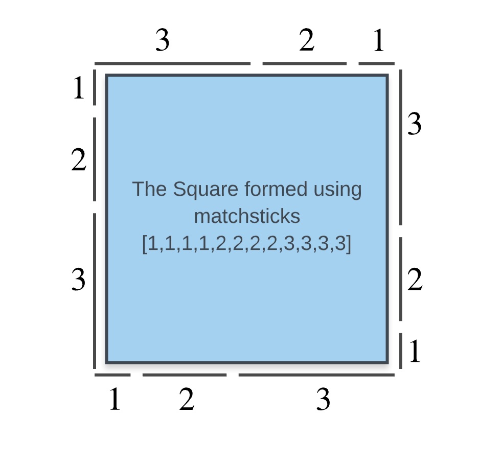
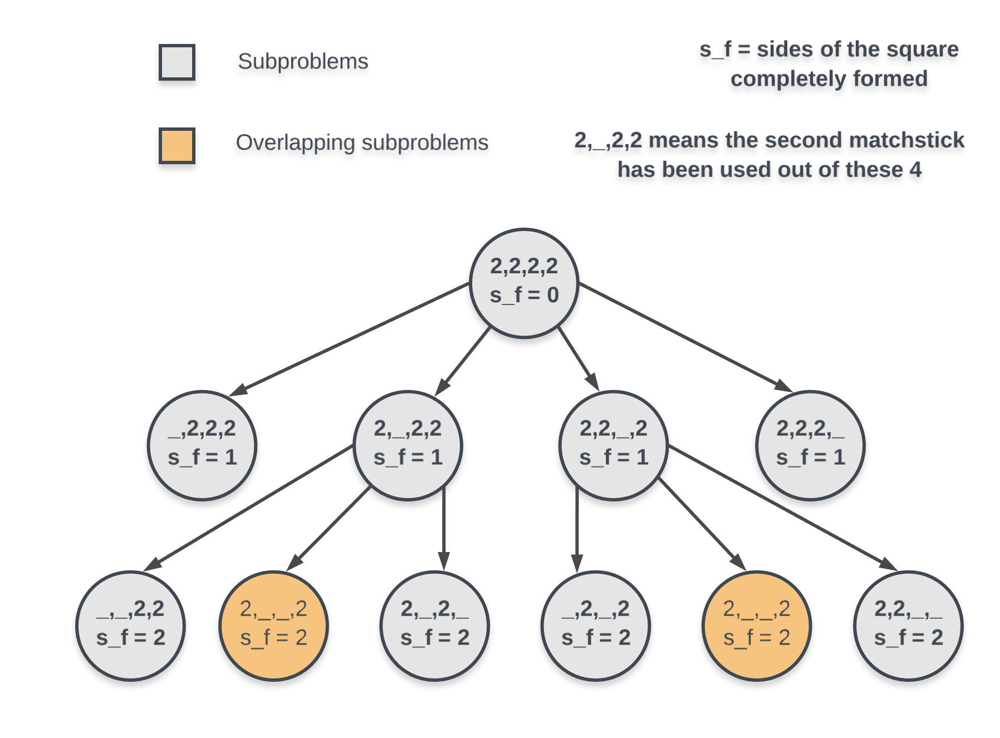

# 473. Matchsticks to Square — Detailed Explanation

## Overview

Suppose we have the matchsticks:

```
1,1,1,1,2,2,2,2,3,3,3,3
```

In this case a square of side **6** can be formed because:

```
3 + 2 + 1 = 6
```

Each side of the square can be formed using one matchstick of length **3**, one of **2**, and one of **1**.

So the core idea of this problem is:

> Partition the matchsticks into **4 subsets** such that each subset has the **same sum**.



### Requirements for the subsets

The subsets must be:

1. **Mutually exclusive**
   No matchstick can belong to more than one subset.

2. **Equal sum**
   Each subset must sum to:

```
total_sum / 4
```

If the total sum is **not divisible by 4**, forming a square is impossible.

---

# Problem Reduction

The problem becomes:

> Assign each matchstick to one of **4 sides** such that all sides have equal length.

For each matchstick we have **4 choices** (each side of the square).

We explore all possibilities recursively.

---

# Approach 1: Depth First Search (Backtracking)

## Intuition

Every matchstick can potentially belong to **any of the 4 sides**.

But we don't know which assignment will work.

So we try all possibilities recursively using **DFS**.

At every step we:

1. Pick a matchstick
2. Try placing it in each side
3. Continue recursively

If all matchsticks are placed and all sides equal the target length, a square is formed.

---

## Algorithm

1. Compute total sum of matchsticks.
2. If the sum is not divisible by `4`, return `false`.
3. Let:

```
side_length = total_sum / 4
```

4. Maintain an array:

```
sums[4]
```

representing current lengths of the four sides.

5. Process matchsticks one by one and try placing them on each side.

6. If a placement exceeds the target side length, skip it.

7. If all matchsticks are used and all sides equal the target, return `true`.

---

## Important Optimization

Sort matchsticks **in descending order**.

Why?

Trying longer sticks first causes failure earlier.

Example:

```
[8,4,4,4]
```

Target side length:

```
20 / 4 = 5
```

The stick `8` immediately fails, so we stop early.

---

## DFS Implementation (Java)

```java
import java.util.*;

class Solution {
    public List<Integer> nums;
    public int[] sums;
    public int possibleSquareSide;

    public Solution() {
        this.sums = new int[4];
    }

    public boolean dfs(int index) {

        if (index == this.nums.size()) {
            return sums[0] == sums[1] &&
                   sums[1] == sums[2] &&
                   sums[2] == sums[3];
        }

        int element = this.nums.get(index);

        for(int i = 0; i < 4; i++) {

            if (this.sums[i] + element <= this.possibleSquareSide) {

                this.sums[i] += element;

                if (this.dfs(index + 1))
                    return true;

                this.sums[i] -= element;
            }
        }

        return false;
    }

    public boolean makesquare(int[] nums) {

        if (nums == null || nums.length == 0)
            return false;

        int perimeter = 0;

        for(int num : nums)
            perimeter += num;

        this.possibleSquareSide = perimeter / 4;

        if (this.possibleSquareSide * 4 != perimeter)
            return false;

        this.nums = Arrays.stream(nums).boxed().collect(Collectors.toList());

        Collections.sort(this.nums, Collections.reverseOrder());

        return dfs(0);
    }
}
```

---

## Complexity Analysis

### Time Complexity

```
O(4^N)
```

Each matchstick has 4 choices.

### Space Complexity

```
O(N)
```

Due to recursion stack depth.

---

# Approach 2: Dynamic Programming with Bitmask

## Intuition

DFS repeats many states.

Example used matchsticks:

```
3,3,4,4,5,5
```

Square side length:

```
8
```

Possible arrangements:

```
(4,4), (3,5), (3,5)
(3,4), (3,5), (4), (5)
(3,3), (4,4), (5), (5)
```

Same matchsticks → different states.

So we need **memoization**.

---

# State Definition



A state is defined by:

```
(mask, sides_formed)
```

Where:

- `mask` = which matchsticks are used
- `sides_formed` = number of completed sides

Since there are **≤ 15 matchsticks**, we use a **bitmask**.

Example:

```
mask = 101011
```

means matchsticks at those positions are used.

Maximum masks:

```
2^15
```

---

# Important Optimization

We **do not need to check all 4 sides**.

If **3 sides are complete**, the last one must also be valid because:

```
total_sum = 4 * side_length
```

Thus the remaining sticks automatically form the final side.

---

# Dynamic Programming Algorithm

1. Compute target side length.

2. Use a recursive function:

```
recurse(mask, sidesDone)
```

3. Calculate current sum of used matchsticks.

4. If sum completes a side:

```
sidesDone++
```

5. If:

```
sidesDone == 3
```

return `true`.

6. Try adding each remaining matchstick.

7. Cache results in memo.

---

# DP Implementation (Java)

```java
import java.util.*;

class Solution {

    public HashMap<Pair<Integer,Integer>, Boolean> memo;

    public int[] nums;

    public int possibleSquareSide;

    public Solution() {
        memo = new HashMap<>();
    }

    public boolean recurse(int mask, int sidesDone) {

        int total = 0;
        int L = nums.length;

        Pair<Integer,Integer> key = new Pair(mask, sidesDone);

        for(int i=L-1;i>=0;i--){

            if((mask&(1<<i))==0)
                total += nums[L-1-i];
        }

        if(total>0 && total%possibleSquareSide==0)
            sidesDone++;

        if(sidesDone==3)
            return true;

        if(memo.containsKey(key))
            return memo.get(key);

        boolean ans=false;

        int c = total/possibleSquareSide;

        int rem = possibleSquareSide*(c+1)-total;

        for(int i=L-1;i>=0;i--){

            if(nums[L-1-i] <= rem && (mask&(1<<i))>0){

                if(recurse(mask^(1<<i), sidesDone)){
                    ans=true;
                    break;
                }
            }
        }

        memo.put(key,ans);

        return ans;
    }

    public boolean makesquare(int[] nums) {

        if(nums==null || nums.length==0)
            return false;

        int perimeter=0;

        for(int n:nums)
            perimeter+=n;

        int side=perimeter/4;

        if(side*4!=perimeter)
            return false;

        this.nums=nums;
        this.possibleSquareSide=side;

        return recurse((1<<nums.length)-1,0);
    }
}
```

---

# Complexity Analysis

### Time Complexity

```
O(N * 2^N)
```

Where:

```
N ≤ 15
```

### Space Complexity

```
O(N + 2^N)
```

- recursion stack
- memo cache

---

# Key Insights

1. Total matchstick length must be divisible by **4**.
2. The problem reduces to **partitioning into 4 equal subsets**.
3. DFS explores placements.
4. Sorting descending improves pruning.
5. Bitmask DP avoids recomputation.
6. Only **3 sides need to be formed explicitly**.

---

# Final Takeaway

This problem combines:

- Backtracking
- Subset partitioning
- Bitmask Dynamic Programming

The constraints (`N ≤ 15`) allow **state compression**, making DP feasible.
