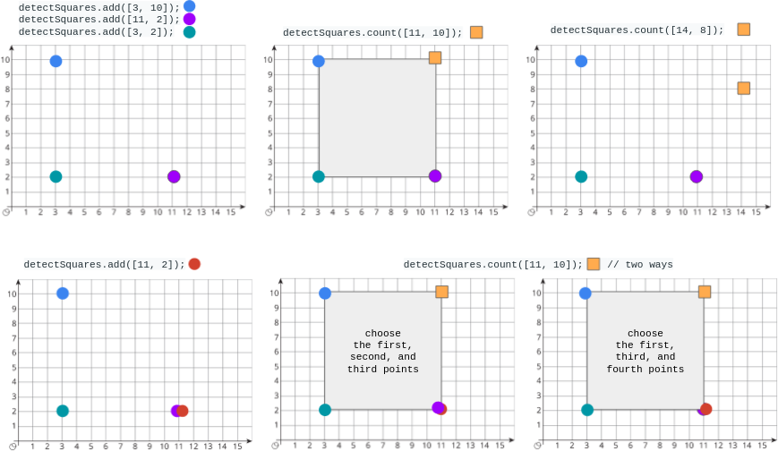

# 2013. Detect Squares

You are given a **stream of points on the X‑Y plane**. Design an algorithm that:

1. **Adds new points** from the stream into a data structure.
2. **Counts the number of ways** to choose three points from the data structure such that together with a query point they form an **axis‑aligned square** with **positive area**.

Duplicate points **are allowed** and should be treated as **separate points**.

---

# Definition: Axis‑Aligned Square

An **axis‑aligned square** is a square where:

- All sides are **equal length**
- Edges are **parallel to the x-axis or y-axis**

Example:

```
(x1, y1) ----- (x2, y1)
   |              |
   |              |
(x1, y2) ----- (x2, y2)
```

---

# Implement the `DetectSquares` Class

## Constructor

```
DetectSquares()
```

Initializes the object with an **empty data structure**.

---

## Methods

### `void add(int[] point)`

Adds a new point to the data structure.

```
point = [x, y]
```

Duplicates are allowed.

---

### `int count(int[] point)`

Counts how many ways to form **axis‑aligned squares** with the query point.

```
point = [x, y]
```

The query point acts as one vertex of the square.

Return the **number of valid squares**.

---

# Example



## Input

```
["DetectSquares","add","add","add","count","count","add","count"]

[[],
 [[3,10]],
 [[11,2]],
 [[3,2]],
 [[11,10]],
 [[14,8]],
 [[11,2]],
 [[11,10]]]
```

---

## Output

```
[null,null,null,null,1,0,null,2]
```

---

# Explanation

```
DetectSquares detectSquares = new DetectSquares();
```

```
detectSquares.add([3,10]);
detectSquares.add([11,2]);
detectSquares.add([3,2]);
```

Current stored points:

```
(3,10)
(11,2)
(3,2)
```

---

```
detectSquares.count([11,10]);
```

Possible square:

```
(3,10) ----- (11,10)
   |             |
   |             |
(3,2)  ----- (11,2)
```

Return:

```
1
```

---

```
detectSquares.count([14,8]);
```

No axis‑aligned square can be formed.

Return:

```
0
```

---

```
detectSquares.add([11,2]);
```

Duplicate points are allowed.

---

```
detectSquares.count([11,10]);
```

Now two valid squares exist because `(11,2)` appears **twice**.

Return:

```
2
```

---

# Constraints

```
point.length == 2
0 <= x, y <= 1000
At most 3000 calls total for add and count
```
