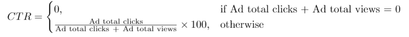

# 1322. Ads Performance

## Table: Ads

| Column Name | Type |
| ----------- | ---- |
| ad_id       | int  |
| user_id     | int  |
| action      | enum |

Notes:

- `(ad_id, user_id)` is the **primary key**.
- Each row represents an **interaction of a user with an advertisement**.
- The `action` column is an ENUM with possible values:

```
('Clicked', 'Viewed', 'Ignored')
```

---

# Problem

A company wants to measure the **performance of each advertisement**.

The performance metric used is **Click-Through Rate (CTR)**.

CTR is defined as:

```
CTR = (Number of Clicks / Number of (Clicks + Views)) × 100
```

Notes:

- **Ignored actions are not included** in the calculation.
- The result must be **rounded to 2 decimal places**.



---

# Requirements

Return a result table containing:

- `ad_id`
- `ctr` (Click-Through Rate)

Sorting rules:

1. Sort by **ctr in descending order**
2. If two ads have the same ctr, sort by **ad_id in ascending order**

---

# Example

## Input

### Ads table

| ad_id | user_id | action  |
| ----- | ------- | ------- |
| 1     | 1       | Clicked |
| 2     | 2       | Clicked |
| 3     | 3       | Viewed  |
| 5     | 5       | Ignored |
| 1     | 7       | Ignored |
| 2     | 7       | Viewed  |
| 3     | 5       | Clicked |
| 1     | 4       | Viewed  |
| 2     | 11      | Viewed  |
| 1     | 2       | Clicked |

---

# Output

| ad_id | ctr   |
| ----- | ----- |
| 1     | 66.67 |
| 3     | 50.00 |
| 2     | 33.33 |
| 5     | 0.00  |

---

# Explanation

CTR is calculated as:

```
CTR = clicks / (clicks + views) × 100
```

### ad_id = 1

Clicks = 2
Views = 1

```
CTR = (2 / (2 + 1)) × 100 = 66.67
```

---

### ad_id = 2

Clicks = 1
Views = 2

```
CTR = (1 / (1 + 2)) × 100 = 33.33
```

---

### ad_id = 3

Clicks = 1
Views = 1

```
CTR = (1 / (1 + 1)) × 100 = 50.00
```

---

### ad_id = 5

No clicks and no views.

```
CTR = 0.00
```

Ignored actions are **not counted** in CTR calculations.
