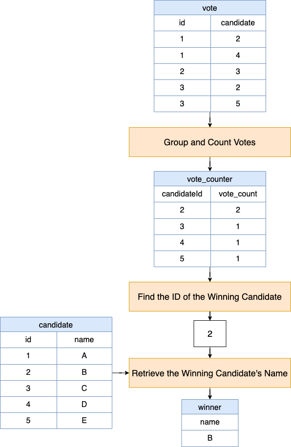

# 574. Winning Candidate

## Approach: Group and Find the Maximum using the `ORDER BY` Clause



### Intuition

The core idea is simple:

- Count how many votes each candidate received.
- Sort candidates by vote count in descending order.
- Pick the top one.
- Join that result with the `Candidate` table to get the candidate's name.

Because the problem guarantees that **exactly one candidate wins**, we do not need to handle ties.

---

## Step-by-Step Breakdown

### 1. Count votes for each candidate

We begin with the `Vote` table.

```sql
SELECT
  candidateId,
  COUNT(*) AS vote_count
FROM Vote
GROUP BY candidateId;
```

### What this does

- `candidateId` identifies the candidate.
- `COUNT(*)` counts how many rows belong to that candidate.
- `GROUP BY candidateId` ensures the count is computed separately for each candidate.

### Example result

If the `Vote` table is:

| id  | candidateId |
| --- | ----------- |
| 1   | 2           |
| 2   | 4           |
| 3   | 3           |
| 4   | 2           |
| 5   | 5           |

Then the grouped result becomes:

| candidateId | vote_count |
| ----------- | ---------- |
| 2           | 2          |
| 3           | 1          |
| 4           | 1          |
| 5           | 1          |

---

### 2. Sort by highest vote count and keep only the winner

Now we sort by vote count in descending order and take the first row.

```sql
SELECT
  candidateId,
  COUNT(*) AS vote_count
FROM Vote
GROUP BY candidateId
ORDER BY COUNT(*) DESC
LIMIT 1;
```

### What this does

- `ORDER BY COUNT(*) DESC` puts the candidate with the most votes first.
- `LIMIT 1` keeps only that top candidate.

### Example result

| candidateId | vote_count |
| ----------- | ---------- |
| 2           | 2          |

This tells us that candidate with `id = 2` won.

---

### 3. Join with the `Candidate` table to get the name

The `Vote` table only stores `candidateId`, not the candidate's name.

So we join the winner's `candidateId` with the `Candidate` table:

```sql
SELECT c.name
FROM Candidate AS c
JOIN (
    SELECT
      candidateId,
      COUNT(*) AS vote_count
    FROM Vote
    GROUP BY candidateId
    ORDER BY COUNT(*) DESC
    LIMIT 1
) AS v
ON c.id = v.candidateId;
```

This gives us the winner's name.

---

## Full Query

```sql
SELECT
  c.name
FROM
  Candidate AS c
  JOIN (
    SELECT
      candidateId,
      COUNT(*) AS vote_count
    FROM
      Vote
    GROUP BY
      candidateId
    ORDER BY
      COUNT(*) DESC
    LIMIT
      1
  ) AS v
  ON c.id = v.candidateId;
```

---

## Detailed Explanation of the Query

### Outer Query

```sql
SELECT c.name
FROM Candidate AS c
```

- We want the final answer to be the candidate's `name`.
- `Candidate AS c` gives the `Candidate` table a short alias `c`.

---

### Subquery

```sql
SELECT
  candidateId,
  COUNT(*) AS vote_count
FROM Vote
GROUP BY candidateId
ORDER BY COUNT(*) DESC
LIMIT 1
```

This subquery:

1. groups votes by `candidateId`,
2. counts how many votes each candidate received,
3. sorts them from highest to lowest,
4. returns only the winner.

---

### Join Condition

```sql
ON c.id = v.candidateId
```

- `c.id` is the candidate's ID in the `Candidate` table.
- `v.candidateId` is the winner's ID from the subquery.

This join matches the winner's ID to the candidate's record so we can return the winner's name.

---

## Dry Run on the Example

### Candidate table

| id  | name |
| --- | ---- |
| 1   | A    |
| 2   | B    |
| 3   | C    |
| 4   | D    |
| 5   | E    |

### Vote table

| id  | candidateId |
| --- | ----------- |
| 1   | 2           |
| 2   | 4           |
| 3   | 3           |
| 4   | 2           |
| 5   | 5           |

### Step 1: Count votes

| candidateId | vote_count |
| ----------- | ---------- |
| 2           | 2          |
| 3           | 1          |
| 4           | 1          |
| 5           | 1          |

### Step 2: Sort descending and take top one

| candidateId | vote_count |
| ----------- | ---------- |
| 2           | 2          |

### Step 3: Join with Candidate

`candidateId = 2` matches candidate `B`.

### Final output

| name |
| ---- |
| B    |

---

## Why This Works

This approach works because:

- every vote is represented by one row in `Vote`,
- grouping by `candidateId` gives the total votes per candidate,
- sorting descending ensures the highest vote count comes first,
- `LIMIT 1` selects the winner,
- joining with `Candidate` converts the winner's ID into the winner's name.

Since the problem guarantees a unique winner, this method is sufficient.

---

## Time Complexity

Let:

- `n` = number of rows in `Vote`
- `m` = number of rows in `Candidate`

### Subquery

- Counting and grouping votes: typically `O(n)`
- Sorting grouped candidates: `O(k log k)`, where `k` is the number of distinct candidates receiving votes

### Join

- Joining the winner with `Candidate`: typically small, effectively `O(m)` in a naive interpretation, though database engines optimize this well

### Overall

In practical terms, the dominant work is grouping and sorting the `Vote` table.

---

## Space Complexity

- The grouped result stores one row per candidate who received votes.
- So auxiliary space is `O(k)`, where `k` is the number of distinct candidates in `Vote`.

---

## Clean Version for Submission

```sql
SELECT c.name
FROM Candidate c
JOIN (
    SELECT candidateId
    FROM Vote
    GROUP BY candidateId
    ORDER BY COUNT(*) DESC
    LIMIT 1
) v
ON c.id = v.candidateId;
```

This is slightly cleaner because `vote_count` is not needed outside the subquery.

---

## Key Takeaways

- Use `GROUP BY` to aggregate votes per candidate.
- Use `COUNT(*)` to compute total votes.
- Use `ORDER BY ... DESC` to bring the highest count to the top.
- Use `LIMIT 1` to select the winner.
- Use a `JOIN` to map the winner's ID to the candidate's name.

---

## Final Answer

```sql
SELECT c.name
FROM Candidate c
JOIN (
    SELECT candidateId
    FROM Vote
    GROUP BY candidateId
    ORDER BY COUNT(*) DESC
    LIMIT 1
) v
ON c.id = v.candidateId;
```
